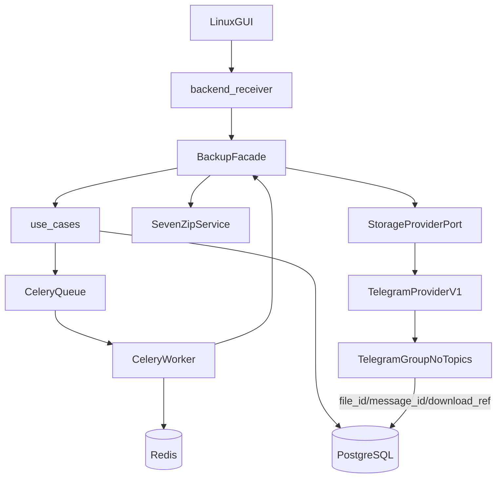

# Руководство по реализации: Portable Messenger Disk (Telegram-first v1)

Документ описывает порядок внедрения мульти-мессенджерной архитектуры, где `v1` использует Telegram как первый реальный провайдер, но ядро остается provider-agnostic.

Смысл гайда: зафиксировать, что расширение на `Max`, `VK` и другие мессенджеры делается добавлением адаптеров, а не переписыванием бизнес-логики.

## 1) Базовая архитектура

Проект следует **линейному стеку слоёв** (см. [docs/ONION_ARCHITECTURE.md](docs/ONION_ARCHITECTURE.md)): запрос вниз `application → infrastructure → use_cases → domain`.

| Слой | Назначение | Что не должно попадать в слой |
|------|------------|--------------------------------|
| `domain` | Сущности, статусы, инварианты, доменные ошибки | SQL, HTTP, детали Telegram/Max/VK API |
| `use_cases` | Use cases: backup, restore, retry; порты; persistence-записи | Конкретные SDK/клиенты, SQL, Celery |
| `infrastructure` | `bootstrap`, `BackupFacade`, реализация портов: БД, 7z, Celery, провайдеры | Бизнес-правила lifecycle, UI |
| `application` | GUI (English-only) + `backend_receiver` (прослойка → `infrastructure.facade`) | `use_cases`, `domain`, SQL, Celery |
| `presentation` | *(удалить)* — дубль `application/gui/` | — |

## 2) Контракт провайдера хранения

Порт `StorageProviderPort` (возможное имя `MessageProvider`) задает минимальный API, который нужен ядру:

- `healthcheck(remote_target)` — проверить подключение, валидность credentials (в конфиге адаптера) и доступ к целевой группе/каналу.
- `upload_file(local_path, remote_target, display_name)` — загрузить файл и вернуть `external_file_id`, `external_message_id`, метаданные.
- `get_file_info(external_file_id)` — получить данные для скачивания.
- `download_file(file_info, dest_path, resume)` — скачать/докачать файл.
- `classify_error(error)` — перевести ошибку провайдера в внутренний тип (`retryable`, `fatal`, `rate_limited`).
- `provider_limits()` — объявить ограничения (max size, throttling, особенности destination).

Это обязательный контракт для всех будущих адаптеров.

**Текущая реализация (baseline):**

- Контракт: `src/use_cases/ports.py` — `StorageProviderPort` (алиас `MessageProvider`).
- Адаптер `v1`: `TelegramProviderV1` в том же файле; `infrastructure/providers/telegram_provider.py` — re-export для обратной совместимости.
- DTO порта: `src/use_cases/dto.py` (`UploadResult`, `ProviderFileInfo`, `ProviderLimits`, `ClassifiedProviderError`).

## 2.1) Слой persistence (репозитории)

**Зачем:** use cases и worker работают с доменными dataclass (`Session`, `SourceItem`, `ArchiveVolume`), не зная SQL и схему таблиц. Репозиторий — прослойка «домен ↔ БД».

**Разделение по файлам:**

| Файл | Роль |
|------|------|
| `src/use_cases/repositories.py` | `@dataclass` репозитории и фабрика `Repositories.from_dsn(dsn)` — публичный API для сохранения/чтения |
| `src/infrastructure/db/orm.py` | SQLAlchemy ORM-модели строк БД (`UploadSessionRow`, `SourceItemRow`, `ArchiveVolumeRow`) |
| `src/infrastructure/db/mappers.py` | Явный маппинг `upload_session_row_to_domain` / `domain_to_upload_session_row` (и аналоги для остальных сущностей) |
| `src/infrastructure/db/engine.py` | `build_db_session_factory`, `db_session_scope` (транзакции commit/rollback) |
| `src/infrastructure/db/migrations/*.sql` | Источник истины для схемы таблиц (как и раньше) |

**Правила:**

1. В коде приложения **не писать сырой SQL** — только SQLAlchemy ORM и `select()` в репозиториях.
2. Доменные модели живут в `domain/`; ORM-строки **не отдаются** наружу репозитория.
3. Репозитории — `frozen` dataclass с инжектируемой `db_session_factory`, без ручных `__init__`.
4. Имена мапперов — явные (`*_row_to_domain`), не «внутренние» хелперы с `_`.

**Пример wiring** (в `infrastructure/bootstrap.py` → `BackupFacade`):

```python
facade = build_facade(cfg)
facade.enqueue_file(session_id, path, display_name)  # внутри: use case + repos
```

**Статус:** CRUD для трёх сущностей и unit-тесты мапперов готовы. **Дальше:** `infrastructure/facade.py`, перенос bootstrap из `application/`; integration-тесты с PostgreSQL.

## 3) Telegram-specific границы в v1

В `v1` только `TelegramProviderV1` реализует `StorageProviderPort` (см. `src/use_cases/ports.py`).

Telegram-специфика, которая должна оставаться только в адаптере:

- работа через локальный `telegram-bot-api`;
- только `chat_id` целевой группы (без `message_thread_id` и без тем);
- обработка `retry_after`/FloodWait;
- ограничения размера и формата отправки;
- маппинг Telegram-ответов в унифицированный результат порта.

Telegram-специфика, которая не должна утекать в `domain` / `use_cases`:

- названия методов Bot API;
- структура конкретных JSON-полей Telegram;
- Telegram-коды ошибок как часть доменных правил.

## 4) Основной поток данных



Гарантия архитектуры: GUI → `backend_receiver` → `infrastructure.facade` → `use_cases`; `application` не импортирует use cases напрямую. `Celery` и `Redis` — фоновый контур в `infrastructure`. Бизнес-правила остаются в `use_cases`. После upload идентификаторы и `provider_download_ref` фиксируются в БД для restore.

## 5) Негласные правила реализации

1. Конвейер работает параллельно: архивация, отправка и очистка выполняются как независимые стадии для разных `source_item`.
2. Новый `source_item` не ждет полного завершения предыдущего: как только архив готов, он ставится в очередь отправки, а архивация продолжает следующий объект.
3. Временные файлы удаляются только для полностью отправленных томов; очистка не блокирует архивацию и отправку других объектов.
4. Исходники не перемещаются приложением в отдельную служебную директорию: пользователь сам выбирает и добавляет данные через GUI в свой профиль.
5. Секреты не пишутся в git и в открытом виде в логах.
6. Текстовые операционные логи не отправляются в мессенджер.
7. В БД хранится провайдерная идентификация файлов/сообщений и отображаемые имена томов.
8. Имена томов в Telegram должны включать хешированное пользовательское имя файла (стабильный префикс/часть имени), чтобы сохранялась читаемая группировка и приватность.

## 6) Этапы внедрения

### Этап 0. Каркас проекта

- Инициализация Python-проекта и зависимостей.
- Базовая структура каталогов по слоям.
- Подключение `pytest`, базовой проверки линтером и форматтером.

**Готово, когда:** проект запускается локально, тестовый прогон `pytest` проходит.

### Этап 1. Инфраструктура

- `docker-compose` для `app`, `postgres`, `redis`, `telegram-bot-api`.
- Переменные окружения и `.env.example` без секретов.
- Healthcheck и порядок старта сервисов.

**Готово, когда:** все сервисы поднимаются и приложение подключается к БД/Redis.

### Этап 2. БД и миграции

- Таблицы: `upload_sessions`, `source_items`, `archive_volumes`.
- Поля `archive_volumes` для restore (как в `domain.models.ArchiveVolume`): `external_file_id`, `external_message_id`, `provider_download_ref`. `provider_name` / `provider_file_name` — только в `UploadResult` (DTO), не в таблице.
- Индексы по сессии, статусам и provider-полям.
- Доступ к данным через **SQLAlchemy** (см. §2.1), не через сырой SQL в use cases.

**Статус реализации:**

- Миграции: `src/infrastructure/db/migrations/0001_initial.sql`, `0002_align_schema_with_domain.sql`; раннер `apply_migrations` в `src/infrastructure/db/migrate.py`.
- ORM + мапперы + dataclass-репозитории: §2.1.
- Зависимость: `sqlalchemy>=2.0.40` (в паре с `psycopg`) в `pyproject.toml`.

**Готово, когда:** миграции воспроизводимы с нуля; репозитории подключены к worker/use cases и проходят integration-тест с PostgreSQL.

### Этап 3. Конфигурация

- Единый конфиг модуль с валидацией.
- Общие параметры: пути, ретраи, таймауты, политика завершения.
- Provider-настройки в отдельных секциях (`telegram.*`, в будущем `max.*`, `vk.*`).

**Готово, когда:** ошибки конфигурации читаемы и диагностируемы.

### Этап 4. Порт и Telegram-адаптер

- Ввести `StorageProviderPort` в `use_cases`.
- Реализовать `TelegramProviderV1` (HTTP к локальному Bot API, `multipart/form-data` для `sendDocument`).
- Нормализовать ошибки и лимиты через общий контракт (`ClassifiedProviderError`, `ProviderLimits`).

**Статус реализации:**

- Контракт и адаптер: `src/use_cases/ports.py` (`StorageProviderPort`, `TelegramProviderV1`).
- Contract-тесты: `tests/test_provider_contract.py`, `tests/test_telegram_provider.py`.
- Live upload в реальную группу — ещё не зафиксирован как пройденный smoke.

**Готово, когда:** тестовый файл отправляется в Telegram через абстракцию порта.

### Этап 5. Postman

- Коллекция запросов к Telegram Bot API и служебным endpoint-ам приложения.
- Позитивные и негативные сценарии.
- Экспорт коллекции в `docs/postman/` без секретов.

**Готово, когда:** любой разработчик повторяет проверки только подставив свои переменные.

### Этап 6. Архивация и worker

- Интеграция `7z` (`-t7z -mhe=on -v1999m` для Telegram v1).
- Шифрование обязательно для всех архивов: ключ по умолчанию генерируется приложением автоматически, но пользователь может изменить его в настройках.
- Celery-задачи: архивировать, отправить том, обновить статус, ретрай; стадии конвейера выполняются параллельно для разных объектов.
- После отправки каждого тома сохранять в БД `external_file_id`/`external_message_id` и `provider_download_ref` для дальнейшего скачивания.
- Имя отправляемого файла в Telegram формировать с хешированным пользовательским именем файла (например, `<hash_of_user_file_name>.<part>.7z.001`).
- Очистка кеша для успешно отправленных томов без перемещения исходников приложением.

**Готово, когда:** несколько объектов проходят конвейер внахлест (архивация/отправка/очистка), и статусы корректно отражаются в БД.

### Этап 7. Сессии и UI

- Управление сессией в Linux UI.
- Прогресс, ETA, ошибки, остановка по правилам.
- Экран restore и экран управления логическими группами/папками внутри GUI (без Telegram topics/threads).

**Готово, когда:** пользовательский сценарий backup/restore выполняется без ручных SQL.

### Этап 8. Документация и релиз v1

- Синхронизация README, гайда, runbook и ограничений Telegram-first.
- Smoke-checklist релиза.
- CI/CD для публикации артефактов и инструкций установки.

**Готово, когда:** релиз воспроизводим и документирован.

## 7) Тестовая стратегия (pytest)

| Уровень | Что проверяет | Инструменты |
|---------|---------------|-------------|
| Unit | domain/use_cases без внешних зависимостей | `pytest`, фейки портов |
| Integration | БД, миграции, репозитории (SQLAlchemy), Celery-задачи, 7z интеграция | `pytest`, контейнеры/compose |
| Provider contract | соответствие адаптера контракту `StorageProviderPort` | общий contract-test suite |
| Provider-specific | Telegram edge-cases (FloodWait, лимиты, неверная группа/права) | моки HTTP + живой smoke |

Ключевой принцип: каждый новый провайдер подключается через тот же contract-test suite.

## 8) Postman и проверка API

- Коллекция должна покрывать минимум: `health`, `upload test file`, `get file info`, `negative auth`.
- Для Telegram добавить кейсы на неверный токен, неверный target, rate limit.
- Хранить только шаблоны переменных, без реальных токенов.

## 9) Roadmap — логирование и observability (v1)

- **Каталог логов сессий в проекте:** писать операционные логи в выделенную зону (например `logs/sessions/<session_id>/` — старт/финиш/retry задач, ошибки провайдера, этапы restore). Дополняет stdout/Docker, не заменяет; секреты редактировать; `logs/` в `.gitignore`.

## 10) Roadmap — live-проверка провайдера после v1 (Telegram)

- Реальные тесты upload/restore после релиза v1 (токен, `chat_id`, локальный Bot API).
- Документировать фактический путь скачивания файла в Telegram (что возвращает API на upload и на `getFile`/`download`).
- Валидировать **`provider_download_ref`**: работает ли контракт end-to-end или поле/двойная семантика (`UploadResult` vs `ProviderFileInfo`) лишние; при провале — упростить DTO, БД и адаптер.
- Зафиксировать выводы в спеке и тестах (integration/e2e).

## 11) Roadmap после релиза v1

- Добавить `MaxProvider`, `VkProvider` как реализации `StorageProviderPort`.
- Ввести capability-matrix провайдеров (лимиты, типы destination, ограничения API).
- Добавить авто-проверки совместимости: contract-suite для каждого адаптера в CI.
- Сохранить единый UX приложения независимо от провайдера.

## 12) Definition of Done для документации

- README и guide описывают продукт как мульти-мессенджерный.
- Зафиксирована граница между общей логикой и Telegram-адаптером `v1`.
- Явно описаны роли `Celery`, `Redis`, `Postman`, `pytest`.
- Есть прозрачный путь подключения новых мессенджеров без переписывания ядра.

---

Текущая версия этого гайда соответствует стратегии: `Telegram-first v1`, `provider-agnostic core`.
