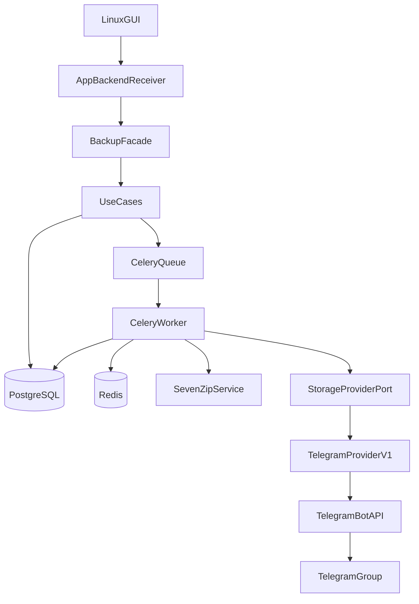

# telegram-uploader

Linux desktop app for backing up files to messenger storage. **v1** is Telegram-first; the core is provider-agnostic via `StorageProviderPort`, so additional messengers (Max, VK, etc.) can be added later without rewriting the app.

Full project overview: **[docs/PROJECT.md](docs/PROJECT.md)** · detailed backlog: **[docs/BACKLOG.md](docs/BACKLOG.md)** · layer rules: **[docs/ONION_ARCHITECTURE.md](docs/ONION_ARCHITECTURE.md)**

## What it does

1. User picks files in the GUI (English UI; `display_name` is captured at enqueue).
2. The pipeline archives with **7z** (encrypt + split), uploads volumes to a **target Telegram group**, and tracks state in **PostgreSQL**.
3. **Celery workers** (archive / upload / cleanup / restore queues) run heavy work; the GUI talks to **`BackupFacade`** only.
4. **Restore** (planned end-to-end) downloads volumes and extracts the original file.

## Current status (June 2026)

| Area | Status |
|------|--------|
| Onion layers: `domain` → `use_cases` → `infrastructure` → `application` | Done |
| Backup: GUI → workers → Telegram → `completed` | Done |
| Restore download (Bot API) | Broken — HTTP 404 |
| Restore extract (7z → original file) | Not implemented |
| Telegram Client API provider (MTProto) | Planned — [migration doc](docs/TELEGRAM_CLIENT_API_MIGRATION.md) |
| CI (GitHub Actions: ruff, mypy, pytest) | Partial — [`.github/workflows/ci.yml`](.github/workflows/ci.yml) |
| CD (`.deb` package + safe upgrades) | Planned — see [Packaging & CD](docs/PROJECT.md#packaging--cd-p005--planned) |
| `import-linter` / observation layer | Not implemented |

Architecture cleanup is in progress bottom-up: **use_cases → infrastructure → application** (see backlog).

## Quick start

### Prerequisites

- Linux with **Docker** and **Docker Compose**
- **Python 3.12+** with Tkinter (for the host GUI)
- Git

### Setup

```bash
git clone git@github.com:RomFuture/telegram-uploader.git
cd telegram-uploader

cp .env.example .env
# Edit .env: Telegram bot token, API id/hash, target chat id, etc.

python3 -m venv .venv
.venv/bin/pip install -e ".[dev]"
```

Host GUI connects to Postgres/Redis on `localhost` (default Postgres port **5433** in `.env.example` to avoid clashing with a system Postgres). Containers use Compose service names internally.

### Run the app

```bash
./scripts/run.sh
```

This script:

1. Starts the Docker stack (`docker compose up -d`) — Postgres, Redis, `telegram-bot-api`, Celery workers.
2. Launches the Tkinter GUI on the host (`.venv/bin/python -m application.gui`).

Manual equivalent:

```bash
docker compose up -d
PYTHONPATH=src .venv/bin/python -m application.gui
```

**Smoke test:** Start Session → Add File → Start Backup → Refresh Progress. Watch workers: `docker compose logs -f celery-worker-archive-1`.

## Architecture



Layers (onion): `application` → `infrastructure` → `use_cases` → `domain`. GUI must not import infrastructure directly.

## Stack

| Piece | Role |
|-------|------|
| `src/domain/` | Entities, statuses, invariants |
| `src/use_cases/` | Use cases + `StorageProviderPort` Protocol |
| `src/infrastructure/` | DB, 7z, Celery, `TelegramProviderV1`, `BackupFacade`, `bootstrap` |
| `src/application/` | `backend_receiver` + Tkinter GUI |
| Docker | Postgres, Redis, Celery workers, `telegram-bot-api` (legacy) |

## Verify (development)

```bash
.venv/bin/pytest -m "not integration" -v
.venv/bin/ruff check src tests && .venv/bin/mypy src
docker compose logs -f celery-worker-archive-1
```

## Documentation

| Document | Purpose |
|----------|---------|
| [docs/PROJECT.md](docs/PROJECT.md) | Project overview, run instructions, packaging/CD plan |
| [docs/BACKLOG.md](docs/BACKLOG.md) | Everything not implemented yet |
| [docs/INTERNAL_SPEC.md](docs/INTERNAL_SPEC.md) | Product rules (encryption, `display_name`, English UI) |
| [docs/ONION_ARCHITECTURE.md](docs/ONION_ARCHITECTURE.md) | Layer structure and import rules |
| [docs/TELEGRAM_CLIENT_API_MIGRATION.md](docs/TELEGRAM_CLIENT_API_MIGRATION.md) | Bot API → Client API (MTProto) |

---

## Roadmap — work stages & planned features (TODO)

Status key: **done** · **in progress** · **TODO**

### P-demo — show a working v1

| Item | Status |
|------|--------|
| `scripts/run.sh` — one command: Docker stack + GUI | **done** |
| `.github/workflows/ci.yml` — ruff, mypy, pytest on push/PR | **in progress** |
| README quick start (clone → `.env` → `./scripts/run.sh`) | **done** |
| Backup happy path stable for demo | **done** |
| Client API / restore for demo | **TODO** (not a demo blocker if backup is stable) |

### P0.05 — Packaging & CD (optional, early)

| Item | Status |
|------|--------|
| CD pipeline: build `.deb` on release tag | **TODO** |
| Safe upgrade order (stop workers → migrate DB → refresh image → start) | **TODO** (documented in [PROJECT.md](docs/PROJECT.md)) |
| Version coupling: deb = `pyproject.toml` = Docker tag = migrations | **TODO** |

### P0 — Architecture cleanup (current priority)

**Order:** `use_cases` → `infrastructure` → `application`

| Stage | Focus | Status |
|-------|-------|--------|
| **P0.1** `use_cases` | Audit ports/records, restore/upload refs for Client API, failed-status policy in use cases, remove backup/restore duplication | **TODO** |
| **P0.2** `infrastructure` | Bootstrap/facade wiring, **Telegram Client API provider**, structured logging, failed-pipeline rollback | **TODO** |
| **P0.3** `application` + GUI | Thin `backend_receiver`, better errors, failed/stuck statuses, settings UI, restore UX | **TODO** |

### P1 — Restore end-to-end

| Item | Status |
|------|--------|
| Download all volumes by `part_number` | **TODO** |
| 7z decrypt/extract with session `encryption_key` | **TODO** |
| Write result to user-selected `dest_path` (fix staging bug) | **TODO** |
| Restore statuses: success / `failed` | **TODO** |
| Resume downloads | **TODO** (nice to have) |

### P2 — Observation & CI

| Item | Status |
|------|--------|
| `import-linter` + layer contracts | **TODO** |
| CI: add `lint-imports` step | **TODO** |
| `src/observation/health.py` (postgres, redis, telegram) | **TODO** (optional) |
| `logs/` in `.gitignore` for session logs | **TODO** |

### P3 — Tests & integration

| Item | Status |
|------|--------|
| `tests/test_worker_pipeline_integration.py` — full chain in Docker | **TODO** |
| `tests/test_repositories_integration.py` — live PostgreSQL | **TODO** |
| Live Telegram smoke (opt-in) after Client API | **TODO** |

### P4 — `domain` cleanup (deferred)

| Item | Status |
|------|--------|
| Generic `ensure` / `mark` with `@overload` | **TODO** |
| Scenario-first public API | **TODO** |
| Merge `guards.py` + `scenarios.py` if justified | **TODO** |
| Audit `domain/__init__.py` exports | **TODO** |

### P5 — Docs sync

| Item | Status |
|------|--------|
| [ONION_ARCHITECTURE.md](docs/ONION_ARCHITECTURE.md) — Client API in runtime stack | **TODO** |
| [IMPLEMENTATION_GUIDE.md](IMPLEMENTATION_GUIDE.md) — archive or trim | **TODO** |

### Post-v1

| Item | Status |
|------|--------|
| Max / VK storage adapters (`StorageProviderPort`) | **TODO** |
| Provider compatibility matrix (limits, channels, API quirks) | **TODO** |
| Contract test suite per provider | **TODO** |
| Session log directory (`logs/sessions/<session_id>/`) | **TODO** |
| Prometheus / Grafana metrics (optional) | **TODO** |
| Kubernetes deploy for workers + Postgres (optional, far) | **TODO** |

### Explicitly out of scope (v1)

- Telegram topics (`message_thread_id`)
- Auto-moving user source files into a service directory
- Max / VK providers (port exists, no adapter yet)
