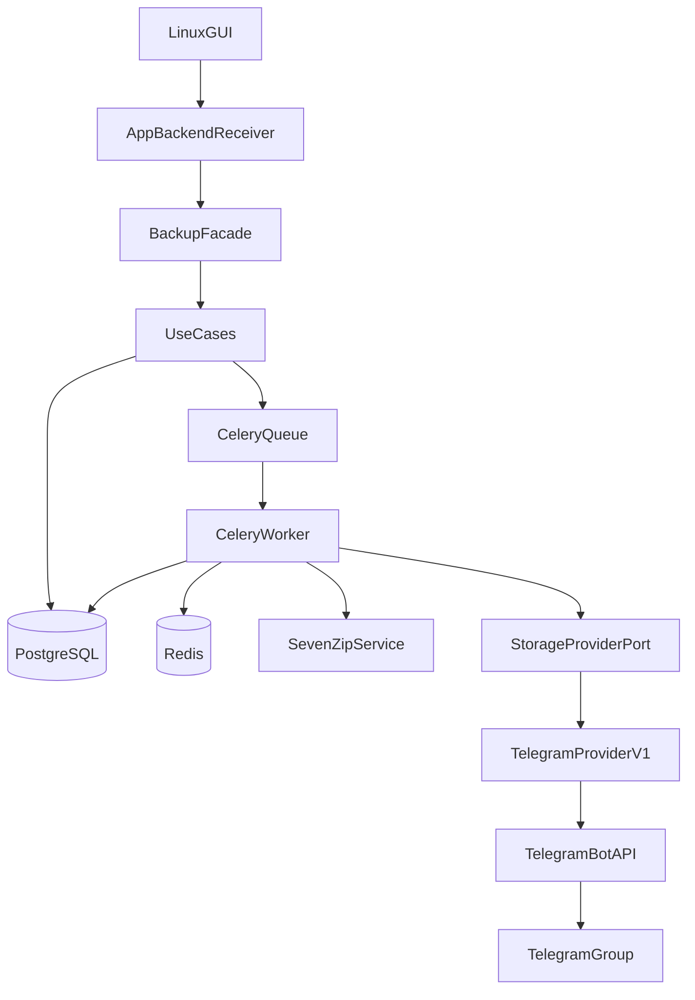

# telegram-uploader

Linux desktop backup into messenger storage. v1 ships Telegram only. The core speaks `StorageProviderPort`, so you can add Max or VK adapters later.

Docs: [PROJECT.md](docs/PROJECT.md) · [BACKLOG.md](docs/BACKLOG.md) · [ONION_ARCHITECTURE.md](docs/ONION_ARCHITECTURE.md)

## Backup flow

You pick files in the GUI (English UI; `display_name` lands at enqueue). Workers encrypt and split archives with 7z, upload volumes to a Telegram group, and record state in PostgreSQL. Celery runs archive, upload, cleanup, and restore queues. The GUI calls `BackupFacade` only. Restore should download volumes and extract the original file; that path is unfinished.

## Status (June 2026)

| Area | State |
|------|-------|
| Onion layers: `domain` → `use_cases` → `infrastructure` → `application` | Done |
| Backup: GUI → workers → Telegram → `completed` | Done |
| Restore download (Bot API) | Fails with HTTP 404 |
| Restore extract (7z → original file) | Missing |
| Telegram Client API (MTProto) | Planned ([migration](docs/TELEGRAM_CLIENT_API_MIGRATION.md)) |
| CI: ruff, mypy, pytest | Partial ([workflow](.github/workflows/ci.yml)) |
| CD: `.deb` package + upgrades | Planned ([packaging](docs/PROJECT.md#packaging--cd-p005--planned)) |
| `import-linter`, observation layer | Missing |

Active refactor order: `use_cases`, then `infrastructure`, then `application`. Details live in the backlog.

## Run locally

You need Linux, Docker, Docker Compose, Python 3.12+, Tkinter, and Git.

```bash
git clone git@github.com:RomFuture/telegram-uploader.git
cd telegram-uploader

cp .env.example .env
# Set bot token, API id/hash, target chat id

python3 -m venv .venv
.venv/bin/pip install -e ".[dev]"
```

Copy `.env.example` to `.env` and fill Telegram credentials. The GUI reads Postgres and Redis on `localhost`. Default Postgres port is 5433 so you avoid a clash with a local install. Containers talk over Compose service names.

Start everything:

```bash
./scripts/run.sh
```

The script runs `docker compose up -d` (Postgres, Redis, `telegram-bot-api`, Celery workers) and opens the Tkinter GUI on the host.

Without the script:

```bash
docker compose up -d
PYTHONPATH=src .venv/bin/python -m application.gui
```

Smoke: Start Session → Add File → Start Backup → Refresh Progress. Tail workers with `docker compose logs -f celery-worker-archive-1`.

## Architecture



Layers: `application` → `infrastructure` → `use_cases` → `domain`. The GUI must not import infrastructure.

## Stack

| Path | Role |
|------|------|
| `src/domain/` | Entities, statuses, invariants |
| `src/use_cases/` | Use cases, `StorageProviderPort` |
| `src/infrastructure/` | DB, 7z, Celery, Telegram provider, facade, bootstrap |
| `src/application/` | `backend_receiver`, Tkinter GUI |
| Docker | Postgres, Redis, workers, `telegram-bot-api` |

## Checks

```bash
.venv/bin/pytest -m "not integration" -v
.venv/bin/ruff check src tests && .venv/bin/mypy src
docker compose logs -f celery-worker-archive-1
```

## More docs

| File | Contents |
|------|----------|
| [docs/PROJECT.md](docs/PROJECT.md) | Overview, packaging/CD |
| [docs/BACKLOG.md](docs/BACKLOG.md) | Open work |
| [docs/INTERNAL_SPEC.md](docs/INTERNAL_SPEC.md) | Encryption, `display_name`, UI language |
| [docs/ONION_ARCHITECTURE.md](docs/ONION_ARCHITECTURE.md) | Layers and imports |
| [docs/TELEGRAM_CLIENT_API_MIGRATION.md](docs/TELEGRAM_CLIENT_API_MIGRATION.md) | Bot API → Client API |

---

## Roadmap

### P-demo

| Task | State |
|------|-------|
| `scripts/run.sh`: Docker + GUI | Done |
| `.github/workflows/ci.yml` | Partial |
| README quick start | Done |
| Backup happy path | Done |
| Client API / restore for demo | Open |

### P0.05 Packaging & CD

| Task | State |
|------|-------|
| CD pipeline: `.deb` on release tag | Open |
| Safe upgrade order (stop workers → migrate → image → start) | Open ([spec](docs/PROJECT.md)) |
| Version lock: deb = `pyproject.toml` = image tag = migrations | Open |

### P0 Architecture cleanup

Work order: `use_cases` → `infrastructure` → `application`.

| Stage | Work | State |
|-------|------|-------|
| P0.1 | Ports/records audit, restore refs for Client API, failed-status in use cases, dedupe backup/restore | Open |
| P0.2 | Bootstrap/facade, Client API provider, structured logging, rollback on failure | Open |
| P0.3 | Thin `backend_receiver`, GUI errors, failed/stuck UI, settings, restore UX | Open |

### P1 Restore end-to-end

| Task | State |
|------|-------|
| Download volumes by `part_number` | Open |
| 7z decrypt/extract with session key | Open |
| Write to user `dest_path` (fix staging bug) | Open |
| Restore success / `failed` statuses | Open |
| Resume downloads | Open (low priority) |

### P2 Observation & CI

| Task | State |
|------|-------|
| `import-linter` layer contracts | Open |
| CI `lint-imports` step | Open |
| `src/observation/health.py` | Open |
| `logs/` in `.gitignore` | Open |

### P3 Integration tests

| Task | State |
|------|-------|
| `tests/test_worker_pipeline_integration.py` in Docker | Open |
| `tests/test_repositories_integration.py` on live Postgres | Open |
| Live Telegram smoke after Client API | Open |

### P4 Domain (deferred)

| Task | State |
|------|-------|
| Generic `ensure` / `mark` with `@overload` | Open |
| Scenario-first public API | Open |
| Merge `guards.py` + `scenarios.py` if it pays off | Open |
| Audit `domain/__init__.py` exports | Open |

### P5 Docs

| Task | State |
|------|-------|
| [ONION_ARCHITECTURE.md](docs/ONION_ARCHITECTURE.md): Client API in stack | Open |
| [IMPLEMENTATION_GUIDE.md](IMPLEMENTATION_GUIDE.md): archive or trim | Open |

### After v1

| Task | State |
|------|-------|
| Max / VK adapters | Open |
| Provider compatibility matrix | Open |
| Contract tests per provider | Open |
| Session logs under `logs/sessions/<session_id>/` | Open |
| Prometheus / Grafana | Open |
| Kubernetes for workers + Postgres | Open |

### Out of scope for v1

- Telegram topics (`message_thread_id`)
- Moving user files into a service directory
- Max / VK adapters (port only today)
