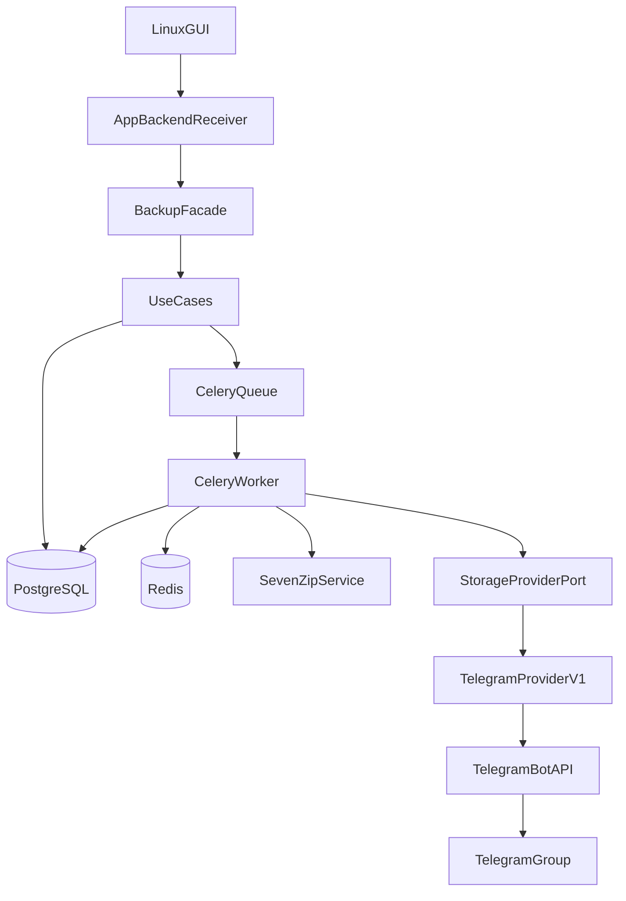

# telegram-uploader

Linux desktop backup into messenger storage. v1 ships Telegram only. The core speaks `StorageProviderPort`, so you can add Max or VK adapters later.

Docs: [PROJECT.md](docs/PROJECT.md) · [BACKLOG.md](docs/BACKLOG.md) · [ONION_ARCHITECTURE.md](docs/ONION_ARCHITECTURE.md)

## Backup flow

You pick files in the GUI (English UI; `display_name` lands at enqueue). Workers encrypt and split archives with 7z, upload volumes to a Telegram group, and record state in PostgreSQL. Celery runs archive, upload, cleanup, and restore queues. The GUI calls `BackupFacade` only. Restore should download volumes and extract the original file; that path is unfinished.

## Status (June 2026)

| Area | State |
|------|-------|
| Onion layers: `domain` → `use_cases` → `infrastructure` → `application` | Done |
| Backup: GUI → workers → Telegram → `completed` | Done |
| Restore download (Bot API) | Fails with HTTP 404 |
| Restore extract (7z → original file) | Missing |
| Telegram Client API (MTProto) | Planned ([migration](docs/TELEGRAM_CLIENT_API_MIGRATION.md)) |
| CI: ruff, mypy, pytest | Partial ([workflow](.github/workflows/ci.yml)) |
| CD: `.deb` package + upgrades | Planned ([packaging](docs/PROJECT.md#packaging--cd-p005--planned)) |
| `import-linter`, observation layer | Missing |

Active refactor order: `use_cases`, then `infrastructure`, then `application`. Details live in the backlog.

## Setup from scratch

You need Linux, Docker, Docker Compose, Python 3.12+, Tkinter, and Git.

### 1. Clone and install Python deps

```bash
git clone --recurse-submodules git@github.com:RomFuture/telegram-uploader.git
cd telegram-uploader
# if you already cloned without submodules:
# git submodule update --init --recursive

python3 -m venv .venv
.venv/bin/pip install -e ".[dev]"
```

### 2. Telegram: API id and hash

These feed the local `telegram-bot-api` container (large file uploads).

1. Open [my.telegram.org](https://my.telegram.org) and log in with your phone number.
2. Open **API development tools**.
3. Create an app (any name).
4. Copy **api_id** and **api_hash** into `.env` as `TELEGRAM_API_ID` and `TELEGRAM_API_HASH`.

### 3. Telegram: bot token

1. In Telegram, open [@BotFather](https://t.me/BotFather).
2. Send `/newbot`, pick a display name and a `@username`.
3. Copy the token BotFather returns.
4. Put it in `.env` as `TELEGRAM_BOT_TOKEN`.

### 4. Telegram: backup group and chat id

Backup volumes land in one group. The bot must post documents there.

1. Create a **private group** in Telegram (v1 does not use topics).
2. Add your bot to the group.
3. Make the bot an **admin** with permission to send messages and files.
4. Send any message in the group (so the chat exists for the API).
5. Resolve the numeric **chat id** and set `TELEGRAM_TARGET_CHAT_ID` in `.env`.

Common ways to get the id:

- Forward a message from the group to [@userinfobot](https://t.me/userinfobot) or [@RawDataBot](https://t.me/RawDataBot) and read the chat id from the reply.
- Or call `getUpdates` after messaging the group:

```bash
curl -s "https://api.telegram.org/bot<YOUR_BOT_TOKEN>/getUpdates" | python3 -m json.tool
```

Look for `"chat":{"id":...}`. Supergroups often look like `-1001234567890`.

### 5. Configure `.env`

```bash
cp .env.example .env
```

Edit at least these keys:

| Variable | Value |
|----------|-------|
| `TELEGRAM_BOT_TOKEN` | token from BotFather |
| `TELEGRAM_API_ID` | from my.telegram.org |
| `TELEGRAM_API_HASH` | from my.telegram.org |
| `TELEGRAM_TARGET_CHAT_ID` | numeric group id |
| `TELEGRAM_BOT_API_URL` | `http://localhost:8081` (default; matches compose) |
| `POSTGRES_PORT` | `5433` on the host if you already run Postgres on 5432 |

Leave `ARCHIVE_ENCRYPTION_KEY` empty to auto-generate per session in the GUI, or set a fixed passphrase.

Files you back up must live under `HOST_SOURCE_MOUNT` (default: your `$HOME`). Docker workers mount that path read-only at the same location inside the container.

### 6. Run

```bash
./scripts/run.sh
```

The script builds and starts Postgres, Redis, `telegram-bot-api`, Celery workers, restarts workers to pick up code changes, then opens the Tkinter GUI on the host.

Manual equivalent:

```bash
docker compose up -d --build
PYTHONPATH=src .venv/bin/python -m application.gui
```

### 7. First backup (smoke)

1. In the GUI: **Start Session** (profile name + optional encryption key).
2. **Add File** → pick a file under `$HOME` → enter a **display name** (this is the label you will see on volumes in Telegram).
3. **Start Backup** → **Refresh Progress**.
4. Check the target group: you should see `your-display-name.7z.001` (or more parts for large files).
5. Tail workers: `docker compose logs -f celery-worker-archive-1`.

Restore from the app is not reliable yet. Download volumes from the group by hand if you need them back.

> **Planned:** one-click onboarding in the GUI (bot creation, API credentials, group wiring, `.env` generation). Tracked under [Roadmap → Onboarding automation](#onboarding-automation-planned).

## Architecture



Layers: `application` → `infrastructure` → `use_cases` → `domain`. The GUI must not import infrastructure.

## Stack

| Path | Role |
|------|------|
| `src/domain/` | Entities, statuses, invariants |
| `src/use_cases/` | Use cases, `StorageProviderPort` |
| `src/infrastructure/` | DB, 7z, Celery, Telegram provider, facade, bootstrap |
| `src/application/` | `backend_receiver`, Tkinter GUI |
| Docker | Postgres, Redis, workers, `telegram-bot-api` |

## Checks

```bash
.venv/bin/pytest -m "not integration" -v
.venv/bin/ruff check src tests && .venv/bin/mypy src
docker compose logs -f celery-worker-archive-1
```

## More docs

| File | Contents |
|------|----------|
| [docs/PROJECT.md](docs/PROJECT.md) | Overview, packaging/CD |
| [docs/BACKLOG.md](docs/BACKLOG.md) | Open work |
| [docs/INTERNAL_SPEC.md](docs/INTERNAL_SPEC.md) | Encryption, `display_name`, UI language |
| [docs/ONION_ARCHITECTURE.md](docs/ONION_ARCHITECTURE.md) | Layers and imports |
| [docs/TELEGRAM_CLIENT_API_MIGRATION.md](docs/TELEGRAM_CLIENT_API_MIGRATION.md) | Bot API → Client API |

---

## Roadmap

### Onboarding automation (planned)

Today you create the bot, API app, group, and `.env` by hand (see [Setup from scratch](#setup-from-scratch)). Target UX:

| Task | State |
|------|-------|
| GUI wizard: link my.telegram.org, paste or store API id/hash | Open |
| Bot creation flow or guided BotFather steps | Open |
| Pick or create backup group; resolve `TELEGRAM_TARGET_CHAT_ID` | Open |
| Write `.env` / app config; validate with provider healthcheck | Open |
| Client API: phone login + session file (replaces manual bot setup) | Open ([migration](docs/TELEGRAM_CLIENT_API_MIGRATION.md)) |

### P-demo

| Task | State |
|------|-------|
| `scripts/run.sh`: Docker + GUI | Done |
| `.github/workflows/ci.yml` | Partial |
| README setup from scratch (bot, keys, group, smoke) | Done |
| Backup happy path | Done |
| Client API / restore for demo | Open |

### P0.05 Packaging & CD

| Task | State |
|------|-------|
| CD pipeline: `.deb` on release tag | Open |
| Safe upgrade order (stop workers → migrate → image → start) | Open ([spec](docs/PROJECT.md)) |
| Version lock: deb = `pyproject.toml` = image tag = migrations | Open |

### P0 Architecture cleanup

Work order: `use_cases` → `infrastructure` → `application`.

| Stage | Work | State |
|-------|------|-------|
| P0.1 | Ports/records audit, restore refs for Client API, failed-status in use cases, dedupe backup/restore | Open |
| P0.2 | Bootstrap/facade, Client API provider, structured logging, rollback on failure | Open |
| P0.3 | Thin `backend_receiver`, GUI errors, failed/stuck UI, settings, restore UX | Open |

### P1 Restore end-to-end

| Task | State |
|------|-------|
| Download volumes by `part_number` | Open |
| 7z decrypt/extract with session key | Open |
| Write to user `dest_path` (fix staging bug) | Open |
| Restore success / `failed` statuses | Open |
| Resume downloads | Open (low priority) |

### P2 Observation & CI

| Task | State |
|------|-------|
| `import-linter` layer contracts | Open |
| CI `lint-imports` step | Open |
| `src/observation/health.py` | Open |
| `logs/` in `.gitignore` | Open |

### P3 Integration tests

| Task | State |
|------|-------|
| `tests/test_worker_pipeline_integration.py` in Docker | Open |
| `tests/test_repositories_integration.py` on live Postgres | Open |
| Live Telegram smoke after Client API | Open |

### P4 Domain (deferred)

| Task | State |
|------|-------|
| Generic `ensure` / `mark` with `@overload` | Open |
| Scenario-first public API | Open |
| Merge `guards.py` + `scenarios.py` if it pays off | Open |
| Audit `domain/__init__.py` exports | Open |

### P5 Docs

| Task | State |
|------|-------|
| [ONION_ARCHITECTURE.md](docs/ONION_ARCHITECTURE.md): Client API in stack | Open |
| [IMPLEMENTATION_GUIDE.md](IMPLEMENTATION_GUIDE.md): archive or trim | Open |

### After v1

| Task | State |
|------|-------|
| Max / VK adapters | Open |
| Provider compatibility matrix | Open |
| Contract tests per provider | Open |
| Session logs under `logs/sessions/<session_id>/` | Open |
| Prometheus / Grafana | Open |
| Kubernetes for workers + Postgres | Open |

### Out of scope for v1

- Telegram topics (`message_thread_id`)
- Moving user files into a service directory
- Max / VK adapters (port only today)
