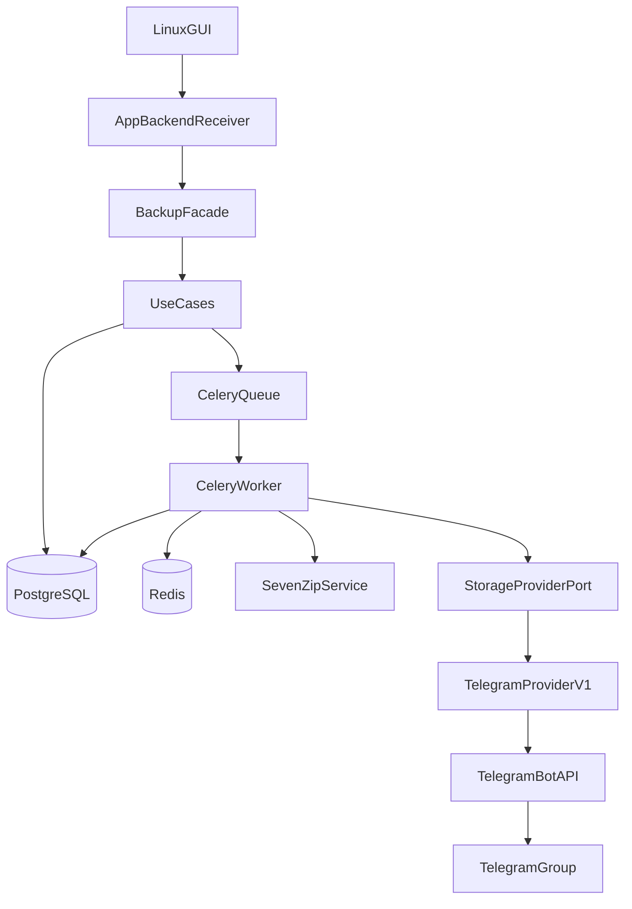

# telegram-uploader

Linux desktop backup into messenger storage. v1 ships Telegram only. The core speaks `StorageProviderPort`, so you can add Max or VK adapters later.

Docs: [PROJECT.md](docs/PROJECT.md) (architecture + refactor plan) · [BACKLOG.md](docs/BACKLOG.md)

## Backup flow

You pick files in the GUI (English UI; `display_name` lands at enqueue). Workers encrypt and split archives with 7z, upload volumes to a Telegram group, and record state in PostgreSQL. Celery runs archive, upload, cleanup, and restore queues. The GUI calls `BackupFacade` only. Restore should download volumes and extract the original file; that path is unfinished.

## Status (June 2026)

| Area | State |
|------|-------|
| Onion layers: `domain` → `use_cases` → `infrastructure` → `application` | Done |
| Backup: GUI → workers → Telegram → `completed` | Done |
| Restore download (Bot API) | Fails with HTTP 404 |
| Restore extract (7z → original file) | Missing |
| Telegram Client API (MTProto) | Planned ([migration](docs/TELEGRAM_CLIENT_API_MIGRATION.md)) |
| CI: ruff, mypy, pytest, lint-imports | Done ([workflow](.github/workflows/ci.yml)) |
| CD: `.deb` on tag `v*` | Done ([release](.github/workflows/release.yml)) |

**Start here (maintainer):** [docs/PROJECT.md](docs/PROJECT.md) — architecture, refactor PR plan (R2–R8), gate/smoke rules.

Active work: **Phase 1 refactor** (narrow API, drop facade hop). Open features → [BACKLOG.md](docs/BACKLOG.md).

## Setup from scratch

You need Linux, Docker, Docker Compose, Python 3.12+, Tkinter, and Git.

```bash
git clone --recurse-submodules git@github.com:RomFuture/telegram-uploader.git
cd telegram-uploader
# if you already cloned without submodules:
# git submodule update --init --recursive

python3 -m venv .venv
.venv/bin/pip install -e ".[dev]"

cp .env.example .env
```

**Telegram (v1, Bot API):** backup still runs through a **bot** and a local **`telegram-bot-api`** container. Fill `.env` using **[docs/TELEGRAM_SETUP.md](docs/TELEGRAM_SETUP.md)** before first run.

| Variable | Source |
|----------|--------|
| `TELEGRAM_API_ID`, `TELEGRAM_API_HASH` | [my.telegram.org](https://my.telegram.org) — powers `telegram-bot-api` in Docker |
| `TELEGRAM_BOT_TOKEN` | [@BotFather](https://t.me/BotFather) |
| `TELEGRAM_TARGET_CHAT_ID` | Numeric id of your private backup group |

Then run:

```bash
./scripts/run.sh
```

The script checks `.env` for placeholder/missing Telegram keys **before** `docker compose up`, then starts Postgres, Redis, `telegram-bot-api`, Celery workers, restarts workers to pick up code changes, and opens the Tkinter GUI.

Smoke: Start Session → Add File → Start Backup → Refresh Progress. Volumes should appear in your Telegram group as `display-name.7z.001`. See [TELEGRAM_SETUP.md § First backup](docs/TELEGRAM_SETUP.md#6-first-backup) and worker logs: `docker compose logs -f celery-worker-archive-1`.

## Install from .deb (Ubuntu 24.04 amd64)

Download the latest `.deb` from [GitHub Releases](https://github.com/RomFuture/telegram-uploader/releases) (built automatically on tag `v*`, version synced with `pyproject.toml`).

```bash
sudo dpkg -i telegram-uploader_0.1.0_amd64.deb
sudo apt -f install
telegram-uploader --setup
telegram-uploader           # GUI → Settings → Client API
telegram-uploader-login     # after credentials configured (once)
```

Config: `~/.config/telegram-uploader/.env` (created on first run). Application files: `/opt/telegram-uploader/`. See [PROJECT.md § Packaging](docs/PROJECT.md#packaging) for upgrade steps.

Local build (requires [nfpm](https://nfpm.goreleaser.com/)):

```bash
./scripts/build_deb.sh
```

### `telegram-bot-api` fails to start

If `docker compose up` reports `dependency telegram-bot-api failed to start` (container exit 1), `.env` still has empty or placeholder values — usually `TELEGRAM_API_ID` / `TELEGRAM_API_HASH` left as `change_me` after `cp .env.example .env`.

```bash
docker compose logs telegram-bot-api
# → "You must provide valid api-id and api-hash obtained at https://my.telegram.org"
```

Fix: set real `api_id` (numeric) and `api_hash` from [my.telegram.org](https://my.telegram.org), plus bot token and group id — see [TELEGRAM_SETUP.md](docs/TELEGRAM_SETUP.md). `./scripts/run.sh` should catch this early and point to the same guide.

### Telegram provider: Bot API now, Client API next

v1 backup uses **Bot API** (`TelegramProviderV1` + `telegram-bot-api`). **Restore download is unreliable** on this stack (HTTP 404). The planned replacement is **Client API (MTProto)** with a user session — different auth (phone login, session file), no `telegram-bot-api` container, stable upload/download from the target group.

We are **not investing further in Bot API onboarding polish** (wizard, extra setup automation) until that migration lands. For now, manual [TELEGRAM_SETUP.md](docs/TELEGRAM_SETUP.md) is enough to run backup; active plan: **[TELEGRAM_CLIENT_API_MIGRATION.md](docs/TELEGRAM_CLIENT_API_MIGRATION.md)**.

## Architecture



Layers: `application` → `infrastructure` → `use_cases` → `domain`. The GUI must not import infrastructure.

## Stack

| Path | Role |
|------|------|
| `src/domain/` | Entities, statuses, invariants |
| `src/use_cases/` | Use cases, `StorageProviderPort` |
| `src/infrastructure/` | DB, 7z, Celery, Telegram provider, facade, bootstrap |
| `src/application/` | `backend_receiver`, Tkinter GUI |
| Docker | Postgres, Redis, workers, `telegram-bot-api` |

## Checks

```bash
.venv/bin/pytest -m "not integration" -v
.venv/bin/ruff check src tests && .venv/bin/mypy src
docker compose logs -f celery-worker-archive-1
```

## More docs

| File | Contents |
|------|----------|
| [docs/PROJECT.md](docs/PROJECT.md) | **Architecture, refactor plan, gate/smoke, stack** |
| [docs/BACKLOG.md](docs/BACKLOG.md) | Open work |
| [docs/INTERNAL_SPEC.md](docs/INTERNAL_SPEC.md) | Encryption, `display_name`, UI language |
| [docs/TELEGRAM_SETUP.md](docs/TELEGRAM_SETUP.md) | Bot, API keys, group, `.env`, first backup |
| [docs/TELEGRAM_CLIENT_API_MIGRATION.md](docs/TELEGRAM_CLIENT_API_MIGRATION.md) | Bot API → Client API |

---

## Roadmap

### Onboarding automation (deferred until Client API)

Today you create the bot, API app, group, and `.env` by hand ([TELEGRAM_SETUP.md](docs/TELEGRAM_SETUP.md)). `./scripts/run.sh` validates required keys before compose. **Bot API–specific wizard work is on hold** — credentials and auth will change with Client API (phone + session instead of bot token + local Bot API server).

| Task | State |
|------|-------|
| `.env` preflight in `scripts/run.sh` | Done |
| GUI wizard for Bot API (my.telegram.org, BotFather, group id) | **Deferred** — superseded by Client API plan |
| Client API: phone login + session file | Open ([migration](docs/TELEGRAM_CLIENT_API_MIGRATION.md)) |
| Write `.env` / app config from wizard; provider healthcheck | Open (after Client API) |

### P-demo

| Task | State |
|------|-------|
| `scripts/run.sh`: Docker + GUI | Done |
| `.github/workflows/ci.yml` | Partial |
| README + [TELEGRAM_SETUP.md](docs/TELEGRAM_SETUP.md) | Done |
| Backup happy path | Done |
| Client API / restore for demo | Open |

### P0.05 Packaging & CD

| Task | State |
|------|-------|
| CD pipeline: `.deb` on release tag | Done ([`.github/workflows/release.yml`](.github/workflows/release.yml)) |
| `packaging/` + `telegram-uploader` launcher | Done |
| Safe upgrade order (stop workers → migrate → image → start) | Documented ([PROJECT.md](docs/PROJECT.md#packaging)) |
| Version lock: deb = `pyproject.toml` = tag `v*` | Done (`scripts/check_release_version.sh`) |

### P0 Architecture cleanup

Work order: `use_cases` → `infrastructure` → `application`.

| Stage | Work | State |
|-------|------|-------|
| P0.1 | Ports/records audit, restore refs for Client API, failed-status in use cases, dedupe backup/restore | Open |
| P0.2 | Bootstrap/facade, Client API provider, structured logging, rollback on failure | Open |
| P0.3 | Thin `backend_receiver`, GUI errors, failed/stuck UI, settings, restore UX | Open |

### P1 Restore end-to-end

| Task | State |
|------|-------|
| Download volumes by `part_number` | Open |
| 7z decrypt/extract with session key | Open |
| Write to user `dest_path` (fix staging bug) | Open |
| Restore success / `failed` statuses | Open |
| Resume downloads | Open (low priority) |

### P2 Observation & CI

| Task | State |
|------|-------|
| `import-linter` layer contracts | Open |
| CI `lint-imports` step | Open |
| `src/observation/health.py` | Open |
| `logs/` in `.gitignore` | Open |

### P3 Integration tests

| Task | State |
|------|-------|
| `tests/test_worker_pipeline_integration.py` in Docker | Open |
| `tests/test_repositories_integration.py` on live Postgres | Open |
| Live Telegram smoke after Client API | Open |

### P4 Domain (deferred)

| Task | State |
|------|-------|
| Generic `verify` / `mark` with `@overload` | Open |
| Scenario-first public API | Open |
| Merge `guards.py` + `scenarios.py` if it pays off | Open |
| Audit `domain/__init__.py` exports | Open |

### P5 Docs

| Task | State |
|------|-------|
| [PROJECT.md](docs/PROJECT.md): sync with code after R5–R8 | Open |

### After v1

| Task | State |
|------|-------|
| Max / VK adapters | Open |
| Provider compatibility matrix | Open |
| Contract tests per provider | Open |
| Session logs under `logs/sessions/<session_id>/` | Open |
| Prometheus / Grafana | Open |
| Kubernetes for workers + Postgres | Open |

### Out of scope for v1

- Telegram topics (`message_thread_id`)
- Moving user files into a service directory
- Max / VK adapters (port only today)
