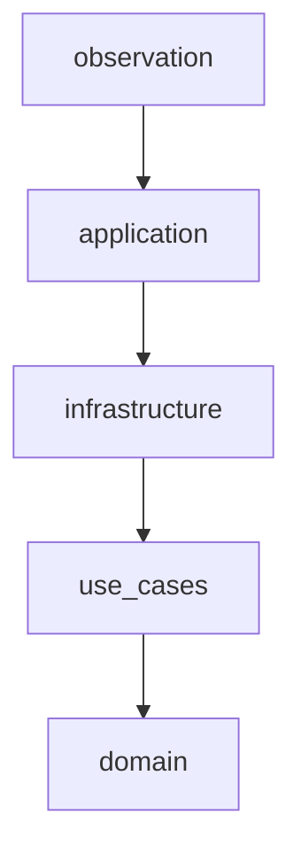
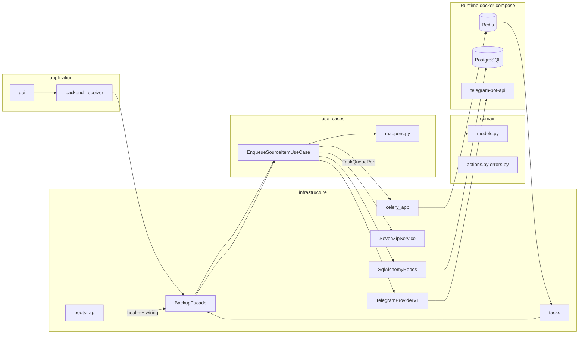
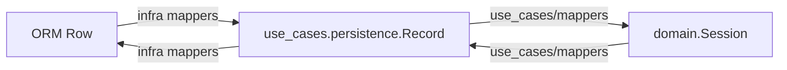
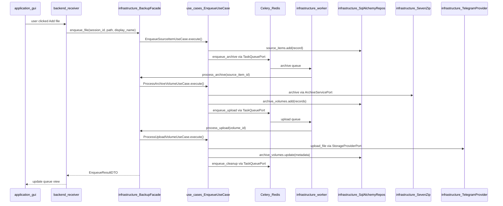

# Onion Architecture — целевая структура проекта

Документ фиксирует **как должны быть устроены слои**, папки и зависимости в `telegram-uploader`.

Это **источник истины по архитектуре**. При расхождении с [IMPLEMENTATION_GUIDE.md](../IMPLEMENTATION_GUIDE.md) (в т.ч. §2.1) **приоритет у этого файла**.

Связанные документы:

- [PROJECT.md](PROJECT.md) — обзор проекта и индекс документации.
- [BACKLOG.md](BACKLOG.md) — что ещё не реализовано.
- [INTERNAL_SPEC.md](INTERNAL_SPEC.md) — продуктовые правила (язык UI, шифрование, `display_name`).
- [TELEGRAM_CLIENT_API_MIGRATION.md](TELEGRAM_CLIENT_API_MIGRATION.md) — план замены Bot API на Client API.
- [ONION_LAYER_IMPLEMENTATION.md](ONION_LAYER_IMPLEMENTATION.md) — gate, smoke, цикл имплементации по слоям.

---

## 1) Принцип: линейный стек слоёв

Проект строится как **строгий линейный стек**: в центре — `domain` (`src/domain/`), затем `use_cases`, `infrastructure`, `application`, `observation`. Это не forked-onion (где `application` и `infrastructure` оба смотрят в `use_cases` параллельно), а **цепочка соседей**.

### Правило соседних слоёв (главное)

**Каждый слой импортирует только одного непосредственного соседа внутрь** (ближе к ядру).  
**Ни один слой не импортирует слои выше себя** — все: `domain`, `use_cases`, `infrastructure`, `application`.

Цепочка (от ядра к периферии):

```
domain  →  use_cases  →  infrastructure  →  application  →  observation
```

**Запрос вниз** (к ядру):

```
application  →  infrastructure  →  use_cases  →  domain
```

**Ответ вверх** (к пользователю; `domain` наружу не отвечает — там нет исходящих вызовов):

```
use_cases  →  infrastructure  →  application
```

| Слой | Импортирует (сосед внутрь) | Вызывается из (сосед снаружи) |
|------|---------------------------|--------------------------------|
| `domain` (ядро) | только stdlib | `use_cases` |
| `use_cases` (мозг) | `domain` | `infrastructure` |
| `infrastructure` | `use_cases` | `application`, Celery worker entrypoints |
| `application` | `infrastructure` | `observation`, пользователь (GUI) |
| `observation` | любой слой | — (снаружи runtime: тесты, CI, health) |

**Критично:** `infrastructure` **не** импортирует `domain`. ORM-строки маппятся в **persistence-записи** (`use_cases/persistence.py`), а `use_cases` переводит записи ↔ доменные сущности (`use_cases/mappers.py`, `use_cases/repositories/loading.py`).

**Критично:** `application` **не** импортирует `use_cases` и `domain`. GUI и `backend_receiver` ходят только в **`infrastructure.facade`**.

Слой взаимодействует с соседом через **публичный API** (`BackupFacade`, порты, persistence-записи). Внутреннему слою **плевать**, кто вызывает — GUI, Celery worker или тест: для него любой вызов это просто **вводные данные**.



### Разрешённые зависимости

| Откуда | Куда | Как |
|--------|------|-----|
| `use_cases` | `domain` | бизнес-оркестрация; маппинг persistence-запись ↔ домен |
| `infrastructure` | `use_cases` | `BackupFacade`, реализации портов, wiring use cases, ORM ↔ `persistence.*` |
| `application` | `infrastructure` | `backend_receiver` → `BackupFacade`; GUI не знает про use cases |
| `observation` | любой слой | тесты, линтеры, health-check **снаружи** runtime |

### Запрещённые зависимости

| Зависимость | Почему ломает стек |
|-------------|-------------------|
| `application → use_cases` | UI перепрыгивает через `infrastructure` |
| `application → domain` | UI перепрыгивает через `infrastructure` и `use_cases` |
| `infrastructure → domain` | адаптер перепрыгивает через `use_cases` |
| `use_cases → infrastructure` | wiring делает `infrastructure` при вызове use cases |
| `use_cases → application` | мозг не знает про UI |
| `domain → *` (кроме stdlib) | ядро не знает о портах, persistence, infrastructure, use_cases |
| `infrastructure → application` | руки не знают про UI |
| `use_cases → sqlalchemy`, `urllib`, `celery` | I/O-детали не в мозге |
| Любой слой → слой **выше** себя | нарушение соседства |

**Composition root** — единственное место склейки портов и реализаций: [`src/infrastructure/bootstrap.py`](../src/infrastructure/bootstrap.py).

**Публичный API для application:** [`src/infrastructure/facade.py`](../src/infrastructure/facade.py) (`BackupFacade`) — единая точка входа: `enqueue_file`, `start_session`, `get_progress`, … *(facade — Phase 6)*.

### Где живёт фоновый конвейер

GUI **не выполняет** тяжёлую работу (7z, upload, download). Цепочка:

1. `gui` → `backend_receiver` → `infrastructure.facade`
2. `facade` создаёт use case, вызывает `.execute()`
3. use case через `TaskQueuePort` ставит задачу в **Celery** / **Redis**
4. **воркер** (`infrastructure/worker/`) — тот же путь: entrypoint → use case, без `application`

Бизнес-решения — в `use_cases`. `infrastructure` — исполнение и wiring.



---

## 2) Пять слоёв

Описание идёт **от ядра к периферии** (domain → … → observation).

### Слой 1 — `domain` (центр)

**Роль:** самый внутренний слой. Top-level пакет [`src/domain/`](../src/domain/). Только модели, статусы, `create` / `verify` / `mark`, `DomainError`. Без пайплайна, без Celery, без restore-логики.

| Сущность | Назначение |
|----------|------------|
| `Session` | сессия бэкапа, ключ шифрования, статус |
| `SourceItem` | файл в очереди (`source_path`, `display_name`, статус) |
| `ArchiveVolume` | том архива + provider metadata для restore |

Статусы: `SessionStatus`, `SourceItemStatus`, `ArchiveVolumeStatus`.

**Пакет:** [`src/domain/`](../src/domain/) — единая точка входа через `__init__.py`:

| Модуль | Роль |
|--------|------|
| `models.py` | entity + enums + internal `.create()` |
| `errors.py` | `DomainError` + factory classmethods |
| `actions.py` | `create_*`, `verify_*`, `mark_*`, `is_*` |

Публичный API: `create_*`, `mark_*`, `verify_*`, `is_*`, status enums, `DomainError`.

**Не в domain:** not-found → `repositories/loading.py`; backup gates → `backup/gates.py`; idempotency → `backup/idempotency.py`; restore refs → `restore/refs.py`.

| Можно | Нельзя |
|-------|--------|
| `dataclass`, `Enum`, чистые функции над моделями | SQL, HTTP, SQLAlchemy, Celery, Telegram API |
| импорт только stdlib | импорт `use_cases`, `ports`, `persistence`, `infrastructure`, `application` |

**Готовность:** ✅ [`src/domain/`](../src/domain/) — **слой закрыт** (2026-06). Дальнейшая чистка: `use_cases` → `infrastructure` → `application` ([BACKLOG.md](BACKLOG.md)).

---

### Слой 2 — `use_cases` (мозг)

**Роль:** оркестрация сценариев через порты. Сосед снаружи для `domain` — импортирует `import domain as domain`.

**Пакет:** [`src/use_cases/`](../src/use_cases/)

| Можно | Нельзя |
|-------|--------|
| `import domain as domain` в use case-классах | `from domain.models import ...` в `backup/` / `session/` / `restore/` |
| `use_cases/mappers.py`, `repositories/loading.py` | `import domain` из `infrastructure` / `application` |
| `domain.verify_*`, `domain.create_*`, `domain.mark_*` | `raise *NotFound` в use cases (кроме `repositories/loading.py`) |
| `backup/gates.py`, `backup/idempotency.py`, `restore/refs.py` | pipeline-правила и идемпотентность в `domain` |
| `persistence.py` — записи для контракта с infrastructure | `infrastructure.*`, `application.*` |
| `Protocol` (порты репозиториев и сервисов) | SQLAlchemy, `psycopg`, `urllib`, `7z` subprocess |
| DTO (`UploadResult`, `ProviderFileInfo`, …) | конкретные реализации `TelegramProviderV1` |
| `@dataclass` use case с инжектом портов | прямой SQL |

**Готовность:** ✅ use case-классы в `backup/`, `session/`, `restore/`; порты в `ports/`; Protocol репозиториев в `repositories/`.

---

### Слой 3 — `infrastructure` (руки + composition root)

**Роль:** единственная точка входа для `application`; фактическая работа — БД, архивация, провайдер, Celery. Создаёт use cases, инжектит реализации портов, вызывает `.execute()`, возвращает UI-DTO наверх.

| Модуль | Назначение |
|--------|------------|
| `infrastructure/bootstrap.py` | composition root: config, миграции, health, `build_facade()` |
| `infrastructure/facade.py` | `BackupFacade` — публичный API для `application` и worker entrypoints |
| `infrastructure/db/` | SQLAlchemy ORM, мапперы, миграции, реализации `*Repository` |
| `infrastructure/archive/` | `SevenZipService` — шифрование и нарезка томов |
| `infrastructure/providers/` | `TelegramProviderV1` и будущие `Max`/`VK` |
| `infrastructure/worker/` | **Celery** — `celery_app.py`, `tasks.py`; маршрутизация очередей, воркеры |
| `infrastructure/config.py` | env: `POSTGRES_*`, `REDIS_*`, `TELEGRAM_*`, `ARCHIVE_*` |

**Фоновый конвейер:** `use_cases` решает *что* сделать; `infrastructure/worker/tasks.py` — тонкий entrypoint: `build_facade()` → `BackupFacade` → use case `.execute()`.

**Пакет:** [`src/infrastructure/`](../src/infrastructure/)

| Можно | Нельзя |
|-------|--------|
| `use_cases.*` (порты, persistence, use case-классы) | `use_cases.domain` (модели домена) |
| создавать use cases, инжектить реализации портов | `application.*` |
| SQLAlchemy, Celery, HTTP, subprocess | бизнес-правила backup (статусы, идемпотентность шагов) |
| ORM ↔ persistence-запись в `infrastructure/db/mappers.py` | |

**Готовность:** backup pipeline wired (`facade`, `bootstrap`, workers). Restore download — Client API migration ([BACKLOG.md](BACKLOG.md)).

---

### Слой 4 — `application` (лицо для пользователя)

**Роль:** GUI (English-only) и **прослойка** между пользователем и `infrastructure`. Переводит клики в вызовы `BackupFacade`, показывает UI-DTO наверх. Не знает про use cases, domain, SQL, Celery.

| Компонент | Назначение |
|-----------|------------|
| `application/gui/` | Unlock, file explorer, progress drawer, restore, settings — см. [ONION_LAYER_IMPLEMENTATION.md §7](ONION_LAYER_IMPLEMENTATION.md#7-целевой-gui-application--p03) |
| `application/backend_receiver.py` | прослойка: событие GUI → `infrastructure.facade` → UI-DTO |

**Пакет:** [`src/application/`](../src/application/)

Папка `src/presentation/` **удалена** (2025-06, Phase 4.2); GUI — в `application/gui/` *(Phase 7)*.

~~`application/bootstrap.py`~~ — **удалён** (Phase 4.2); bootstrap в `infrastructure/bootstrap.py`.

| Можно | Нельзя |
|-------|--------|
| `infrastructure.facade` (через `backend_receiver`) | `use_cases.*`, `use_cases.domain.*` |
| UI-строки на английском ([INTERNAL_SPEC](INTERNAL_SPEC.md)) | прямой SQL, Celery, Telegram API |
| | бизнес-логика ретраев и lifecycle |
| | `observation.*` в runtime-коде |

**Готовность:** ~0% GUI; bootstrap ✅ в `infrastructure/`.

---

### Слой 5 — `observation` (кибернетика)

**Роль:** наблюдение за системой — качество кода, логи, health, метрики. Не участвует в backup-логике, оборачивает runtime снаружи.

**Готовность:** 0% как выделенный слой; базовый tooling уже в репозитории.

Подробнее — §5.

---

## 3) Структура каталогов

Слои — **параллельные top-level пакеты** в `src/` (`domain`, `use_cases`, `infrastructure`, `application`). Логическая глубина задаётся **правилами импортов**.

При чтении документации порядок слоёв: **domain → use_cases → infrastructure → application → observation**.

### Целевое дерево

```
src/
  domain/                     # слой 1 (ядро)
    models.py                 # Session, SourceItem, ArchiveVolume + enums
    errors.py                 # DomainError
    actions.py                # create_*, verify_*, mark_*

  use_cases/
    persistence.py            # SessionRecord, SourceItemRecord, ArchiveVolumeRecord
    mappers.py                # persistence record ↔ domain entity
    repositories/
      loading.py              # get + map + not-found raises
    ports/
      storage_provider.py     # StorageProviderPort (Protocol)
      archive_service.py      # (future) ArchiveServicePort
    repositories/
      session.py              # SessionRepository (Protocol) — работает с SessionRecord, не с domain
      source_item.py          # SourceItemRepository (Protocol)
      archive_volume.py       # ArchiveVolumeRepository (Protocol)
    dto.py                    # UploadResult, ProviderFileInfo, ...
    backup/
      gates.py                # require_* — статус перед шагом
      idempotency.py          # decide_*_on_retry — повторный запуск шага
      ...                     # ProcessArchiveVolumeUseCase, ...
    restore/
      refs.py                 # restore_download_ref
      ...                     # DownloadVolumeUseCase, ...
    session/                  # (future) CreateSessionUseCase, PauseSessionUseCase

  infrastructure/
    bootstrap.py              # composition root: config, миграции, health, build_facade()
    facade.py                 # BackupFacade — публичный API для application
    db/
      orm.py                  # UploadSessionRow, SourceItemRow, ArchiveVolumeRow
      mappers.py              # ORM row ↔ use_cases.persistence.*Record (без use_cases.domain)
      engine.py               # build_db_session_factory, db_session_scope
      sqlalchemy_repositories.py  # реализации Protocol; отдаёт/принимает SessionRecord и т.д.
      migrate.py
      migrations/
    archive/
      seven_zip_service.py
    providers/
      telegram_provider.py    # TelegramProviderV1 — единственное место HTTP к Bot API
    worker/
      celery_app.py
      tasks.py
    config.py

  application/
    backend_receiver.py       # GUI → infrastructure.facade
    gui/                      # Linux UI, English-only

tests/                        # observation: unit / integration / contract
.github/                      # observation: CI
pyproject.toml                # observation: ruff, mypy, pytest
docs/

  (future) src/observation/
    logging.py                # structured logs, session_id correlation
    health.py                 # readiness probes
    metrics.py                # pipeline counters
```

### Текущее vs целевое (кратко)

| Сейчас | Цель |
|--------|------|
| `src/use_cases/repositories.py` — SQLAlchemy внутри | Protocol в `use_cases/repositories/`; реализация в `infrastructure/db/sqlalchemy_repositories.py` |
| `src/use_cases/ports.py` — Protocol + `TelegramProviderV1` | Protocol в `use_cases/ports/`; реализация в `infrastructure/providers/telegram_provider.py` |
| `src/presentation/` — пустой дубль | ✅ удалён (Phase 4.2); GUI в `application/gui/` |
| ~~`src/application/bootstrap.py`~~ | ✅ перенесён в `infrastructure/bootstrap.py` (Phase 4.2) |
| нет `infrastructure/facade.py` | `BackupFacade` — единая точка входа для application |
| ~~`src/domain/` как legacy top-level~~ | **`src/domain/`** — канонический слой 1 ✅ (отделён от `use_cases` с 2025-06) |
| ~~`use_cases/domain/`~~ | удалён; domain — равноправный пакет |
| нет use case-классов | `use_cases/backup/`, `restore/`, `session/` |

---

## 4) Порты и реализации

**Порт** — контракт в `use_cases` (`Protocol` + `@dataclass` frozen use case с инжектом). **Реализация** — класс в `infrastructure`, который этот Protocol выполняет.

### Граница persistence (почему infrastructure не трогает domain)

Репозитории в `use_cases` оперируют **persistence-записями** (`SessionRecord`, …), а не доменными `Session`. Use case внутри себя:

1. читает `SessionRecord` из репозитория;
2. маппит в `Session` через **`use_cases/mappers.py`** (`from domain.models import Session`);
3. применяет бизнес-правила;
4. маппит обратно в `SessionRecord` и сохраняет.

`infrastructure/db/sqlalchemy_repositories.py` знает только `use_cases.persistence` и ORM-строки. **Импорт `domain` в `infrastructure` запрещён.**



### Открытый техдолг

См. [BACKLOG.md](BACKLOG.md): Client API provider, restore extract, failed-status rollback, CI, GUI in container.

### Целевой поток: «забэкапить файл»



`application` знает только `BackupFacade` и UI-DTO.  
`infrastructure/facade.py` — wiring + вызов use cases.  
`use_cases` знает `domain` + persistence-записи + Protocol.  
Worker (`tasks.py`) — тот же `BackupFacade`, без участия `application`.

### Пример wiring (composition root)

```python
# infrastructure/bootstrap.py — единственное место склейки
def build_facade(cfg: AppConfig) -> BackupFacade:
    repos = SqlAlchemyRepositories.from_dsn(cfg.postgres_dsn)
    provider = TelegramProviderV1(bot_token=..., base_url=...)
    task_queue = CeleryTaskQueue()
    return BackupFacade(
        enqueue_source_item=EnqueueSourceItemUseCase(
            source_items=repos.source_items,
            task_queue=task_queue,
        ),
        process_archive=ProcessArchiveVolumeUseCase(...),
        # ...
    )
```

---

## 5) Слой `observation` — идеи

Observation не заменяет бизнес-логику: он **следит**, что система жива, предсказуема и проверяема.

### A. Базовый уровень (уже в репозитории)

| Инструмент | Назначение |
|------------|------------|
| `pytest` | unit (`use_cases.domain`, `use_cases` с фейками портов), integration (БД, Celery), contract (`StorageProviderPort`) |
| `ruff` | стиль, очевидные ошибки |
| `mypy` | типы на границах слоёв |
| `import-linter` (roadmap) | автозапрет: `application → use_cases`, `infrastructure → use_cases.domain`, `use_cases → infrastructure/application` в CI |

### B. Операционное наблюдение (v1 roadmap)

- Структурированные логи с `session_id` / `task_id` — см. [IMPLEMENTATION_GUIDE §9](../IMPLEMENTATION_GUIDE.md): `logs/sessions/<session_id>/`
- Health/readiness: PostgreSQL, Redis, `telegram-bot-api`, Celery workers (`archive`, `upload`, `cleanup`, `restore`)
- Счётчики пайплайна: `queued` / `archiving` / `uploading` / `failed` — для GUI (ETA, прогресс)
- Correlation ID через цепочку Celery-задач (один backup traceable end-to-end)

### C. Кибернетика / контроль (post-v1)

- Dead-letter и dashboard упавших Celery-задач
- Метрики rate-limit и retry по провайдеру
- Алерты на рост очереди `upload` или заполнение `ARCHIVE_CACHE_DIR`
- Audit log в БД: кто/когда enqueue, restore, смена статуса
- Периодический smoke провайдера (см. [IMPLEMENTATION_GUIDE §10](../IMPLEMENTATION_GUIDE.md) — live Telegram verification)

### Физическое размещение

| Сейчас | Позже |
|--------|-------|
| `tests/`, `pyproject.toml`, `.github/` | `src/observation/logging.py`, `health.py`, `metrics.py` |

Модули в `observation/` **без бизнес-правил** — только формат логов, пробы, счётчики.

---

## 6) Технологический стек и runtime

Слои onion — **логическая** организация кода. Ниже — **физические** сервисы и библиотеки, без которых приложение не работает. Всё перечисленное относится к **infrastructure** и **observation**, кроме вызова постановки задач из `use_cases` через порт.

### Карта: технология → слой → где в репозитории

| Технология | Роль | Слой | Файлы / сервисы |
|------------|------|------|-----------------|
| **Python 3.12+** | язык приложения | все | `pyproject.toml` |
| **PostgreSQL 16** | сессии, очередь `source_item`, тома, restore metadata | infrastructure | `infrastructure/db/`, `docker-compose.yml` → `postgres` |
| **SQLAlchemy 2** + **psycopg** | ORM-доступ к PostgreSQL | infrastructure | `orm.py`, `engine.py`, `sqlalchemy_repositories.py` (цель) |
| **Redis 7** | Celery **broker** и **result backend** | infrastructure (runtime) | `config.redis_url`, `docker-compose.yml` → `redis` |
| **Celery 5** | асинхронный конвейер: archive → upload → cleanup → restore | infrastructure | `infrastructure/worker/celery_app.py`, `tasks.py` |
| **7z** (`p7zip-full`) | шифрование и нарезка томов (`-t7z -mhe=on -v1999m`) | infrastructure | `infrastructure/archive/seven_zip_service.py`, `Dockerfile` |
| **telegram-bot-api** (local) | Bot API для больших файлов (не `api.telegram.org` напрямую) | infrastructure (runtime) | `docker-compose.yml` → `telegram-bot-api`, `TELEGRAM_BOT_API_URL` |
| **HTTP** (`urllib`) | upload/download через `TelegramProviderV1` | infrastructure | `infrastructure/providers/telegram_provider.py` (цель) |
| **Docker Compose** | подъём всего контура локально | observation / ops | `docker-compose.yml`, `Dockerfile` |
| **pytest / ruff / mypy** | качество и регрессии | observation | `tests/`, `pyproject.toml` |

### Celery + Redis — топология воркеров

**Redis** — единая точка: очередь задач и хранение результатов (`redis_url` в [`AppConfig`](../src/infrastructure/config.py)).

**Четыре очереди** (маршруты в [`celery_app.py`](../src/infrastructure/worker/celery_app.py)):

| Очередь | Назначение | Нагрузка |
|---------|------------|----------|
| `archive` | 7z: шифрование, split, запись в `ARCHIVE_CACHE_DIR` | CPU / disk |
| `upload` | отправка тома провайдеру (Telegram `sendDocument`) | network |
| `cleanup` | удаление temp после подтверждённого upload | fast local I/O |
| `restore` | скачивание томов и сборка архива | network |

**Пять процессов-воркеров** в [`docker-compose.yml`](../docker-compose.yml):

| Сервис | Очередь | Concurrency |
|--------|---------|-------------|
| `celery-worker-archive-1` | `archive` | 1 |
| `celery-worker-archive-2` | `archive` | 1 |
| `celery-worker-upload` | `upload` | 1 |
| `celery-worker-cleanup` | `cleanup` | 1 |
| `celery-worker-restore` | `restore` | 1 |

Два воркера на `archive` — чтобы параллельно архивировать разные `source_item`, не блокируя upload другого объекта.

**Задачи** ([`tasks.py`](../src/infrastructure/worker/tasks.py)) — по одной на стадию:

- `archive_volume` → `BackupFacade.process_archive_volume`
- `upload_volume` → `BackupFacade.process_upload_volume`
- `cleanup_volume` → `BackupFacade.process_cleanup_volume`
- `restore_volume` → `BackupFacade.process_restore_volume` (download only; extract — [BACKLOG.md](BACKLOG.md))

**Параллельный конвейер:** архивация `source_item` B может идти одновременно с upload `source_item` A и cleanup уже отправленных томов. Статусы в PostgreSQL — источник истины для GUI.

### Docker Compose — сервисы runtime

| Сервис | Образ / сборка | Зависимости |
|--------|----------------|-------------|
| `app` | Dockerfile → `python -m infrastructure.bootstrap` | postgres, redis, telegram-bot-api |
| `celery-worker-*` (×5) | тот же образ, разные `-Q` | redis |
| `postgres` | `postgres:16-alpine` | — |
| `redis` | `redis:7-alpine` | — |
| `telegram-bot-api` | `aiogram/telegram-bot-api` | — |

`infrastructure/bootstrap` проверяет PostgreSQL (миграции) и Redis (`ping`), собирает `BackupFacade`; воркеры стартуют после healthy Redis.

### Кеш архивации (`ARCHIVE_CACHE_DIR`)

Временные артефакты пайплайна (не в git):

```
/tmp/telegram_uploader/          # default; env ARCHIVE_CACHE_DIR
  <source_item_id>/
    raw/                         # тома от 7z; удаляются после копии в outgoing/
    outgoing/                    # тома с hashed именами для upload
    volume_manifest.json
```

Управляется `SevenZipService` + задачи `cleanup`; см. [IMPLEMENTATION_GUIDE](../IMPLEMENTATION_GUIDE.md) и [INTERNAL_SPEC](INTERNAL_SPEC.md).

### Переменные окружения (ключевые)

| Группа | Переменные | Назначение |
|--------|------------|------------|
| PostgreSQL | `POSTGRES_HOST`, `POSTGRES_PORT`, `POSTGRES_DB`, `POSTGRES_USER`, `POSTGRES_PASSWORD` | DSN для SQLAlchemy и миграций |
| Redis | `REDIS_HOST`, `REDIS_PORT`, `REDIS_DB` | Celery broker/backend |
| Telegram | `TELEGRAM_BOT_TOKEN`, `TELEGRAM_BOT_API_URL`, `TELEGRAM_TARGET_CHAT_ID`, `TELEGRAM_API_ID`, `TELEGRAM_API_HASH` | провайдер и local Bot API |
| Archive | `ARCHIVE_ENCRYPTION_KEY`, `ARCHIVE_CACHE_DIR` | шифрование 7z и путь кеша |

### Граница onion для Celery

| Правильно | Неправильно |
|-----------|-------------|
| `use_cases` вызывает `TaskQueuePort.enqueue_archive(source_item_id)` | `use_cases` импортирует `celery_app` и `.delay()` |
| `infrastructure/worker/tasks.py` — тонкий entrypoint: поднять DI, вызвать use case | бизнес-правила ретраев и смены статусов прямо в `tasks.py` |
| `application` читает статусы через `BackupFacade.get_progress()` | GUI опрашивает Redis или `use_cases` напрямую |

**Порт:** `TaskQueuePort` в `use_cases/ports/`; реализация `CeleryTaskQueue` в `infrastructure/worker/`.

---

## 7) Иерархия документов

| Документ | Вопрос |
|----------|--------|
| [PROJECT.md](PROJECT.md) | Обзор проекта, статус, индекс |
| [BACKLOG.md](BACKLOG.md) | Что **не** реализовано |
| [INTERNAL_SPEC.md](INTERNAL_SPEC.md) | **Что** обязан делать продукт |
| **ONION_ARCHITECTURE.md** (этот файл) | **Как** устроены слои |
| [TELEGRAM_CLIENT_API_MIGRATION.md](TELEGRAM_CLIENT_API_MIGRATION.md) | План Client API |
| [ONION_LAYER_IMPLEMENTATION.md](ONION_LAYER_IMPLEMENTATION.md) | **Как работать:** gate, smoke, цикл по слоям |

---

**При расхождении по слоям и импортам — приоритет у этого файла.**
