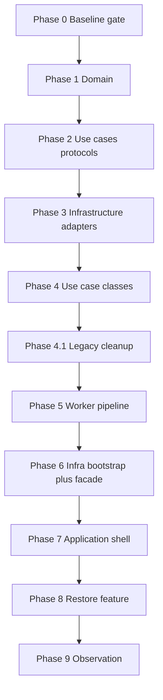
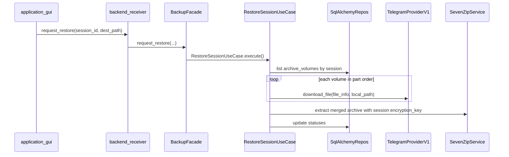

# Onion Layer Implementation Guide

Step-by-step guide to evolve `telegram-uploader` toward the target onion architecture. Work **one layer slice at a time**: implement → add/update tests → verify → proceed.

---

## Document hierarchy

| Document | Answers |
|----------|---------|
| [INTERNAL_SPEC.md](INTERNAL_SPEC.md) | **What** the product must do (encryption, `display_name`, English UI) |
| [ONION_ARCHITECTURE.md](ONION_ARCHITECTURE.md) | **How** layers, folders, and dependencies are organized — **source of truth** |
| [IMPLEMENTATION_GUIDE.md](../IMPLEMENTATION_GUIDE.md) | **Feature roadmap** (Telegram-first stages 0–8) |
| [STEP_BY_STEP_IMPLEMENTATION_GUIDE.md](../STEP_BY_STEP_IMPLEMENTATION_GUIDE.md) | **From-scratch checkpoints** (compose, migrations, adapters) |
| **This file** | **Layer-by-layer migration** with mandatory test gates |

When `IMPLEMENTATION_GUIDE.md` disagrees with `ONION_ARCHITECTURE.md` on layers or imports, follow **ONION_ARCHITECTURE.md**.

### Adjacent-layer rule (read first)

Each layer imports **only its immediate inner neighbor**. No layer imports anything **above** it.

```
domain → use_cases → infrastructure → application → observation
```

**Request down:** `application → infrastructure → use_cases → domain`  
**Response up:** `use_cases → infrastructure → application`

| Layer | May import (inner neighbor) | Must NOT import |
|-------|----------------------------|-----------------|
| `domain` | stdlib only | everything else |
| `use_cases` | `domain` | `infrastructure`, `application`, `observation` |
| `infrastructure` | `use_cases` only | **`domain`**, `application`, `observation` |
| `application` | `infrastructure` only (`BackupFacade` via `backend_receiver`) | **`use_cases`**, `domain`, `observation` |
| `observation` | any (outside runtime) | — |

**Why `infrastructure` must not touch `domain`:** DB adapters map ORM rows to `use_cases.persistence.*Record`. Use cases map records ↔ `domain` entities.

**Why `application` must not touch `use_cases`:** `backend_receiver` calls `infrastructure.facade.BackupFacade` only; facade wires and invokes use cases internally.

### Package and import conventions

Every layer and subpackage under `src/` is a **proper Python package** with a non-empty `__init__.py`. These rules apply to all layers (`use_cases`, `infrastructure`, `application`, …) and to every nested package inside them (`use_cases/domain/`, `use_cases/backup/`, `infrastructure/db/`, …).

| Rule | Detail |
|------|--------|
| **Package entrypoint** | Each directory that is part of the layer layout must contain `__init__.py`. No implicit namespace packages. |
| **Non-empty `__init__.py`** | An empty `__init__.py` is **not allowed**. Every package declares its public surface here. |
| **Re-export public API** | Any class, function, or Protocol consumed **outside** that package must be imported and re-exported in the package's `__init__.py`, with an explicit `__all__`. External code imports from the package, not from internal modules. |
| **Relative imports inside a package** | Modules within the **same** package must import sibling modules with a **relative** import: `from .models import Session`, not `from use_cases.domain.models import Session`. |
| **Domain purity** | `use_cases/domain/` may import stdlib and sibling modules (`.models`, `.errors`) only — never `use_cases.persistence`, `use_cases.mappers`, or other use-case subpackages. |
| **Absolute imports across packages** | Code in one subpackage importing from a **sibling** subpackage uses the absolute package path: `from use_cases.domain import Session`, not `from .domain import Session`. Record ↔ domain mappers live in `use_cases/mappers.py`. |

**Example — `use_cases/domain/`**

```python
# use_cases/domain/guards.py  — sibling import (relative)
from .errors import SessionNotFound
from .models import Session

# use_cases/backup/enqueue_source_item.py  — cross-subpackage (absolute)
import use_cases.domain as domain

item = domain.create_source_item(session_id, source_path, display_name)
domain.require_source_item(mapped_item, source_item_id)  # raises domain.DomainError
```

**Example — `use_cases/domain/__init__.py`**

```python
from .errors import DomainError
from .guards import require_session, require_source_item
from .models import Session, SourceItem, ArchiveVolume

__all__ = [
    "ArchiveVolume",
    "DomainError",
    "Session",
    "SourceItem",
    "create_session",
    "create_source_item",
    "require_session",
    "require_source_item",
    # ...
]
```

External code imports **only** from `use_cases.domain` — not from `use_cases.domain.models`, `.errors`, `.guards`, or `.transitions`. Use cases catch `domain.DomainError`; internal error subclasses stay inside the package.

**Verification (manual / future CI):**

```bash
# No empty __init__.py under src/
find src -name __init__.py -empty

# Sibling modules must not use absolute self-package paths
# (e.g. use_cases/domain/*.py must not contain "from use_cases.domain.")
grep -rE "from use_cases\.domain\.(models|errors|mappers)" src/use_cases/domain/
```

---

## Technology stack

Current stack as of Phase 0–1 baseline. Pin versions in `pyproject.toml`; Docker images in `docker-compose.yml` / `Dockerfile`.

### Language and packaging

| Component | Version / detail |
|-----------|------------------|
| **Python** | `>=3.12` (`pyproject.toml`); Docker image `python:3.12-slim` |
| **Packaging** | `setuptools` + `wheel` (`pip install -e ".[dev]"`) |
| **Architecture** | Onion layers: `domain` → `use_cases` → `infrastructure` → `application` |
| **Domain style** | `@dataclass(slots=True)` + `@classmethod create()` factories; domain exceptions follow the same pattern (`InvalidStatusTransition.create`) |

### Runtime dependencies (Python)

| Library | Version | Role |
|---------|---------|------|
| **SQLAlchemy** | `>=2.0.40` | ORM, session factory (`infrastructure/db/`) |
| **psycopg** | `>=3.2.4` (binary extra) | PostgreSQL driver (migrations + repositories) |
| **Celery** | `5.4.0` | Background tasks: archive, upload, cleanup, restore |
| **Redis** | `5.2.1` | Celery broker and result backend |

**Standard library (no pip):**

| Module | Role |
|--------|------|
| `urllib` | HTTP to Telegram Bot API (`TelegramProviderV1` — currently in `use_cases/ports.py`, target: `infrastructure/providers/`) |
| `dataclasses`, `enum`, `pathlib`, `logging` | Domain entities, config, worker logging |

### Infrastructure (Docker Compose)

| Service | Image | Role |
|---------|-------|------|
| **PostgreSQL** | `postgres:16-alpine` | Sessions, source items, archive volumes |
| **Redis** | `redis:7-alpine` | Celery broker |
| **telegram-bot-api** | `aiogram/telegram-bot-api:latest` | Local Bot API on `:8081` (not `api.telegram.org`) |
| **app** | Project `Dockerfile` | Bootstrap entrypoint (`python -m application.bootstrap`) |
| **Celery workers** | Same image, 5 processes | Queues: `archive` (×2), `upload`, `cleanup`, `restore` |

### External binaries

| Tool | Where installed | Role |
|------|-----------------|------|
| **7z** (`p7zip-full`) | `Dockerfile` (`apt`) + host for local dev | Encrypt, split volumes, manifest (`SevenZipService`) |

### Database

| Approach | Detail |
|----------|--------|
| **Migrations** | Raw `.sql` files + custom runner (`infrastructure/db/migrate.py`) — not Alembic |
| **ORM** | SQLAlchemy 2.x row models (`infrastructure/db/orm.py`) |
| **Mapping** | ORM ↔ domain today (`infrastructure/db/mappers.py`); target: ORM ↔ `use_cases.persistence.*Record` (Phase 2–3) |

### Celery topology

| Queue | Worker | Task |
|-------|--------|------|
| `archive` | `celery-worker-archive-1`, `archive-2` | `archive_volume` |
| `upload` | `celery-worker-upload` | `upload_volume` |
| `cleanup` | `celery-worker-cleanup` | `cleanup_volume` |
| `restore` | `celery-worker-restore` | `restore_volume` |

Serializer: JSON. Routing: `infrastructure/worker/celery_app.py`.

### Telegram integration (v1)

- Provider: `TelegramProviderV1` (HTTP via local **telegram-bot-api**)
- Upload: `sendDocument` with multipart body
- Config: `TELEGRAM_BOT_TOKEN`, `TELEGRAM_BOT_API_URL`, `TELEGRAM_TARGET_CHAT_ID` (`infrastructure/config.py`)
- Restore metadata: `external_file_id`, `external_message_id`, `provider_download_ref` in DB

### Dev tooling

| Tool | Version | Role |
|------|---------|------|
| **pytest** | `8.3.5` | Unit / contract tests (`tests/`, 23 tests after Phase 1) |
| **ruff** | `0.11.2` | Linter — rules E, F, I, B, UP; line length 100 |
| **mypy** | `1.15.0` | Strict typing on `src/` |

Pinned dev lock: `requirements-dev.lock` (dev extras only).

### Layer layout (what exists today)

```
src/
  use_cases/        domain/, persistence, repositories/, ports/, backup/, session/, restore/
  infrastructure/   db/, archive/, providers/, worker/, config.py
  application/      bootstrap.py (migrations + Redis ping)
  presentation/     empty stub (to be removed in Phase 7)
```

### Planned, not yet in repo

| Item | Target phase |
|------|--------------|
| Linux GUI (`application/gui/`) | 7 |
| `BackupFacade` + `infrastructure/bootstrap.py` | 6 |
| Restore pipeline end-to-end | 8 |
| `import-linter` + GitHub Actions CI | 9 |
| Postman collection for API smoke tests | 9 (optional) |

### Local dev quick start

```bash
python3 -m venv .venv
.venv/bin/pip install -e ".[dev]"
.venv/bin/pytest -v
.venv/bin/ruff check src tests
.venv/bin/mypy src

docker compose up -d postgres redis
# If port 5432 is taken: POSTGRES_PORT=5433 docker compose up -d postgres
POSTGRES_PORT=5433 PYTHONPATH=src .venv/bin/python -m application.bootstrap
```

---

## How to use this guide

Each phase follows the same template:

| Section | Purpose |
|---------|---------|
| **Goal** | What layer slice is fixed or added |
| **Current state** | What exists today |
| **Implementation steps** | Ordered file changes |
| **Tests** | Concrete `tests/` files to add or update |
| **Verification** | Commands and manual checklist |
| **Do not proceed until** | Hard gate before the next phase |



---

## Current vs target matrix

| Area | Current state | Target (ONION_ARCHITECTURE) | Fixed in phase |
|------|---------------|----------------------------|----------------|
| Domain entities | Canonical code in `use_cases/domain/` | Same | 4.1 ✅ |
| Repository contracts | Protocols in `use_cases/repositories/` on `persistence.*Record` | Same | 2 ✅ |
| Persistence boundary | ORM ↔ `use_cases.persistence`; `use_cases/mappers.py` for record ↔ domain | Same | 2–3 ✅ |
| Repository implementations | `infrastructure/db/sqlalchemy_repositories.py` | Same | 3 ✅ |
| Storage provider port | Protocol in `use_cases/ports/`; HTTP in `infrastructure/providers/` | Same | 2–3 ✅ |
| Task queue port | `TaskQueuePort` in use_cases; `CeleryTaskQueue` in infrastructure | Same | 2–3 (port ✅, adapter Phase 3) |
| Archive service port | `ArchiveServicePort` in use_cases; adapter in infrastructure | Same | 2–3 (port ✅, adapter Phase 3) |
| Use case classes | `use_cases/backup/`, `restore/`, `session/` | Same | 4 ✅ |
| Celery tasks | Stubs in `infrastructure/worker/tasks.py` | Thin entrypoints calling use cases | 5 |
| Bootstrap | `src/application/bootstrap.py` — migrations + ping only | `infrastructure/bootstrap.py` — composition root + `build_facade()` | 6 |
| BackupFacade | Missing | `infrastructure/facade.py` — public API for application | 6 |
| GUI | Empty `src/presentation/` stub | `application/gui/` + `backend_receiver.py` → facade | 7 |
| Restore pipeline | Not wired | End-to-end download + 7z extract | 8 |
| Layer enforcement | Manual review | `import-linter` + CI | 9 |

### Known violations (technical debt)

| Violation | File | Fixed in |
|-----------|------|----------|
| ~~`use_cases` imports `sqlalchemy`, `infrastructure.db`~~ | — | 2 ✅ |
| ~~`TelegramProviderV1` HTTP lives in use_cases~~ | — | 2 ✅ |
| ~~`infrastructure/db/mappers.py` imports `domain`~~ | — | 2 ✅ |
| ~~`CeleryTaskQueue` / `ArchiveServiceAdapter` missing~~ | — | 3 ✅ |
| ~~No use case orchestration classes~~ | — | 4 ✅ |
| ~~`src/domain/` still exists; `use_cases/domain/{models,errors}.py` re-export only~~ | — | 4.1 ✅ |
| ~~`from domain` imports in tests and `use_cases/domain/{factories,mappers,transitions}.py`~~ | — | 4.1 ✅ |
| ~~`infrastructure/db/__init__.py` aliases protocol names to SQLAlchemy classes~~ | — | 4.1 ✅ |
| Worker tasks return `{"status": "stub"}` | `src/infrastructure/worker/tasks.py` | 5 |
| Bootstrap in wrong layer; no facade | `src/application/bootstrap.py` | 6 |

---

## Phase 0 — Baseline gate

**Goal:** Confirm the existing foundation is stable before any layer migration.

### Current state (already implemented)

| Component | Location | Status |
|-----------|----------|--------|
| Domain models | `src/domain/models.py`, `errors.py` | `Session`, `SourceItem`, `ArchiveVolume` + status enums; domain exceptions |
| Provider DTOs | `src/use_cases/dto.py` | `UploadResult`, `ProviderFileInfo`, `ProviderLimits`, `ClassifiedProviderError` |
| DB migrations | `src/infrastructure/db/migrations/` | `0001_initial.sql`, `0002_align_schema_with_domain.sql` |
| ORM + mappers | `src/infrastructure/db/orm.py`, `mappers.py` | Row models aligned with domain |
| DB engine | `src/infrastructure/db/engine.py` | Session factory + transaction scope |
| Migration runner | `src/infrastructure/db/migrate.py` | `apply_migrations(dsn)` |
| 7z service | `src/infrastructure/archive/seven_zip_service.py` | Encrypt, split, hashed names, manifest |
| Celery topology | `src/infrastructure/worker/celery_app.py` | 4 queues: `archive`, `upload`, `cleanup`, `restore` |
| Docker Compose | `docker-compose.yml` | 5 worker processes + postgres + redis + telegram-bot-api |
| Config | `src/infrastructure/config.py` | `AppConfig` from env |
| Bootstrap (partial) | `src/application/bootstrap.py` | Migrations + Redis ping |
| Unit tests | `tests/` (9 files, ~15 tests) | No live PostgreSQL, Celery execution, or 7z subprocess integration |

### Tests (existing — must pass)

```bash
pytest
ruff check src tests
mypy src
```

| Test file | Covers |
|-----------|--------|
| `tests/test_smoke.py` | `StorageProviderPort` is runtime-checkable Protocol |
| `tests/test_provider_contract.py` | Dummy provider satisfies port contract |
| `tests/test_telegram_provider.py` | `classify_error()` categories |
| `tests/test_telegram_multipart.py` | `_build_send_document_multipart()` structure |
| `tests/test_repositories.py` | `Repositories.from_dsn()` type; mapper round-trip |
| `tests/test_archive_pipeline.py` | `build_hashed_volume_name()`; migration files exist |
| `tests/test_celery_workers.py` | Queue routing in `celery_app` |
| `tests/test_migrate_unit.py` | `apply_migrations()` records versions (mocked) |

### Verification

```bash
# Unit suite
pytest -v

# Runtime services (optional but recommended before Phase 2)
docker compose up -d postgres redis
python -m application.bootstrap   # migrations + Redis ping
```

### Do not proceed until

- [ ] `pytest`, `ruff check`, `mypy` all pass
- [ ] PostgreSQL and Redis are reachable via compose (if testing locally)

---

## Phase 1 — Domain layer (Layer 1)

**Goal:** Keep the domain pure. Add only what upcoming use cases need.

### Current state

- `src/domain/models.py` — complete baseline (`Session`, `SourceItem`, `ArchiveVolume`, factories, enums)
- `src/domain/errors.py` — **done** (`DomainError`, not-found errors, `InvalidStatusTransition` via `@dataclass` + `.create()`)
- `tests/test_domain.py` — **done** (8 tests)

### Implementation steps

| Step | Action |
|------|--------|
| 1.1 | Create `src/domain/errors.py` with domain exceptions, e.g.: |
| | `DomainError` (base) |
| | `SessionNotFound`, `SourceItemNotFound`, `ArchiveVolumeNotFound` |
| | `InvalidStatusTransition` (with `entity`, `from_status`, `to_status`) |
| 1.2 | Export errors from `src/domain/__init__.py` if the package uses public re-exports |
| 1.3 | *(Optional)* Add pure transition helpers on dataclasses if use cases need them, e.g. `SourceItem.with_status(SourceItemStatus.ARCHIVING)` returning a new instance — no I/O, no side effects |

### Tests

Create `tests/test_domain.py`:

- `Session.create()` sets `CREATED` status and generates UUID
- `SourceItem.create()` requires `display_name` (not derived from path)
- `ArchiveVolume.create()` sets defaults (`external_*` fields are `None`)
- Status enums are `str` subclasses (serializable to DB)
- `InvalidStatusTransition` carries entity context
- No imports from `use_cases`, `infrastructure`, or third-party packages in `src/domain/`

### Verification

```bash
pytest tests/test_domain.py -v
grep -rE "infrastructure|use_cases|sqlalchemy|celery|urllib" src/domain/   # must be empty
```

### Do not proceed until

- [ ] `tests/test_domain.py` passes
- [ ] `src/domain/` has zero outward-layer imports

---

## Phase 2 — Use cases: extract ports only (Layer 2a)

**Goal:** `use_cases` contains **only** Protocols, DTOs, and (later) use case classes. Remove all I/O.

This is the **highest-priority refactor** per ONION_ARCHITECTURE §4 and §7.

### Current state

- `src/use_cases/persistence.py` — `SessionRecord`, `SourceItemRecord`, `ArchiveVolumeRecord`
- `src/use_cases/domain/mappers.py` — record ↔ domain (only subpackage that imports `domain`)
- `src/use_cases/repositories/` — `SessionRepository`, `SourceItemRepository`, `ArchiveVolumeRepository`, `Repositories` Protocol
- `src/use_cases/ports/` — `StorageProviderPort`, `TaskQueuePort`, `ArchiveServicePort`
- `tests/test_layer_boundaries.py` — enforces no I/O imports in `use_cases`
- SQLAlchemy CRUD and `TelegramProviderV1` moved to `infrastructure/` (Phase 3 overlap)
- No use case class packages yet

### Target package layout

```
src/use_cases/
  persistence.py                  # SessionRecord, SourceItemRecord, ArchiveVolumeRecord
  domain/                         # layer 1 core — canonical home for models/errors (Phase 4.1 removes src/domain/)
    mappers.py                    # record ↔ domain
  dto.py                          # unchanged
  repositories/
    __init__.py                   # Repositories bundle Protocol
    session.py                    # SessionRepository Protocol
    source_item.py                # SourceItemRepository Protocol
    archive_volume.py             # ArchiveVolumeRepository Protocol
  ports/
    __init__.py
    storage_provider.py           # StorageProviderPort Protocol only
    task_queue.py                 # TaskQueuePort Protocol
    archive_service.py            # ArchiveServicePort Protocol
```

### Implementation steps

| Step | Action |
|------|--------|
| 2.1 | Create `use_cases/persistence.py` — `SessionRecord`, `SourceItemRecord`, `ArchiveVolumeRecord` (mirror domain fields; owned by use_cases as infrastructure contract) |
| 2.2 | Create `use_cases/domain/mappers.py` — `session_record_to_domain`, `domain_to_session_record`, etc.; **`import domain` only inside `use_cases/domain/`** |
| 2.3 | Create `use_cases/repositories/session.py` — `SessionRepository` Protocol; methods use `SessionRecord`, **not** `domain.Session` |
| 2.4 | Create `use_cases/repositories/source_item.py` — `add`, `get`, `list_by_session`, `update` with `SourceItemRecord` |
| 2.5 | Create `use_cases/repositories/archive_volume.py` — `add`, `get`, `list_by_source_item`, `list_by_session`, `update` with `ArchiveVolumeRecord` |
| 2.6 | Create `use_cases/repositories/__init__.py` — `Repositories` Protocol bundling the three repos |
| 2.7 | Create `use_cases/ports/storage_provider.py` — move `StorageProviderPort` + `MessageProvider` alias; **no** `TelegramProviderV1` |
| 2.8 | Create `use_cases/ports/task_queue.py`: |
| | ```python |
| | class TaskQueuePort(Protocol): |
| |     def enqueue_archive(self, source_item_id: UUID) -> None: ... |
| |     def enqueue_upload(self, archive_volume_id: UUID) -> None: ... |
| |     def enqueue_cleanup(self, archive_volume_id: UUID) -> None: ... |
| |     def enqueue_restore(self, archive_volume_id: UUID) -> None: ... |
| | ``` |
| 2.9 | Create `use_cases/ports/archive_service.py` — `ArchiveServicePort` wrapping `SevenZipService.archive()` signature (input paths + `display_name` → volume list + manifest) |
| 2.10 | Delete or gut `src/use_cases/repositories.py` and `src/use_cases/ports.py` — leave thin re-export shims **only temporarily** if needed for import stability during migration; remove shims in Phase 3 |
| 2.11 | Update all `tests/` imports to new paths |

### Tests

| File | What to test |
|------|--------------|
| `tests/test_smoke.py` | Import `StorageProviderPort` from `use_cases.ports.storage_provider` |
| `tests/test_provider_contract.py` | Dummy provider still satisfies port |
| `tests/test_layer_boundaries.py` *(new)* | Walk `src/use_cases/**/*.py`; assert no imports of `sqlalchemy`, `urllib`, `infrastructure`, `celery`; assert `import domain` only under `use_cases/domain/` |

Example boundary test pattern:

```python
import ast
from pathlib import Path

FORBIDDEN = {"sqlalchemy", "urllib", "infrastructure", "celery"}

def test_use_cases_have_no_infrastructure_imports() -> None:
    root = Path("src/use_cases")
    for path in root.rglob("*.py"):
        tree = ast.parse(path.read_text())
        for node in ast.walk(tree):
            if isinstance(node, ast.Import):
                for alias in node.names:
                    assert alias.name.split(".")[0] not in FORBIDDEN, f"{path}: {alias.name}"
            if isinstance(node, ast.ImportFrom) and node.module:
                assert node.module.split(".")[0] not in FORBIDDEN, f"{path}: {node.module}"
```

### Verification

```bash
pytest tests/test_smoke.py tests/test_provider_contract.py tests/test_layer_boundaries.py -v
grep -rE "sqlalchemy|infrastructure|urllib|celery" src/use_cases/   # must be empty
```

### Do not proceed until

- [x] Zero SQLAlchemy / HTTP / infrastructure imports in `src/use_cases/`
- [x] `tests/test_layer_boundaries.py` passes
- [x] All existing port/contract tests still pass (import paths updated)

---

## Phase 3 — Infrastructure: move implementations (Layer 3a)

**Goal:** Infrastructure **implements** ports. Remove inverted re-exports. **No `import domain` anywhere in `infrastructure`.**

### Current state

- SQLAlchemy CRUD still in `use_cases/repositories.py` (until moved here)
- `infrastructure/db/repositories.py` — re-exports from use_cases
- `infrastructure/providers/telegram_provider.py` — 6-line re-export from use_cases
- `SevenZipService` exists but is not exposed via `ArchiveServicePort`
- No `CeleryTaskQueue`

### Target package layout

```
src/infrastructure/
  db/
    sqlalchemy_repositories.py    # SessionRepository, SourceItemRepository, ArchiveVolumeRepository, Repositories
  providers/
    telegram_provider.py          # TelegramProviderV1 + TelegramProviderError (full HTTP)
  archive/
    seven_zip_service.py          # unchanged implementation
    archive_service_adapter.py    # (optional) ArchiveServicePort adapter
  worker/
    celery_task_queue.py          # CeleryTaskQueue implements TaskQueuePort
```

### Implementation steps

| Step | Action |
|------|--------|
| 3.1 | Rewrite `infrastructure/db/mappers.py` — ORM row ↔ `use_cases.persistence.*Record` only; remove all `domain` imports |
| 3.2 | Move SQLAlchemy CRUD from `use_cases/repositories.py` → `infrastructure/db/sqlalchemy_repositories.py` |
| | Classes: `SqlAlchemySessionRepository`, `SqlAlchemySourceItemRepository`, `SqlAlchemyArchiveVolumeRepository`, `SqlAlchemyRepositories` |
| | Accept/return `SessionRecord` etc., never `domain.Session` |
| | Keep `from_dsn(postgres_dsn)` factory pattern |
| 3.3 | Delete `infrastructure/db/repositories.py` re-export shim; update `infrastructure/db/__init__.py` to export from `sqlalchemy_repositories` |
| 3.4 | Move `TelegramProviderV1`, `TelegramProviderError`, `_extract_retry_after_seconds` from `use_cases/ports.py` → `infrastructure/providers/telegram_provider.py` |
| 3.5 | Delete old `use_cases/repositories.py` and `use_cases/ports.py` completely |
| 3.6 | Create `infrastructure/worker/celery_task_queue.py`: |
| | ```python |
| | @dataclass(frozen=True) |
| | class CeleryTaskQueue: |
| |     def enqueue_archive(self, source_item_id: UUID) -> None: |
| |         from infrastructure.worker.tasks import archive_volume |
| |         archive_volume.delay(str(source_item_id)) |
| |     # ... upload, cleanup, restore similarly |
| | ``` |
| 3.7 | Add `ArchiveServiceAdapter` (or make `SevenZipService` structurally match `ArchiveServicePort`) in `infrastructure/archive/` |
| 3.8 | Update every import across `tests/`, `application/`, `worker/` to new paths |
| 3.9 | Extend `tests/test_layer_boundaries.py` — `infrastructure` must not import `domain` or `application` |

### Tests

| File | Action |
|------|--------|
| `tests/test_repositories.py` | Import `SqlAlchemyRepositories` from `infrastructure.db.sqlalchemy_repositories` |
| `tests/test_repositories_integration.py` *(new)* | CRUD round-trip against live PostgreSQL; mark `@pytest.mark.integration` |
| `tests/test_telegram_provider.py` | Import `TelegramProviderV1` from `infrastructure.providers.telegram_provider` |
| `tests/test_telegram_multipart.py` | Same import path update |
| `tests/test_celery_task_queue.py` *(new)* | Mock Celery tasks; assert `enqueue_archive` calls `archive_volume.delay` with correct queue |

Add to `pyproject.toml`:

```toml
[tool.pytest.ini_options]
markers = [
  "integration: tests requiring docker compose services",
]
```

Integration test sketch:

```python
@pytest.mark.integration
def test_session_crud_round_trip(postgres_dsn: str) -> None:
    repos = SqlAlchemyRepositories.from_dsn(postgres_dsn)
    record = SessionRecord(id=uuid4(), profile_name="test", encryption_key="key", ...)
    repos.sessions.add(record)
    loaded = repos.sessions.get(record.id)
    assert loaded is not None
    assert loaded.profile_name == "test"
```

### Verification

```bash
# Unit suite (no live services)
pytest -m "not integration" -v

# Integration (requires compose postgres)
docker compose up -d postgres
pytest -m integration -v

# Structural port compliance
python -c "
from infrastructure.providers.telegram_provider import TelegramProviderV1
from use_cases.ports.storage_provider import StorageProviderPort
assert isinstance(TelegramProviderV1('token', 'http://localhost:8081'), StorageProviderPort)
"
```

### Do not proceed until

- [x] No code remains in `use_cases/repositories.py` or `use_cases/ports.py`
- [x] `infrastructure/db/repositories.py` re-export shim is deleted
- [x] `grep -rE "from domain|import domain" src/infrastructure/` returns **empty**
- [x] `pytest -m "not integration"` passes
- [x] Integration CRUD test passes against compose PostgreSQL (when available)

---

## Phase 4 — Use case classes (Layer 2b)

**Goal:** Business orchestration lives in `@dataclass` use cases with injected ports. No I/O inside use case methods beyond calling ports.

### Current state

- Use case classes in `session/`, `backup/`, `restore/` — **done**
- `tests/test_use_cases_backup.py`, `tests/test_use_cases_restore.py` — **done**
- Ports and DTOs ready after Phases 2–3

### Target package layout

```
src/use_cases/
  session/
    create_session.py             # CreateSessionUseCase
    pause_session.py              # PauseSessionUseCase (future)
  backup/
    enqueue_source_item.py        # EnqueueSourceItemUseCase
    start_backup_pipeline.py      # StartBackupPipelineUseCase
    process_archive_volume.py     # ProcessArchiveVolumeUseCase
    process_upload_volume.py      # ProcessUploadVolumeUseCase
    cleanup_volume.py             # CleanupVolumeUseCase
  restore/
    restore_session.py            # RestoreSessionUseCase
```

### Use case catalog

| Use case | Injected ports | Responsibility |
|----------|----------------|----------------|
| `CreateSessionUseCase` | `SessionRepository` | Create session with encryption key |
| `EnqueueSourceItemUseCase` | `SourceItemRepository`, `TaskQueuePort` | Build `domain.SourceItem` → save as `SourceItemRecord`; persist `display_name` at enqueue; enqueue archive |
| `StartBackupPipelineUseCase` | repos + `TaskQueuePort` | Validate session is `RUNNING`; enqueue pending items |
| `ProcessArchiveVolumeUseCase` | `SourceItemRepository`, `ArchiveVolumeRepository`, `ArchiveServicePort`, `TaskQueuePort` | Run 7z; persist volumes; transition statuses; enqueue upload per volume |
| `ProcessUploadVolumeUseCase` | `ArchiveVolumeRepository`, `StorageProviderPort`, `TaskQueuePort` | Upload via provider; save `external_*` metadata; enqueue cleanup |
| `CleanupVolumeUseCase` | `ArchiveVolumeRepository` | Remove temp files from `ARCHIVE_CACHE_DIR` |
| `RestoreSessionUseCase` | repos + `StorageProviderPort` | Download volumes; reassemble; decrypt/extract |

### Key business rules

From ONION_ARCHITECTURE §4 and [INTERNAL_SPEC.md](INTERNAL_SPEC.md):

1. **`display_name` is captured at enqueue time** — never derived from `source_path.name` later
2. **Status transitions happen in use cases** — not in `tasks.py`
3. **Use cases call `TaskQueuePort`** — never `celery_app.delay()` directly
4. **Provider metadata persisted after upload** — `external_file_id`, `external_message_id`, `provider_download_ref`
5. **Volume names hash `display_name`** — not `source_path` (file may be renamed between enqueue and archive)

### Implementation steps

| Step | Action |
|------|--------|
| 4.1 | Implement `CreateSessionUseCase` — `execute(profile_name, encryption_key) -> Session` |
| 4.2 | Implement `EnqueueSourceItemUseCase` — `execute(session_id, source_path, display_name)` |
| 4.3 | Implement `ProcessArchiveVolumeUseCase` — load item, call `ArchiveServicePort`, create `ArchiveVolume` rows, enqueue upload |
| 4.4 | Implement `ProcessUploadVolumeUseCase` — call `StorageProviderPort.upload_file`, update volume + source item status |
| 4.5 | Implement `CleanupVolumeUseCase` — delete local temp paths |
| 4.6 | Implement `RestoreSessionUseCase` — query volumes by session, download, reassemble |
| 4.7 | Each use case: `@dataclass(frozen=True, slots=True)` with port fields; single `execute()` method |

Example skeleton:

```python
from use_cases.mappers import domain_to_source_item_record, source_item_create

@dataclass(frozen=True, slots=True)
class EnqueueSourceItemUseCase:
    source_items: SourceItemRepository
    task_queue: TaskQueuePort

    def execute(self, session_id: UUID, source_path: Path, display_name: str):
        item = source_item_create(session_id, source_path, display_name)  # inside use_cases/domain/
        self.source_items.add(domain_to_source_item_record(item))
        self.task_queue.enqueue_archive(item.id)
        return item
```

### Tests

Create in-memory fakes in `tests/fakes/` (or inline in test files):

| Fake | Implements |
|------|------------|
| `InMemorySessionRepository` | `SessionRepository` |
| `InMemorySourceItemRepository` | `SourceItemRepository` |
| `InMemoryArchiveVolumeRepository` | `ArchiveVolumeRepository` |
| `FakeTaskQueue` | `TaskQueuePort` — records enqueued IDs |
| `FakeStorageProvider` | `StorageProviderPort` — returns canned `UploadResult` |
| `FakeArchiveService` | `ArchiveServicePort` — returns canned volume list |

| File | Scenarios |
|------|-----------|
| `tests/test_use_cases_backup.py` | Enqueue persists `display_name`; archive creates volumes; upload saves metadata; invalid status raises `InvalidStatusTransition` |
| `tests/test_use_cases_restore.py` | Restore queries volumes in part order; handles missing volume |

### Verification

```bash
pytest tests/test_use_cases_backup.py tests/test_use_cases_restore.py -v
```

### Do not proceed until

- [x] Happy path backup flow works with fakes (enqueue → archive → upload → cleanup)
- [x] `display_name` test explicitly asserts it is stored as provided, not from path
- [x] No `infrastructure` or `celery` imports in `src/use_cases/`

---

## Phase 4.1 — Legacy cleanup: physical move (Layer 2c)

**Goal:** Remove **duplicate and shim** artifacts left after Phases 2–4. Code that already *behaves* as onion must *live* in the target paths only — no parallel `src/domain/` package, no re-export proxies, no stale import paths.

Phases 2–4 migrated **logic** (ports, adapters, use cases). Phase 4.1 migrates **ownership** (where files live and what imports resolve to).

> **Naming note:** Phase 4 implementation steps use numbers `4.1`–`4.7` (CreateSession, Enqueue, …). This section is a **separate gate** — steps below are `4.1.1`, `4.1.2`, …

### Legacy inventory (logical ✅ vs physical ❌)

| Artifact | Logical owner (onion) | Physical state today | Action in 4.1 |
|----------|----------------------|----------------------|---------------|
| Domain models + enums | `use_cases/domain/models.py` | Canonical in `src/domain/models.py`; shim in `use_cases/domain/models.py` | Move body → delete `src/domain/` |
| Domain errors | `use_cases/domain/errors.py` | Canonical in `src/domain/errors.py`; shim in `use_cases/domain/errors.py` | Move body → delete `src/domain/` |
| Domain mappers | `use_cases/domain/mappers.py` | OK, but imports `domain.models` | Switch to `use_cases.domain.models` |
| Domain factories / transitions | `use_cases/domain/{factories,transitions}.py` | Import top-level `domain` | Switch to `use_cases.domain.*` |
| Repository / port monoliths | `use_cases/repositories/`, `use_cases/ports/` | Deleted in 2–3 ✅ | Verify absent |
| SQLAlchemy repos shim | `infrastructure/db/sqlalchemy_repositories.py` | `repositories.py` deleted ✅ | — |
| DB `__init__` aliases | Export `SqlAlchemy*` types | `ArchiveVolumeRepository = SqlAlchemy…` shadows Protocol names | Drop aliases; export concrete names only |
| Domain unit tests | `tests/test_domain.py` | Imports `domain.*`, scans `src/domain/` | Point at `use_cases.domain.*` |
| Layer boundary tests | `tests/test_layer_boundaries.py` | Allows `import domain` under `use_cases/domain/` | Forbid top-level `domain` package everywhere |

### Target package layout (domain inside use_cases only)

```
src/use_cases/domain/
  models.py       # Session, SourceItem, ArchiveVolume + enums + .create() factories
  errors.py       # DomainError, *NotFound, InvalidStatusTransition
  mappers.py      # record ↔ domain (imports use_cases.domain.models only)
  factories.py    # thin wrappers over .create() (optional; may inline into mappers)
  transitions.py  # ensure_*_status helpers
  __init__.py     # public re-exports for use case modules

# DELETE entirely:
src/domain/       # models.py, errors.py, __init__.py — no top-level domain package
```

Use case modules (`backup/`, `session/`, `restore/`) import domain **only** via `use_cases.domain.*` — never `from domain`.

### Implementation steps

| Step | Action |
|------|--------|
| 4.1.1 | Copy `src/domain/models.py` → `use_cases/domain/models.py` (replace re-export shim with full file body) |
| 4.1.2 | Copy `src/domain/errors.py` → `use_cases/domain/errors.py` (replace re-export shim) |
| 4.1.3 | Update `use_cases/domain/mappers.py`, `factories.py`, `transitions.py` — `from use_cases.domain.models` / `use_cases.domain.errors`; **no** `from domain` |
| 4.1.4 | Update `use_cases/domain/__init__.py` — export `Session`, `SourceItem`, errors, etc. for sibling use case packages |
| 4.1.5 | Delete package `src/domain/` (`models.py`, `errors.py`, `__init__.py`) |
| 4.1.6 | Update `tests/test_domain.py` — imports from `use_cases.domain.*`; boundary walk targets `src/use_cases/domain/` only |
| 4.1.7 | Update `tests/test_repositories.py` and any other `from domain` in `tests/` |
| 4.1.8 | Tighten `tests/test_layer_boundaries.py`: assert **no** file under `src/` imports top-level package `domain` (including `use_cases/domain/` — use `use_cases.domain` internally) |
| 4.1.9 | Clean `infrastructure/db/__init__.py` — remove `ArchiveVolumeRepository = SqlAlchemy…` aliases; keep `SqlAlchemyRepositories`, `SqlAlchemySessionRepository`, …; update callers |
| 4.1.10 | `grep -rE "from domain|import domain" src/ tests/` → **empty** (only `use_cases.domain` allowed) |
| 4.1.11 | Sync docs: Technology stack §Layer layout, `README.md` import examples, `ONION_ARCHITECTURE.md` §7 checklist |

### Tests

| File | Action |
|------|--------|
| `tests/test_domain.py` | Imports `use_cases.domain.models` / `errors`; purity walk on `src/use_cases/domain/` |
| `tests/test_layer_boundaries.py` | Add `test_no_top_level_domain_imports_anywhere()` covering `src/` + `tests/` |
| `tests/test_use_cases_backup.py` | No `domain` imports — only `use_cases.domain` (regression) |
| All unit tests | Must pass unchanged in behavior |

### Verification

```bash
# No legacy package on disk
test ! -d src/domain

# No top-level domain imports
grep -rE "from domain[\\. ]|import domain" src/ tests/   # must be empty

# Purity of canonical domain home
grep -rE "infrastructure|use_cases\\.repositories|sqlalchemy" src/use_cases/domain/   # must be empty

pytest -m "not integration" -v
ruff check src tests
mypy src
```

### Do not proceed until

- [x] `src/domain/` directory does not exist
- [x] `use_cases/domain/models.py` and `errors.py` contain real implementations (not `from domain…` re-exports)
- [x] `grep -rE "from domain|import domain" src/ tests/` returns **empty**
- [x] `tests/test_domain.py` and extended `test_layer_boundaries.py` pass
- [x] `pytest -m "not integration"` passes

---

## Phase 5 — Worker pipeline wiring (Layer 3b)

**Goal:** Replace stubs in `infrastructure/worker/tasks.py` with thin entrypoints that bootstrap DI and call use cases.

### Current state

```python
# tasks.py today — all return {"status": "stub"}
def archive_volume(self, source_item_id: str) -> dict[str, str]: ...
def upload_volume(self, archive_volume_id: str) -> dict[str, str]: ...
def cleanup_volume(self, archive_volume_id: str) -> dict[str, str]: ...
def restore_volume(self, archive_volume_id: str) -> dict[str, str]: ...
```

### Implementation steps

| Step | Action |
|------|--------|
| 5.1 | Worker tasks call `build_facade()` from `infrastructure/bootstrap.py` (shared with app startup) |
| 5.2 | Rewrite `archive_volume` — parse UUID, call `ProcessArchiveVolumeUseCase.execute()` |
| 5.3 | Rewrite `upload_volume` — call `ProcessUploadVolumeUseCase.execute()` |
| 5.4 | Rewrite `cleanup_volume` — call `CleanupVolumeUseCase.execute()` |
| 5.5 | Rewrite `restore_volume` — call restore use case step |
| 5.6 | Add Celery retry config on tasks (`autoretry_for`, `max_retries`, exponential backoff) — retry **policy** defined in use cases; tasks only honor `ClassifiedProviderError.retry_after_seconds` |
| 5.7 | Add idempotency guards — skip if volume already `UPLOADED` / item already `COMPLETED` |

Target task shape:

```python
@celery_app.task(name="infrastructure.worker.tasks.archive_volume", bind=True, max_retries=3)
def archive_volume(self: Task, source_item_id: str) -> dict[str, str]:
    uc = build_process_archive_volume_use_case()
    uc.execute(UUID(source_item_id))
    return {"stage": "archive", "source_item_id": source_item_id, "status": "done"}
```

### Tests

| File | Action |
|------|--------|
| `tests/test_celery_workers.py` | Keep queue routing tests; add mock use case injection test |
| `tests/test_worker_pipeline_integration.py` *(new)* | Full chain: create session → enqueue item → wait for worker → assert DB statuses (`ARCHIVING` → `UPLOADING` → `COMPLETED`); mark `@pytest.mark.integration` |

### Verification

```bash
docker compose up -d
pytest tests/test_celery_workers.py -v

# Manual smoke
# 1. Insert session + source_item via use case or psql
# 2. Trigger archive_volume.delay(...)
# 3. Watch worker logs — no "stub" responses
# 4. Check archive_volumes table for new rows

pytest -m integration tests/test_worker_pipeline_integration.py -v
```

### Do not proceed until

- [ ] Worker logs show real pipeline execution (not stub)
- [ ] Multiple `source_item` can overlap (archive B while upload A) — per IMPLEMENTATION_GUIDE §6
- [ ] DB statuses are consistent after retries and partial failures

---

## Phase 6 — Infrastructure bootstrap + facade (Layer 3c)

**Goal:** Composition root and public API live in `infrastructure`. `application` never imports `use_cases`.

### Current state

- [`src/application/bootstrap.py`](../src/application/bootstrap.py) — migrations + Redis ping only (wrong layer)
- No `infrastructure/bootstrap.py`, no `infrastructure/facade.py`
- `docker-compose` runs `python -m application.bootstrap` (tech debt)

### Implementation steps

| Step | Action |
|------|--------|
| 6.1 | Create `infrastructure/bootstrap.py` — `bootstrap()`: logging, config, migrations, Redis ping, `build_facade()` |
| 6.2 | Create `infrastructure/facade.py` — `BackupFacade` with methods for application: `enqueue_file`, `start_session`, `get_progress`, `request_restore`, plus worker methods: `process_archive`, `process_upload`, … |
| 6.3 | `build_facade(cfg)` wires repos, provider, task queue, archive service, use case instances |
| 6.4 | Move migration/ping logic from `application/bootstrap.py` → `infrastructure/bootstrap.py` |
| 6.5 | Delete `application/bootstrap.py`; update `docker-compose.yml` → `python -m infrastructure.bootstrap` |
| 6.6 | Worker `tasks.py` and Phase 7 `backend_receiver` both use `BackupFacade` from `build_facade()` |

Target wiring:

```python
# infrastructure/bootstrap.py
def build_facade(cfg: AppConfig) -> BackupFacade:
    repos = SqlAlchemyRepositories.from_dsn(cfg.postgres_dsn)
    provider = TelegramProviderV1(bot_token=..., base_url=...)
    task_queue = CeleryTaskQueue()
    return BackupFacade(
        enqueue_source_item=EnqueueSourceItemUseCase(
            source_items=repos.source_items,
            task_queue=task_queue,
        ),
        # ... other use cases
    )
```

### Tests

| File | Scenarios |
|------|-----------|
| `tests/test_bootstrap_wiring.py` | `build_facade()` returns `BackupFacade`; no import cycles |
| `tests/test_facade.py` | `enqueue_file` delegates to use case; returns UI-DTO (not domain entity) |

### Verification

```bash
pytest tests/test_bootstrap_wiring.py tests/test_facade.py -v
python -m infrastructure.bootstrap   # target entrypoint; logs "Facade wired"
```

### Do not proceed until

- [ ] `build_facade()` shared by worker tasks and app startup
- [ ] `application/bootstrap.py` deleted
- [ ] No business logic in bootstrap/facade beyond wiring and delegation
- [ ] `tests/test_bootstrap_wiring.py` and `tests/test_facade.py` pass

---

## Phase 7 — Application shell: backend + GUI (Layer 4b)

**Goal:** User-facing layer. Delete `src/presentation/`.

### Current state

- `src/presentation/__init__.py` — empty placeholder
- No `backend_receiver.py`, no `application/gui/`

### Implementation steps

| Step | Action |
|------|--------|
| 7.1 | Create `src/application/backend_receiver.py` — translator between GUI and infrastructure: |
| | `start_session(profile_name) -> SessionViewDTO` |
| | `enqueue_file(session_id, path, display_name) -> QueueItemViewDTO` |
| | `pause_session(session_id)` |
| | `get_session_progress(session_id) -> ProgressDTO` |
| | `request_restore(session_id, dest_path)` |
| 7.2 | `backend_receiver` calls **only** `BackupFacade` — no `use_cases`, no `domain`, no direct DB/Celery |
| 7.3 | Create `src/application/gui/` — screens per STEP guide §10: |
| | Session setup |
| | Source selection / queue |
| | Progress and ETA |
| | Restore |
| | Settings (encryption key, target group) |
| 7.4 | **English-only** all UI strings — per INTERNAL_SPEC |
| 7.5 | GUI shows `display_name` from DB, never `source_path.name` at render time |
| 7.6 | Delete `src/presentation/`; update `pyproject.toml` / imports if referenced |

### Tests

Create `tests/test_backend_receiver.py`:

- `enqueue_file` calls `BackupFacade.enqueue_file` with correct `display_name`
- `start_session` calls `BackupFacade.start_session`
- `backend_receiver` does not import `use_cases` or `domain`
- `tests/test_layer_boundaries.py` asserts `application/` has no `use_cases` or `domain` imports

GUI tests (optional v1): manual checklist or screenshot-based smoke.

### Verification

```bash
pytest tests/test_backend_receiver.py -v
# Manual: launch GUI, add file "Мысли.txt", confirm UI shows "Мысли.txt" (display_name)
```

### Do not proceed until

- [ ] `src/presentation/` is deleted
- [ ] All GUI-visible text is English
- [ ] `display_name` shown from DB, not derived from path

---

## Phase 8 — Restore end-to-end (cross-layer feature)

**Goal:** Complete restore path: DB → provider download → reassemble volumes → 7z decrypt/extract.

### Current state

- `StorageProviderPort.download_file` implemented in `TelegramProviderV1`
- `RestoreSessionUseCase` stub or missing
- No integration test for restore

### Pipeline



### Implementation steps

| Step | Action |
|------|--------|
| 8.1 | Finish `RestoreSessionUseCase` — query volumes ordered by `part_number` |
| 8.2 | Download each volume via `StorageProviderPort` using stored `external_file_id` / `provider_download_ref` |
| 8.3 | Reassemble split volumes in deterministic order |
| 8.4 | Decrypt and extract with session `encryption_key` via 7z |
| 8.5 | Update session / item statuses on success or failure |
| 8.6 | Support resume for interrupted downloads (`resume=True`) |
| 8.7 | Wire restore into `backend_receiver.request_restore` and GUI restore screen |

### Tests

Create `tests/test_restore_integration.py`:

- Mock `StorageProviderPort` returning canned file bytes
- Real `7z` extract if binary available (`pytest.importorskip` or skip marker)
- Assert output files match expected content
- Assert restore works after simulated app restart (reload from DB, re-run)

### Verification

```bash
pytest tests/test_restore_integration.py -v

# Manual smoke (requires live Telegram — post-v1)
# 1. Complete backup of a small file
# 2. Delete local copy
# 3. Restore via GUI
# 4. Verify file content matches original
```

### Do not proceed until

- [ ] Restore completes from DB metadata alone (no in-memory state required)
- [ ] Interrupted download can resume
- [ ] `tests/test_restore_integration.py` passes (with mocks at minimum)

---

## Phase 9 — Observation layer (Layer 5)

**Goal:** Enforce onion boundaries in CI and add operational visibility.

### Current state

- `pytest`, `ruff`, `mypy` in `pyproject.toml`
- No `import-linter`, no `.github/workflows/`, no `src/observation/`
- No session log directories

### Implementation steps

| Step | Action |
|------|--------|
| 9.1 | Add `import-linter` to dev dependencies |
| 9.2 | Create `.importlinter` contracts (adjacent-layer rule): |
| | • `use_cases` must not import `infrastructure` or `application` |
| | • `infrastructure` must not import `domain` or `application` |
| | • `application` must not import `use_cases` or `domain` |
| | • `domain` must not import any project layer |
| 9.3 | Create `.github/workflows/ci.yml` — run `ruff`, `mypy`, `pytest -m "not integration"`, `lint-imports` |
| 9.4 | *(Optional v1)* Create `src/observation/health.py` — probes for PostgreSQL, Redis, telegram-bot-api, Celery workers |
| 9.5 | *(Roadmap)* Session logs at `logs/sessions/<session_id>/` per IMPLEMENTATION_GUIDE §9 |
| 9.6 | Add `logs/` to `.gitignore` |
| 9.7 | *(Optional)* Postman collection in `docs/postman/` per IMPLEMENTATION_GUIDE §8 |

Example import-linter contract:

```ini
# .importlinter
[importlinter]
root_package = src

[importlinter:contract:1]
name = Use cases independent of infrastructure
type = forbidden
source_modules = use_cases
forbidden_modules = infrastructure

[importlinter:contract:2]
name = Infrastructure independent of domain
type = forbidden
source_modules = infrastructure
forbidden_modules = domain

[importlinter:contract:3]
name = Application independent of use_cases and domain
type = forbidden
source_modules = application
forbidden_modules =
    use_cases
    domain

[importlinter:contract:4]
name = Infrastructure independent of application
type = forbidden
source_modules = infrastructure
forbidden_modules = application

[importlinter:contract:5]
name = Domain is the innermost layer
type = forbidden
source_modules = domain
forbidden_modules =
    use_cases
    infrastructure
    application
```

### Tests

| File | Action |
|------|--------|
| `tests/test_layer_boundaries.py` | Already from Phase 2 — keep in CI |
| CI workflow | Fails PR on any layer-skip import (e.g. `application → use_cases`) |

### Verification

```bash
pip install import-linter
lint-imports
pytest -m "not integration" -v
ruff check src tests
mypy src
```

### Do not proceed until

- [ ] `lint-imports` passes
- [ ] CI workflow is green on a clean checkout
- [ ] Layer violation re-introduced manually causes CI failure (sanity check)

---

## Appendix A — Test command cheat sheet

| Scope | Command | Requires |
|-------|---------|----------|
| Unit (default) | `pytest -m "not integration" -v` | Nothing external |
| Integration (DB) | `pytest -m integration -v` | `docker compose up -d postgres` |
| Integration (full pipeline) | `pytest -m integration tests/test_worker_pipeline_integration.py -v` | compose: postgres + redis + workers |
| Layer boundaries | `pytest tests/test_layer_boundaries.py` | Nothing |
| Import contracts | `lint-imports` | `import-linter` installed |
| Lint + types | `ruff check src tests && mypy src` | dev deps |
| Live Telegram smoke | Manual / post-v1 | Real bot token, chat_id, bot-api container |

---

## Appendix B — Phase → feature unlock matrix

| Feature | Unlocked after phase |
|---------|---------------------|
| Clean layer boundaries | 2–3 |
| No duplicate `src/domain/` package | 4.1 |
| Repository CRUD via infrastructure | 3 |
| Telegram upload via port (in correct layer) | 3 |
| Enqueue file (programmatic) | 4 |
| Full backup pipeline (archive → upload → cleanup) | 5 |
| Docker worker execution | 5 |
| GUI can trigger backup | 6 + 7 |
| Restore from messenger | 8 |
| CI enforces onion rules | 9 |
| Session logs + health probes | 9 (optional) |

---

## Appendix C — Documentation sync checklist

After completing Phases 2–3, update these sections to match the new layout:

- [ ] `IMPLEMENTATION_GUIDE.md` §2.1 — repository file paths and wiring example
- [ ] `IMPLEMENTATION_GUIDE.md` §4 — note `TelegramProviderV1` location
- [ ] `STEP_BY_STEP_IMPLEMENTATION_GUIDE.md` §3, §5, §6 — implementation status blocks
- [ ] `ONION_ARCHITECTURE.md` §7 migration checklist — mark completed items `[x]`
- [ ] `README.md` — import examples for `SqlAlchemyRepositories`, `TelegramProviderV1`

After Phase 4.1 (legacy cleanup), additionally:

- [x] Remove all references to `src/domain/` in `README.md`, `STEP_BY_STEP_IMPLEMENTATION_GUIDE.md`, Technology stack §Layer layout
- [x] `ONION_ARCHITECTURE.md` §7 — mark `src/domain/` → `use_cases/domain/` as `[x]`
- [x] `tests/test_domain.py` module docstring / paths in guides point to `use_cases.domain`

---

## Appendix D — Per-phase Definition of Done summary

| Phase | Definition of Done |
|-------|-------------------|
| 0 | `pytest`, `ruff`, `mypy` pass; compose services healthy |
| 1 | `tests/test_domain.py` passes; domain has no outward imports |
| 2 | `use_cases` has Protocols only; `test_layer_boundaries` passes |
| 3 | Implementations in infrastructure; integration CRUD test passes |
| 4 | Use case unit tests pass with fakes; `display_name` rule tested |
| 4.1 | `src/domain/` deleted; canonical code in `use_cases/domain/`; no top-level `domain` imports |
| 5 | Workers execute real pipeline; overlap scenario verified |
| 6 | `build_facade()` in `infrastructure/bootstrap.py`; `BackupFacade` works; `application/bootstrap.py` removed |
| 7 | `backend_receiver` → `BackupFacade` only; GUI works; `presentation/` deleted; English UI |
| 8 | Restore from DB metadata works; integration test passes |
| 9 | `lint-imports` + CI green; layer violations blocked |

---

*This guide follows [ONION_ARCHITECTURE.md](ONION_ARCHITECTURE.md). Update it when phases are completed or scope changes.*
