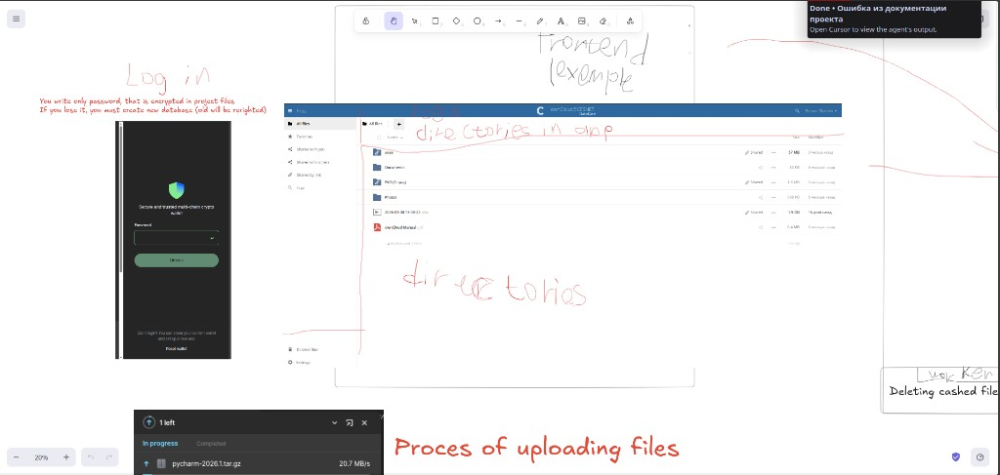

# Onion — гайд по имплементации слоёв

Как **работать** с проектом слой за слоем: порядок, **gate**, **smoke**, закрытие задач.

**Связано:**

- [ONION_ARCHITECTURE.md](ONION_ARCHITECTURE.md) — структура слоёв и импорты (**источник истины по архитектуре**)
- [BACKLOG.md](BACKLOG.md) — что не сделано + обязательный цикл
- [PROJECT.md](PROJECT.md) — обзор и статус

При расхождении по **слоям и импортам** — приоритет у **ONION_ARCHITECTURE.md**.  
При расхождении по **режиму работы (gate/smoke)** — приоритет у **этого файла**.

---

## 1) Порядок слоёв

Чистка и фичи — **снизу вверх**:

```
use_cases  →  infrastructure  →  application
```

| Слой | Статус | Когда трогать |
|------|--------|----------------|
| `domain` | ✅ **закрыт** (2026-06) | Только если нижний слой вскрыл дыру в ядре |
| `use_cases` | 🟡 **сейчас** | P0.1 — первый проход, gate + smoke |
| `infrastructure` | ❌ дальше | P0.2 — провайдеры, БД, Celery, facade |
| `application` | ❌ дальше | P0.3 — GUI, после стабильного низа |
| `observation` | ❌ параллельно | CI, линтеры, health — с demo/релизом |

**Одна сессия = один слой или один чёткий кусок** (не «понемногу везде»).

### Граница `domain` vs `use_cases` (идемпотентность)

| Concern | Слой | Модуль | Пример |
|---------|------|--------|--------|
| Сущности и статусы | `domain` | `models.py` | `SourceItemStatus.QUEUED` |
| Создать / проверить / сменить статус | `domain` | `actions.py` | `mark_source_item`, `verify_*` |
| «Шаг допустим только при статусе X» | `use_cases` | `backup/gates.py` | `require_item_queued` |
| Строка в БД не найдена | `use_cases` | `repositories/loading.py` | `require_session_record` |
| Повторный запуск шага (Celery, двойной enqueue) | `use_cases` | `backup/idempotency.py` | `decide_archive_on_retry` → `SKIP` / `RUN` / `RESUME` |
| Какой ref скачивать при restore | `use_cases` | `restore/refs.py` | `restore_download_ref` |

**Правило:** domain — только **сущности, статусы, create / verify / mark, DomainError**. Всё про пайплайн (gates, idempotency, restore refs, not-found) — **use_cases**. Infrastructure (Celery `tasks.py`) только вызывает facade → use case.

---

## 2) Gate (гейт) — **обязательно**

**Gate** — условие «можно идти дальше». Не «поработал N часов», а **конкретный критерий готовности**.

| ❌ Не gate | ✅ Gate |
|-----------|---------|
| «Написал провайдер» | Round-trip файла через Telegram **без 404** |
| «Прогнал pytest» | pytest зелёный **+** ручной smoke (см. ниже) |
| «Закрыл тикет в голове» | Пункт **удалён из BACKLOG** после gate |

### Gate по слоям (кратко)

| Слой / этап | Gate |
|-------------|------|
| **P0.1** `use_cases` | `pytest tests/test_use_cases_*.py -v` + backup happy path вручную |
| **P0.2** `infrastructure` | `docker compose up` + полный backup smoke; restore download без 404 |
| **P0.3** `application` | Полный сценарий в GUI после правок |
| **P1** restore | Оригинальный файл в **выбранной** `dest_path` |
| **P-demo** v1 | Один скрипт запуска + CI зелёный на `main` (см. BACKLOG § P-demo) |
| **Миграция Client API** | Phase 0: файл туда-обратно через группу без 404 |

**Правило:** gate не закрыт → **следующий слой / следующая фича не начинаются**.

---

## 3) Smoke (smoke test) — **обязательно**

**Smoke** — короткая **ручная** проверка «в целом не горит». Happy path за 5–15 минут.

Автотесты (`pytest`, `ruff`, `mypy`) **нужны**, но **не заменяют** smoke.

### Минимальный smoke (backup)

```bash
docker compose up -d
PYTHONPATH=src .venv/bin/python -m application.gui
# Start Session → Add File → Start Backup → Refresh Progress
docker compose logs -f celery-worker-archive-1
```

### Smoke для Telegram Client API / драйвера

1. Поднять compose (postgres, redis, workers).
2. Залить **один** тестовый файл через client provider.
3. Скачать обратно по сохранённым refs.
4. Файл на диске совпадает · **нет HTTP 404**.

Только mock-тесты без живого round-trip — **smoke не засчитывается**.

### Smoke для demo v1 (один скрипт)

```bash
./scripts/run.sh   # или: make demo
# ожидание: compose + миграции + подсказка запустить GUI
```

Друг должен повторить **одну команду** после `git clone` (с `.env` по примеру).

---

## 4) Обязательный цикл (на каждую заметную правку)

```
код → автотесты → smoke (руками) → gate закрыт → следующий шаг
```

### Кто что делает: Roman vs ИИ

> **ИИ не закрывает gate и не засчитывает smoke.** Отчёт ассистента «тесты прошли у меня в песочнице» ≠ продукт работает у тебя.

| Шаг | **Roman (руками, обязательно)** | **ИИ (может помочь, не заменяет)** |
|-----|--------------------------------|-------------------------------------|
| **1. Код** | Читать diff · понимать, *что* меняется · решать merge/архитектуру · **коммитить** | Писать/править код · рефакторинг · объяснять слои |
| **2. Автотесты** | **Запустить у себя:** `pytest`, `ruff`, `mypy` · починить, если красное · пуш в репо | Написать/дополнить тесты · прогнать в своей среде *(ты всё равно перепроверяешь локально)* |
| **3. Smoke** | **Только ты:** `docker compose up` · GUI клики · логи воркеров · живой Telegram · `./scripts/run.sh` на своей машине · сказать вслух/в чат: **«smoke прошёл»** или **«нет, вот ошибка»** | Подсказать команды · напомнить чеклист · **не** писать «smoke ✅» за тебя |
| **4. Gate** | Сверить критерий из таблицы §2 · **сам** удалить пункт из BACKLOG · разрешить переход к следующему слою | Напомнить, какой gate по плану · **не** объявлять этап закрытым без твоего «ок» |

### Чеклист Roman перед «готово»

- [ ] Я **сам** запускал команды в терминале (не только смотрел вывод ИИ)
- [ ] Я **сам** прошёл smoke-сценарий (GUI или round-trip файла)
- [ ] Я **сам** убедился, что gate из §2 выполнен
- [ ] Только после этого — удаление из BACKLOG / следующая задача

### Чего ИИ делать не должен (и не считается)

| ❌ Не засчитывается | Почему |
|--------------------|--------|
| «Ассистент сказал, что работает» | Нет твоей машины, `.env`, Telegram-сессии |
| Зелёный pytest только у ИИ | Другая среда, кэш, нет compose |
| Mock-тест провайдера без живого upload/download | Smoke для Client API не пройден |
| ИИ удалил пункт из BACKLOG | Решение о gate — только Roman |

**Ассистенту:** в конце сессии с кодом — напомнить про smoke и чеклист Roman; **не** писать «gate закрыт», пока пользователь явно не подтвердил.

---

## 5) Как резать сессию

| Длина | Фокус |
|-------|--------|
| ~1 ч | Один подпункт P0.x · один gate-кандидат |
| ~2–4 ч | Закрыть gate слоя или Phase миграции |
| NS 7–8 ч | Один слой целиком + smoke в конце |

**Вечер продолжает утро** — не начинать «с нуля», если gate не закрыт.

---

## 6) Демо v1 («показать другу»)

Цель: не «идеальный продукт», а **рабочая первая версия** — клонировал, одна команда, backup в GUI, CI зелёный.

Чеклист → [BACKLOG.md § P-demo](BACKLOG.md#p-demo--v1-показать-другу-roman-0906).

---

## 7) Целевой GUI (`application` / P0.3)

**Статус:** MVP на Tkinter есть (`src/application/gui/app.py`); целевой UX — **file-manager** как на мокапе. Референс:



Все подписи в продукте — **English** ([INTERNAL_SPEC.md](INTERNAL_SPEC.md)). GUI по-прежнему ходит только в `BackupFacade` через `backend_receiver` — без импортов `use_cases` / `domain`.

### 7.1 Три экрана/режима

| # | Режим на мокапе | Назначение в telegram-uploader |
|---|-----------------|--------------------------------|
| 1 | **Unlock** (логин) | Разблокировка локального хранилища приложения |
| 2 | **Directories in app** (file explorer) | Рабочая область: профили, папки, файлы, статусы backup/restore |
| 3 | **Upload progress** (нижняя панель) | Прогресс pipeline: archive → upload в Telegram |
| + | **Locker / deleting cached file** | Фоновая очистка `archive-cache` (cleanup worker) |

---

### 7.2 Экран Unlock (вход)

**Визуал (по мокапу):** тёмная карточка по центру, иконка «защищённое хранилище», одно поле **Password**, кнопка **Unlock**, ссылка **Reset wallet** внизу.

**Поведение:**

- Пользователь вводит **только пароль** — он шифрует локальные секреты проекта (доступ к БД, session encryption key material, позже — Client API session file).
- Пароль **не** отправляется в Telegram; это **локальный** замок приложения.
- **Unlock** → открывается главный file explorer. Неверный пароль → понятная ошибка (не traceback).
- **Reset wallet** → подтверждение → **новая пустая БД**, старая перезаписывается. Явный warning: *«If you lose the password, you must create a new database; the old one will be overwritten.»*

**Не путать с Telegram auth:** логин в Telegram (Client API: phone + code) — отдельный flow в **Settings**, после миграции с Bot API. Unlock — всегда первый экран при старте приложения.

**Gate-кандидат P0.3:** Unlock → главный экран без падения; Reset с подтверждением и чистой БД.

---

### 7.3 Главный экран — directories in app

**Визуал (по мокапу):** layout как у cloud drive (референс — OwnCloud/Nextcloud): **sidebar слева**, **таблица файлов** по центру, **search** и **profile/settings** сверху.

#### Sidebar (навигация)

| Пункт на мокапе | Смысл в приложении | v1 |
|-----------------|-------------------|-----|
| **All files** | Корень workspace: все файлы и папки, доступные для backup | ✅ |
| **Favorites** | Закреплённые `display_name` / пути | 🟡 позже |
| **Shared with you** | — | ➖ не v1 (нет multi-user) |
| **Shared with others** | — | ➖ не v1 |
| **Shared by link** | — | ➖ не v1 |
| **Tags** | Метки на `source_items` | 🟡 позже |
| **Deleted files** | Элементы в `failed` / отменённые / soft-delete | 🟡 v1.1 |
| **Settings** | Encryption key, Telegram provider, `HOST_SOURCE_MOUNT`, Client API login | ✅ |

Пользователь **сам** организует данные через профиль/workspace ([INTERNAL_SPEC §7](INTERNAL_SPEC.md)) — приложение **не** переносит исходники в служебную папку.

#### Таблица (main list)

Колонки по мокапу → продуктовые поля:

| Колонка UI | Данные | Правило |
|------------|--------|---------|
| **Name** | `display_name` + иконка типа (folder / file) | Только `display_name` с enqueue; **никогда** basename из `source_path` ([INTERNAL_SPEC §6](INTERNAL_SPEC.md)) |
| **Sharing** | Статус backup: `queued` / `archiving` / `uploading` / `completed` / `failed` | Badge или текст; для restore — `restoring` / `restored` |
| **Size** | Размер исходника или сумма volumes | Человекочитаемый формат (MB, GB) |
| **Modified** | `updated_at` сессии или item | Относительное время («2 months ago») + tooltip с датой |

**Действия в списке (контекстное меню / toolbar):**

- **Add to backup** — выбор файла(ов), захват `display_name` при enqueue
- **Start backup** — запуск pipeline для сессии/выделенных items
- **Restore** — выбор `dest_path`, прогресс download + extract
- Открытие папки в sidebar = смена workspace root (профиль), не chroot в Telegram

**Search:** фильтр по `display_name` и статусу в текущем workspace.

**Profile icon (top-right):** активный профиль, смена профиля, выход (lock → снова Unlock).

---

### 7.4 Панель загрузки — process of uploading files

**Визуал (по мокапу):** компактная панель **внизу экрана** (drawer/popup), не блокирует file explorer.

| Элемент | Поведение |
|---------|-----------|
| Заголовок **«N left»** | Сколько файлов/volumes ещё в работе |
| Вкладки **In progress** / **Completed** | Активные задачи vs завершённые за сессию |
| Строка файла | `display_name` (не путь на диске) |
| **Progress bar** | Общий % по item: archive + upload (и позже restore) |
| **Speed** | Текущая скорость, напр. `20.7 MB/s` — из worker/facade polling |

**Источник данных:** `BackupFacade.get_progress()` → `ProgressDTO`; GUI только отображает, без Celery/HTTP.

**Ошибки:** failed item в той же панели — красный статус + короткое сообщение (не raw exception). Кнопка **Retry** / **Dismiss** где уместно.

**Gate-кандидат P0.3:** Add file → Start backup → панель показывает progress и `completed`; failed виден без логов в терминале.

---

### 7.5 Locker — deleting cached file

**На мокапе:** пометка про удаление cached file.

**В продукте:** отражает **cleanup worker** — удаление временных `.7z` частей из `archive-cache` после успешного upload.

| UX | Детали |
|----|--------|
| Фон | Пользователь не обязан видеть каждое удаление |
| Опционально | Toast / строка в панели progress: *«Cleaning archive cache…»* |
| Settings | Путь cache, ручной **Clear cache** (с предупреждением) |

Не блокирует основной UI; связано с инфраструктурой ([ONION_ARCHITECTURE.md](ONION_ARCHITECTURE.md) → cleanup queue).

---

### 7.6 Текущий MVP → целевой GUI

| Сейчас (Tkinter MVP) | Цель (мокап) |
|----------------------|--------------|
| Одно окно: Session + Queue | Unlock → File explorer + bottom progress drawer |
| Profile name + encryption key на главном экране | Unlock (password) + Settings (encryption key override) |
| Treeview: display_name, status | Таблица: Name, Sharing, Size, Modified |
| Кнопки Add / Start / Refresh / Restore | Toolbar + context menu + progress panel |
| `messagebox` с сырыми ошибками | Inline errors + короткие диалоги |

**Порядок внедрения (P0.3):**

1. Unlock + Settings (локальный пароль, encryption key)
2. File explorer (All files + таблица + Add/Backup)
3. Progress drawer (In progress / Completed)
4. Restore UX + failed/stuck states
5. Sidebar extras (Favorites, Tags, Deleted) — по мере необходимости
6. Telegram **Client API** login в Settings — вместе с [TELEGRAM_CLIENT_API_MIGRATION.md](TELEGRAM_CLIENT_API_MIGRATION.md); Bot API wizard **не** делаем

**Технология UI:** мокап — web/cloud-drive референс; реализация может остаться **desktop-native** (Tkinter → позже Qt/GTK/Electron — решение на этапе P0.3, границы слоя не меняются).

---

### 7.7 Gate P0.3 (GUI) — уточнение

Помимо §2 «полный сценарий в GUI»:

- [ ] Unlock → workspace → Add file → backup → progress panel → `completed` в Telegram group
- [ ] `display_name` везде в UI, не path
- [ ] Failed/stuck видны в таблице и progress panel
- [ ] Restore (после Client API): файл в выбранном `dest_path`
- [ ] Roman прошёл smoke §3 **в новом UX**, не только в старом MVP

---

*Обновляй gate-таблицу при смене приоритетов. Архитектура слоёв — в [ONION_ARCHITECTURE.md](ONION_ARCHITECTURE.md).*
