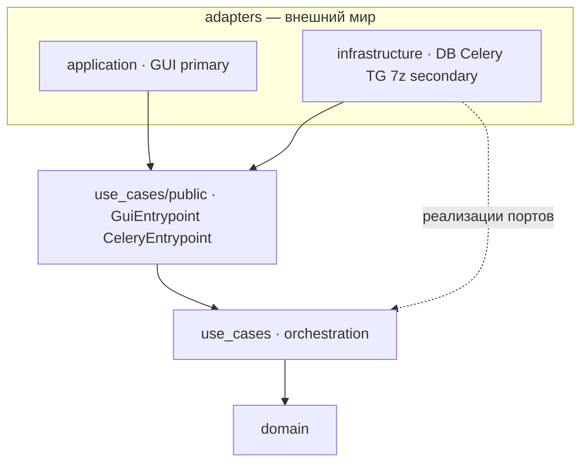
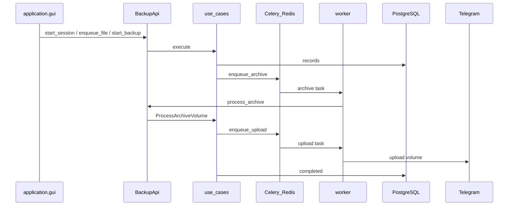

# telegram-uploader — проект и архитектура

> **Единственный канон** по устройству проекта, рефакторингу и режиму работы.  
> Обновлено: **2026-06-12**. Всё остальное в `docs/` — продуктовые правила, Telegram-гайды, бэклог или release notes.

**Содержание:** [1 Обзор](#1-обзор) · [2 Статус](#2-статус) · [3 Решение: рефакторинг](#3-решение-рефакторинг) · [4 Архитектура](#4-архитектура) · [5 Слои и папки](#5-слои-и-папки) · [6 Стек и runtime](#6-стек-и-runtime) · [7 Потоки данных](#7-потоки-данных) · [8 План рефакторинга](#8-план-рефакторинга) · [9 Правила для AI](#9-правила-для-ai) · [10 Режим работы](#10-режим-работы) · [11 Известные баги и долг](#11-известные-баги-и-долг) · [12 GUI](#12-gui) · [13 Запуск](#13-запуск) · [14 Индекс docs](#14-индекс-docs) · [SOLID-аудит](SOLID_AUDIT.md)

---

## 1. Обзор

Linux desktop app: бэкап файлов в хранилище мессенджера. **v1** — Telegram-first; ядро provider-agnostic (`StorageProviderPort`).

**Что делает:**

1. Пользователь выбирает файлы в GUI (English UI, `display_name` при enqueue).
2. Pipeline: **7z** (encrypt + split) → upload томов в **Telegram-группу** → состояние в **PostgreSQL**.
3. **Celery workers** (archive / upload / cleanup / restore) — тяжёлая работа.
4. **Restore** — скачать тома и извлечь оригинал *(частично не готово)*.

**Репо:** `src/domain` → `src/use_cases` → `src/infrastructure` → `src/application`.

---

## 2. Статус

| Область | Статус |
|---------|--------|
| `domain` | ✅ закрыт (2026-06) |
| Phase 0 debugger | ✅ достаточно |
| **Phase 1 refactor (R2–R8)** | ✅ закрыт (UC-1…UC-8, 2026-06) |
| Backup GUI → workers → Telegram → `completed` | ✅ smoke OK (Client API default) |
| Client API: sign-in + upload + Test Client API | ✅ upload + download round-trip in Settings |
| Restore download (Client API) | 🟡 Test Client API OK; **GUI Restore Session smoke — Roman** → [TELEGRAM_CLIENT_API_MIGRATION.md](TELEGRAM_CLIENT_API_MIGRATION.md) |
| Restore extract (7z → `dest_path`) | ✅ UC-7 |
| Bot API provider | legacy (`TELEGRAM_PROVIDER=bot`, `--profile bot`) |
| Packaging `.deb` + upgrade docs | ✅ 0.1.9 |
| Archive retry `E_NOTIMPL` (stale partial 7z) | ✅ fixed |
| CI / CD | ✅ CI + Release on tag `v*` |
| `import-linter` | ✅ UC-8 |

**Нереализованные фичи:** [BACKLOG.md](BACKLOG.md) · **продуктовые правила:** [INTERNAL_SPEC.md](INTERNAL_SPEC.md).

---

## 3. Решение: рефакторинг

**2026-06-11, Roman:**

| Было | Стало |
|------|-------|
| Phase 0 blocker — ещё gate вслух | Phase 0 **закрыт** |
| Мораторий на архитектуру | **Снят** — кодим по PR-плану |
| T2 «проговори backup 2 мин» | **Пропущен** |
| T4 «ментор сказал можно» | **Deferred** — ревью на PR |

**Почему:** лишние hop'ы (facade), рваный график, прокрастинация. **Маленькие PR лучше ещё одного дебага.**

**Как работаем:** один PR → `pytest` + `ruff` + `mypy` → **Roman smoke руками** → следующий PR. Без big-bang.

---

## 4. Архитектура

### 4.1 Целевая модель (hexagonal / ports & adapters)

`application` и `infrastructure` — **оба адаптеры**. Мозг — `use_cases`. Ядро — `domain`.  
Папки **не сливаем**; меняются **правила импортов** и **публичный API**.



### 4.2 Как сейчас (после R5)

```
GUI → BackendReceiver → GuiEntrypoint → use case → ports
Worker (tasks.py) ────→ CeleryEntrypoint ────────────┘
```

`BackupFacade` удалён; composition root — `wire_gui_entrypoint()` / `wire_celery_entrypoint()` в `bootstrap.py`.

### 4.3 Правила зависимостей (целевые)

| Слой | Может | Нельзя |
|------|-------|--------|
| `domain` | stdlib | всё остальное |
| `use_cases` | `domain`, порты, mappers, persistence (внутри) | Tkinter, SQLAlchemy, Celery |
| `use_cases/public` | Command/Result наружу | `Session`, `*Record`, ORM |
| `application` | `use_cases.public`, UI-DTO | `domain`, `infrastructure.db`, Celery |
| `infrastructure` | `use_cases.public`, реализации портов | Tkinter, `domain` *(цель)* |

**Composition root:** `src/infrastructure/bootstrap.py` — единственное место wiring.

**SOLID:** полный аудит соответствия принципам SOLID (2026-06-13) — [SOLID_AUDIT.md](SOLID_AUDIT.md). Кратко: **~73%** в целом; сильнее всего **D** (порты, composition root), слабее **O** (entrypoints закрыты для новых фич) и **S** (толстый GUI, UX-текст в UC).

### 4.4 Граница persistence

Infrastructure **не** импортирует `domain`. Цепочка:

```
ORM Row → infra mappers → SessionRecord → use_cases/mappers → domain.Session
```

Репозитории в `use_cases` работают с **Record**, не с domain entity. Use case внутри маппит ↔ domain.

### 4.5 domain vs use_cases

| Concern | Слой | Пример |
|---------|------|--------|
| Сущности, статусы | `domain` | `SourceItemStatus.QUEUED` |
| create / verify / mark | `domain` | `actions.py` |
| «Шаг только при статусе X» | `use_cases` | `backup/gates.py` |
| Not found | `use_cases` | `repositories/loading.py` |
| Idempotency Celery | `use_cases` | `backup/idempotency.py` |
| Restore refs | `use_cases` | `restore/refs.py` |

### 4.6 Narrow public API (цель R4)

| Метод | Вход | Выход | Кто зовёт |
|-------|------|-------|-----------|
| `start_session` | `StartSessionCommand` | `SessionResult` | GUI |
| `enqueue_file` | `session_id`, `Path`, `display_name` | `QueueItemResult` | GUI |
| `start_backup` | `session_id` | `int` | GUI |
| `get_progress` | `session_id` | `ProgressResult` | GUI |
| `restore_session` | `session_id`, dest `Path` | `RestoreResult` | GUI |
| `process_archive` | `source_item_id` | `None` | worker |
| `process_upload` | `archive_volume_id` | `None` | worker |
| `process_cleanup` | `archive_volume_id` | `None` | worker |
| `process_restore_volume` | `archive_volume_id` | `Path` | worker |

**DTO vs Command:** Command — один dataclass на сценарий (удобнее рефактору). Result — frozen dataclass без логики. GUI **никогда** не видит `domain.Session`.

`BackendReceiver` → тонкий mapper `*Result` → `SessionViewDTO`, или GUI зовёт `BackupApi` напрямую (решить в R5).

---

## 5. Слои и папки

### 5.1 `domain` ✅

`src/domain/` — `models.py`, `actions.py`, `errors.py`. Без SQL, Celery, Telegram.

### 5.2 `use_cases` ✅

Оркестрация, порты (`Protocol`), persistence records, backup/restore/session.

**Layout (R6 done):**

```
use_cases/
  shared/          # persistence, mappers, repositories/, ports/, loading
  session/
  backup/          # UC + gates + idempotency
  restore/
  public/          # GuiEntrypoint, CeleryEntrypoint, commands, results
```

### 5.3 `infrastructure`

| Модуль | Роль |
|--------|------|
| `bootstrap.py` | composition root |
| ~~`facade.py`~~ | удалён (R5) |
| `db/` | SQLAlchemy, migrations, repo impl |
| `archive/` | `SevenZipService` |
| `providers/` | `TelegramClientProvider` (default), `TelegramProviderV1` (legacy bot) |
| `worker/` | Celery `celery_app`, `tasks` |
| `config.py` | env |

Worker entrypoint: тонкий — `get_celery_entrypoint()` → `CeleryEntrypoint`, без бизнес-логики в `tasks.py`.

### 5.4 `application`

`gui/` (Tkinter, English) + `backend_receiver.py`. Только facade/API + UI-DTO.

### 5.5 `observation` (будущее)

Сейчас: `tests/`, `pyproject.toml`, CI, [`observation/logging_setup.py`](../src/observation/logging_setup.py) → `telegram-uploader.log`. Позже: correlation ids, health metrics.

---

## 6. Стек и runtime

| Технология | Слой | Где |
|------------|------|-----|
| Python 3.12+ | все | `pyproject.toml` |
| PostgreSQL 16 | infra | `docker-compose` → `postgres` |
| SQLAlchemy 2 + psycopg | infra | `infrastructure/db/` |
| Redis 7 | infra | Celery broker/backend |
| Celery 5 | infra | `worker/celery_app.py`, `tasks.py` |
| 7z (p7zip) | infra | `seven_zip_service.py` |
| Telethon (Client API) | infra | `telegram_client_provider.py` |
| telegram-bot-api | infra (legacy) | compose `--profile bot` |
| Docker Compose | ops | `docker-compose.yml` (`INSTALL_ROOT`, `HOST_SOURCE_MOUNT`) |
| pytest / ruff / mypy | observation | `tests/`, CI |

### Celery — очереди

| Очередь | Назначение |
|---------|------------|
| `archive` | 7z encrypt + split |
| `upload` | sendDocument |
| `cleanup` | удаление temp |
| `restore` | download volumes |

5 worker-процессов в compose (2× archive). **Правило:** `use_cases` → `TaskQueuePort.enqueue_*`; не `.delay()` из UC.

### Ключевые env

| Группа | Переменные |
|--------|------------|
| Postgres | `POSTGRES_*` |
| Redis | `REDIS_*` |
| Telegram (Client API) | `TELEGRAM_PROVIDER=client`, `TELEGRAM_API_ID`, `TELEGRAM_API_HASH`, `TELEGRAM_SESSION_PATH`, `TELEGRAM_TARGET_CHAT_ID` |
| Telegram (Bot API legacy) | `TELEGRAM_PROVIDER=bot`, `TELEGRAM_BOT_TOKEN`, `TELEGRAM_BOT_API_URL` |
| Packaged / Docker paths | `INSTALL_ROOT` (default `/opt/telegram-uploader`), `HOST_SOURCE_MOUNT` (default `$HOME`), `TELEGRAM_UPLOADER_ENV_FILE` |
| Archive | `ARCHIVE_ENCRYPTION_KEY`, `ARCHIVE_CACHE_DIR` |

Конфиг пользователя: `~/.config/telegram-uploader/.env`. Сессия: `~/.config/telegram-uploader/session.session`.

Кеш архивации в workers: Docker volume `archive-cache` → `/data/archive-cache/<source_item_id>/{raw,outgoing}/` — см. [INTERNAL_SPEC.md](INTERNAL_SPEC.md).

---

## 7. Потоки данных

### Backup (happy path)



**Одно предложение:** GUI пишет намерение в БД и Redis; тяжёлое — в workers; истина — Postgres.

### Phase 0 debugger (закрыт)

PyCharm: `application.gui`, `PYTHONPATH=src`. F8 Step Over, F7 Step Into.  
**CH-1** (auto-generated-key в GUI) — исправлен в R2/R3.

---

## 8. План рефакторинга

### PR-последовательность

| PR | Задача | Gate |
|----|--------|------|
| **R1** ✅ | Правила для AI → [§9](#9-правила-для-ai) | прочитано |
| **R2** ✅ | **CH-1b** — ключ в `CreateSessionUseCase`, убрать литерал из GUI | pytest + smoke |
| **R3** ✅ | **CH-1c** — показ автоключа в GUI (messagebox + clipboard) | smoke |
| **R4** ✅ | `use_cases/public/` — BackupApi, WorkerApi, commands, results | compile + tests |
| **R5** ✅ | Заменить facade hop; worker → WorkerApi | backup smoke |
| **R6** ✅ | **CH-2** — layout `use_cases/shared/` move-only | pytest green |
| **R7** ✅ | `import-linter` под §4.3 | CI |
| **R8** ✅ | Этот файл синхронизирован с кодом | — |

### R5 checklist (facade) — done

- [x] `bootstrap.py` — `build_backup_api()` / `build_worker_api()`
- [x] `backend_receiver.py` → `BackupApi`
- [x] `tasks.py` → `WorkerApi`
- [x] `get_session_progress` → use case (не raw repos)
- [x] `test_facade.py` → `test_public_api.py` + wiring tests

### Вне scope Phase 1

- Client API migration
- Restore extract → `dest_path`
- Merge `application` + `infrastructure` в одну папку
- Удаление `persistence.py` до стабильного public API

---

## 9. Правила для AI

**Каждый architecture PR:**

1. **Один PR = один кусок** — не смешивать с Client API / restore.
2. Порядок — [§8](#8-план-рефакторинга).
3. После PR: `pytest -m "not integration"`, `ruff`, `mypy`, **Roman smoke**.
4. Не big-bang: move и logic — в разных PR.
5. Агенты пишут commit/PR/docs **на английском**; Roman может на русском.

### Документирование backend-изменений

**Обязательно** для любого PR, меняющего код в `domain/`, `use_cases/` или `infrastructure/`:

1. Добавить секцию в [refactor/CHANGES.md](refactor/CHANGES.md): дата, заголовок PR, таблица файлов, поведение до/после, gate/smoke, known issues.
2. Обновлять ту же секцию, если PR дополняется fix'ами до merge.

**Не требуется:** PR только в `application/` (GUI) без изменения backend-контрактов; typo-only правки docs без кода.

**Запрещено:**

- Переименование top-level пакетов до R7
- GUI → SQLAlchemy / Celery
- `use_cases/types.py` реэкспорт domain наружу
- Удаление facade без переподключения `tasks.py`
- Diff > ~400 строк без разбиения

**Застрял** — идея в vault-заметку, не полу-код в репо.

---

## 10. Режим работы

### Gate

Конкретный критерий «можно дальше», не «поработал час».

| Этап | Gate |
|------|------|
| Refactor PR | pytest + ruff + mypy + **Roman smoke backup** |
| P0.2 infra | restore download без 404 |
| P1 restore | файл в выбранном `dest_path` |
| P-demo | `./scripts/run.sh` + CI green |

**Gate не закрыт → следующий PR не начинаем.**

### Smoke (обязательно, руками Roman)

```bash
docker compose up -d
PYTHONPATH=src .venv/bin/python -m application.gui
# Start Session → Add File → Start Backup → Refresh Progress
docker compose logs -f celery-worker-archive-1
```

`pytest` **не заменяет** smoke. ИИ **не** пишет «smoke ✅» за Roman.

### Цикл

```
код → автотесты (Roman локально) → smoke (Roman) → gate → следующий PR
```

### Сессии

| Время | Фокус |
|-------|--------|
| ~1 ч | один подпункт / один PR |
| IT-день | R2 или R4+R5 кусок + smoke в конце |

---

## 11. Известные баги и долг

### CH-1 · encryption_key ✅

**Было:** `app.py` подставлял `"auto-generated-key"`.

**Сделано:** генерация в `CreateSessionUseCase`; GUI шлёт `None`; R3 — messagebox + clipboard для автоключа (plain text не логируется).

### CH-2 · use_cases layout ✅

Move-only в R6 — см. [§5.2](#52-use_cases-).

### Прочий техдолг

- GUI Restore Session smoke — Roman ([migration](TELEGRAM_CLIENT_API_MIGRATION.md)); blocked by FIX-4 (7z extract permission) — см. [refactor/CHANGES.md](refactor/CHANGES.md)
- **FIX-1 (open):** progress bar «зависает» при backup — нет polling, P1.2 ([CHANGES.md](refactor/CHANGES.md))
- **FIX-2 (переоценено):** `database is locked` — два окна GUI на одном `session.session`; не primary blocker ([CHANGES.md](refactor/CHANGES.md))
- **FIX-3 (partial):** Restore в background thread — UI responsive during restore ([CHANGES.md](refactor/CHANGES.md))
- **FIX-4 (fix landed):** dest writability preflight + 7z permission message; smoke TBD ([CHANGES.md](refactor/CHANGES.md))
- Старые volumes (bot `file_id`) — re-upload после переключения на client provider
- **Resolved:** archive retry `E_NOTIMPL` — очистка stale `payload.7z*` перед повторной архивацией (`seven_zip_service._clear_stale_volumes`)

---

## 12. GUI

**Сейчас:** Unlock → file explorer (sidebar + Name/Folder/Size/Modified/Status) → progress drawer внизу. English-only. Данные через `BackendReceiver` → `GuiEntrypoint`.

**Settings:** вкладки General / Client API / Bot API; Save → `~/.config/telegram-uploader/.env`; **Sign in to Telegram…** (in-app dialog) или `telegram-uploader-login`; **Test Client API**.

**Остаётся (P0.3):** restore UX, failed/stuck UI polish, visual polish — [BACKLOG.md](BACKLOG.md) P1.2.

---

## 13. Запуск

```bash
./scripts/run.sh
# или:
docker compose up -d
PYTHONPATH=src .venv/bin/python -m application.gui
```

```bash
.venv/bin/pytest -m "not integration" -v
.venv/bin/ruff check src tests && .venv/bin/mypy src
```

Telegram setup: [TELEGRAM_SETUP.md](TELEGRAM_SETUP.md).

### Packaging

CD: push tag `v*` (version must match `pyproject.toml`) → [`.github/workflows/release.yml`](../.github/workflows/release.yml) builds `.deb` and publishes a GitHub Release.

**Install:** see [README § Install from .deb](../README.md#install-from-deb-ubuntu-2404-amd64).

**Upgrade:**

See [README § Upgrading](../README.md#upgrading-deb-users).

Maintainer release flow: bump `pyproject.toml` → commit → `git tag vX.Y.Z` → `git push origin main && git push origin vX.Y.Z` → CI builds and publishes `.deb`.

1. Stop stack: `docker compose -f /opt/telegram-uploader/docker-compose.yml down`
2. Backup Postgres volume if release notes require it (`docker volume ls` → `postgres-data`)
3. `sudo apt install ./telegram-uploader_<version>_amd64.deb` — postinst recreates venv and reinstalls Python deps
4. `telegram-uploader` — migrations on startup, workers rebuild from packaged `Dockerfile`

Version = `pyproject.toml` = git tag without `v` prefix.

---

## 14. Индекс docs

| Файл | Зачем |
|------|-------|
| **PROJECT.md** (этот) | **Архитектура, рефактор, режим работы** |
| [SOLID_AUDIT.md](SOLID_AUDIT.md) | **Аудит SOLID** по всему `src/` (оценки, примеры, приоритеты) |
| [BACKLOG.md](BACKLOG.md) | Нереализованные фичи |
| [INTERNAL_SPEC.md](INTERNAL_SPEC.md) | Продуктовые правила |
| [TELEGRAM_SETUP.md](TELEGRAM_SETUP.md) | `.env`, группа, первый backup |
| [CLIENT_API_SETUP.md](CLIENT_API_SETUP.md) | Client API: сессия, sign-in |
| [TELEGRAM_CLIENT_API_MIGRATION.md](TELEGRAM_CLIENT_API_MIGRATION.md) | Bot API → MTProto (статус миграции) |
| [releases/](releases/) | Текст GitHub Release по версиям |
| [refactor/CHANGES.md](refactor/CHANGES.md) | **Обязательный журнал backend PR** (`domain` / `use_cases` / `infrastructure`) |
| [BACKUPVAULT_IMPLEMENTATION.md](BACKUPVAULT_IMPLEMENTATION.md) | Side project (не v1) |
| [AI_AGENT_SKILLS.md](AI_AGENT_SKILLS.md) | Cursor skills |

---

*Фичи → BACKLOG. Продукт → INTERNAL_SPEC. Архитектура и план → этот файл.*
