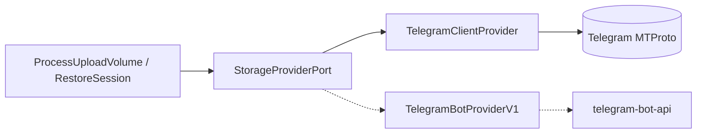

# Telegram: Bot API → Client API (MTProto)

Гайд по замене `TelegramProviderV1` (HTTP Bot API + local `telegram-bot-api`) на **user-session Client API** (MTProto) для надёжного upload/download из целевой группы.

**Статус:** ⏳ запланировано — backup через Bot API работает; **restore падает с HTTP 404** на download.

**Связанные документы:**

| Документ | Роль |
|----------|------|
| [INTERNAL_SPEC.md](INTERNAL_SPEC.md) | продуктовые правила (`display_name`, metadata для restore) |
| [PROJECT.md](PROJECT.md) | `StorageProviderPort` в use_cases; реализация — в `infrastructure/providers/` |
| [BACKLOG.md](BACKLOG.md) | всё нереализованное (приоритеты) |
| [PROJECT.md](PROJECT.md) | обзор проекта и индекс docs |

При расхождении по слоям — приоритет у **[PROJECT.md](PROJECT.md)**.

---

## Зачем менять

| Bot API (сейчас) | Client API (цель) |
|------------------|-------------------|
| `sendDocument` + `getFile` + `GET /file/bot{token}/{path}` | `send_file` + `download_media` по сообщению в чате |
| `file_id` может протухать | restore по `chat_id` + `message_id` — стабильнее для группы |
| local `telegram-bot-api` для больших файлов | user account: до ~2 GB без отдельного Bot API сервера |
| restore: HTTP 404 на download URL | прямой MTProto download из истории группы |

**Onion не ломаем:** use cases по-прежнему вызывают только `StorageProviderPort`.

---

## Текущая реализация (Bot API)

```
infrastructure/providers/telegram_provider.py   → TelegramProviderV1
use_cases/ports/storage_provider.py           → StorageProviderPort (Protocol)
docker-compose.yml                            → telegram-bot-api :8081
```

### Upload flow

1. `ProcessUploadVolumeUseCase` → `storage_provider.upload_file(...)`
2. `sendDocument` multipart → Bot API
3. В БД: `external_file_id`, `external_message_id`, `provider_download_ref`

### Restore flow (сломан на download)

1. `RestoreSessionUseCase` → `get_file_info(external_file_id)` → `getFile`
2. `download_file` → `GET {base_url}/file/bot{token}/{file_path}`
3. **HTTP 404** — типичные причины:
   - bot `file_id` / `file_path` протухли или недоступны с хоста GUI
   - `provider_download_ref` при upload = `file_unique_id`, при download используется другой путь из `getFile`
   - кэш local Bot API не совпадает с контекстом upload (Docker) vs restore (host)

### Что уже в БД (не меняем схему)

Поля `archive_volumes` ([INTERNAL_SPEC §4](INTERNAL_SPEC.md)):

- `external_file_id`
- `external_message_id`
- `provider_download_ref`

Меняем **семантику** значений, не колонки.

---

## Целевая архитектура

```
use_cases/ports/storage_provider.py     ← контракт (минимальные правки)
infrastructure/providers/
  telegram_bot_provider.py              ← Bot API (legacy, deprecate)
  telegram_client_provider.py           ← MTProto (новый default)
infrastructure/bootstrap.py             ← TELEGRAM_PROVIDER=client|bot
```



---

## Выбор библиотеки

| | Telethon | Pyrogram |
|---|----------|----------|
| MTProto | да | да |
| Async | нативно | нативно |
| Celery sync workers | `asyncio.run()` / thread pool | то же |
| Рекомендация | **первый spike** | запасной |

Зависимость: `telethon` только в `infrastructure` (не в use_cases).

---

## Идентификаторы для restore

| Поле | Bot API (сейчас) | Client API (цель) |
|------|------------------|-------------------|
| `external_message_id` | `message_id` в чате | то же — **главный ключ restore** |
| `external_file_id` | bot `file_id` | `document.id` (MTProto) |
| `provider_download_ref` | `file_unique_id` / `file_path` | opaque ref, напр. `client:{chat_id}:{message_id}:{document_id}` |

**Рекомендация:** при upload client provider писать структурированный ref в `provider_download_ref`. Restore читает ref, не полагается на протухающий `file_id`.

### Изменения в use_cases (минимальные)

- `use_cases.restore.refs.restore_download_ref` → расширить до `restore_ref_for_volume(volume)`:
  - приоритет `provider_download_ref` (client ref)
  - fallback: `external_message_id` + `TELEGRAM_TARGET_CHAT_ID` из config
- Сигнатуру `StorageProviderPort` можно **не менять**, если `get_file_info(ref)` принимает opaque string.

---

## Фазы миграции

### Phase 0 — Spike (1–2 дня)

**Цель:** доказать round-trip без HTTP.

1. Скрипт `scripts/telegram_client_spike.py` (или `infrastructure/providers/_spike.py`)
2. Auth: `api_id`, `api_hash`, phone → session file
3. `send_file(chat_id, path)` → сохранить `message.id`, `document.id`
4. `download_media(message, dest)` → файл на диск
5. Файл >50 MB (аргумент против публичного Bot API)

**Gate:** README.md туда-обратно через группу без 404.

---

### Phase 1 — `TelegramClientProvider`

**Файл:** `infrastructure/providers/telegram_client_provider.py`

Реализует `StorageProviderPort`:

| Метод | Client API |
|-------|------------|
| `healthcheck(remote_target)` | `get_entity(chat_id)`, проверка доступа к группе |
| `upload_file(...)` | `client.send_file(chat, path, ...)` → `UploadResult` |
| `get_file_info(ref)` | parse ref → metadata сообщения |
| `download_file(info, dest)` | `client.download_media(...)` |
| `classify_error` | `FloodWaitError` → RATE_LIMITED, `AuthKeyError` → AUTH, … |
| `provider_limits()` | лимиты user account |

**Async в Celery:** обёртка `_run_async(coro)` → `asyncio.run(coro)` на задачу (MVP).

---

### Phase 2 — Config

`.env` / `AppConfig`:

```env
TELEGRAM_PROVIDER=client          # bot | client

TELEGRAM_API_ID=...
TELEGRAM_API_HASH=...
TELEGRAM_SESSION_PATH=/data/telegram/session.session
# или TELEGRAM_SESSION_STRING=...

TELEGRAM_TARGET_CHAT_ID=-100...

# Legacy (удалить после миграции):
# TELEGRAM_BOT_TOKEN=...
# TELEGRAM_BOT_API_URL=...
```

Docker:

- volume `telegram-session:/data/telegram`
- one-shot сервис / CLI: `python -m infrastructure.telegram_auth` (код из SMS/Telegram)

User account **должен быть в группе** с правом читать историю.

---

### Phase 3 — Wiring

`infrastructure/bootstrap.py`:

```python
def build_storage_provider(cfg: AppConfig) -> StorageProviderPort:
    if cfg.telegram_provider == "client":
        return TelegramClientProvider(...)
    return TelegramBotProviderV1(...)  # legacy
```

Переименовать текущий `telegram_provider.py` → `telegram_bot_provider.py` (опционально, для ясности).

---

### Phase 4 — Данные и обратная совместимость

| Сценарий | Действие |
|----------|----------|
| Новые backup после переключения | client refs в БД, `provider_name=telegram_client` |
| Старые volumes (bot `file_id`) | restore **не поддерживается** — re-upload |
| SQL migration | не обязательна |

---

### Phase 5 — docker-compose

**Убрать / optional:**

- сервис `telegram-bot-api`
- `TELEGRAM_BOT_TOKEN`, `TELEGRAM_BOT_API_URL` в worker env

**Добавить:**

- `telegram-session` volume на workers + GUI container (когда GUI в compose)
- документированный auth flow

---

### Phase 6 — Тесты

| Файл | Назначение |
|------|------------|
| `tests/test_telegram_client_provider.py` | unit с mock Telethon |
| `tests/test_provider_contract.py` | оба провайдера проходят contract suite |
| `tests/test_telegram_client_integration.py` | `@pytest.mark.integration`, live session |
| `tests/test_use_cases_restore.py` | fake provider с message-based ref |

---

### Phase 7 — Restore end-to-end (продукт)

Client API решает **download**. Отдельно (см. [BACKLOG.md](BACKLOG.md) P1):

1. Скачать все `.7z` части по `part_number`
2. Расшифровать / распаковать 7z в `dest_path` (ключ из session)
3. GUI **Restore Session** → оригинальный файл в выбранной папке (сейчас staging игнорирует `dest_path` — баг)

---

## Порядок работ (чеклист)

```
[ ] 0. Spike Telethon round-trip
[ ] 1. TelegramClientProvider + unit tests
[ ] 2. AppConfig + TELEGRAM_PROVIDER switch
[ ] 3. bootstrap wiring
[ ] 4. Upload в worker (новые backup)
[ ] 5. Download в restore (GUI + worker)
[ ] 6. Contract + integration tests
[ ] 7. Убрать telegram-bot-api из compose
[ ] 8. Deprecate TelegramBotProviderV1
[ ] 9. Restore: 7z extract → dest_path
```

---

## Риски

| Риск | Митигация |
|------|-----------|
| Flood / ban user session | `classify_error` + Celery backoff |
| Session в Docker | named volume + auth CLI |
| Async + Celery prefork | `asyncio.run` per task; позже shared loop |
| 2FA | интерактивный `telegram_auth` один раз |
| Private group без history | fail в `healthcheck` с понятной ошибкой |
| Старые backup в БД | документировать re-upload |

---

## Что не трогаем

- `domain` — без Telegram-специфики
- `use_cases` backup pipeline — только restore ref helper
- `StorageProviderPort` — без HTTP/Telethon импортов
- GUI — позже: settings / auth screen для session

---

## Ссылки на код (текущее)

| Путь | Назначение |
|------|------------|
| `src/infrastructure/providers/telegram_provider.py` | Bot API adapter |
| `src/use_cases/backup/process_upload_volume.py` | upload use case |
| `src/use_cases/restore/restore_session.py` | download-only restore |
| `src/infrastructure/bootstrap.py` | wiring provider |
| `docker-compose.yml` | `telegram-bot-api` service |

---

*Обновляй этот файл по мере прохождения фаз. После завершения миграции — пометить Bot API как deprecated в ONION_ARCHITECTURE.md.*
