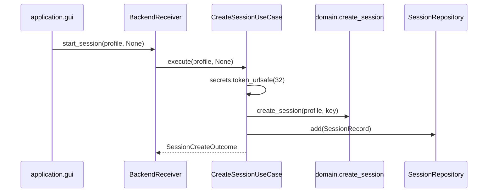

# UC-1 · CH-1b + GetSessionProgressUseCase

**Gate:** pytest + ruff + mypy; smoke Start Session.  
**Связано:** [PROJECT.md R2](../PROJECT.md), баг CH-1, tech debt `get_session_progress` в facade.

---

## 1. Проблема

### CH-1 · encryption_key

**Было:** GUI при пустом поле «Encryption key» подставлял литерал `"auto-generated-key"` и отправлял его в БД.

```python
# src/application/gui/app.py (до)
encryption_key = self._key_var.get().strip()
if not encryption_key:
    encryption_key = "auto-generated-key"
```

Последствия:

- В Postgres лежала **не секретная строка-заглушка**, а не случайный ключ.
- Любой restore/7z decrypt с таким «ключом» бессмысленен.
- Нарушение [INTERNAL_SPEC.md §3](../INTERNAL_SPEC.md): ключ должен генерироваться системой, если пользователь не задал свой.

### get_session_progress без use case

**Было:** `BackupFacade.get_session_progress()` читал репозиторий напрямую:

```python
items = self.repos.source_items.list_by_session(session_id)
```

Это обходило слой orchestration: правило «progress только через UC» не выполнялось ([PROJECT.md §11](../PROJECT.md) — «дыра facade»).

---

## 2. Решение

### 2.1 CreateSessionUseCase — генерация ключа

**Файл:** `src/use_cases/session/create_session.py`

| Аспект | До | После |
|--------|-----|--------|
| Вход `encryption_key` | `str` (обязательный) | `str \| None` |
| Пустой ключ | — | `secrets.token_urlsafe(32)` |
| Возврат | `Session` | `SessionCreateOutcome` |

```python
@dataclass(frozen=True, slots=True)
class SessionCreateOutcome:
    session: Session
    generated_encryption_key: str | None  # None если ключ задал пользователь
```

**Логика:**

1. `encryption_key.strip()`; если пусто → сгенерировать ключ, запомнить в `generated_encryption_key`.
2. Вызвать `domain.create_session(profile_name, resolved_key)` — **domain не менялся**.
3. Сохранить через `SessionRepository.add(domain_to_session_record(session))`.

**Почему `SessionCreateOutcome`, а не public Result:** UC-1 — внутренний UC; public `SessionResult.generated_encryption_key` появился в UC-2 для GUI (R3).

### 2.2 GetSessionProgressUseCase

**Файл:** `src/use_cases/session/get_session_progress.py`

```python
class GetSessionProgressUseCase:
    source_items: SourceItemRepository

    def execute(self, session_id: UUID) -> SessionProgress: ...
```

**Поведение:**

- `source_items.list_by_session(session_id)` → список `SourceItemRecord`.
- Маппинг в `SourceItemProgress(source_item_id, display_name, status)`.
- **`display_name` из record**, не из `source_path` — [INTERNAL_SPEC.md §6](../INTERNAL_SPEC.md).

**Не делает:** фильтрацию по статусу, сортировку, агрегацию volumes — только очередь сессии.

### 2.3 GUI

**Файл:** `src/application/gui/app.py`

```python
encryption_key = self._key_var.get().strip() or None
self._receiver.start_session(profile_name, encryption_key)
```

Литерал `"auto-generated-key"` **удалён**.

### 2.4 Facade (временно, до UC-3)

`BackupFacade.start_session` принимал `str | None` и использовал `SessionCreateOutcome`.  
`get_session_progress` делегировал в `GetSessionProgressUseCase` (поле `get_session_progress_uc` — имя поля не совпадает с методом, чтобы избежать shadowing).

---

## 3. Изменённые файлы

| Файл | Действие |
|------|----------|
| `src/use_cases/session/create_session.py` | CH-1b, `SessionCreateOutcome` |
| `src/use_cases/session/get_session_progress.py` | **новый** |
| `src/use_cases/session/__init__.py` | экспорт новых типов |
| `src/infrastructure/facade.py` | делегирование UC *(удалён в UC-3)* |
| `src/infrastructure/bootstrap.py` | wire `GetSessionProgressUseCase` |
| `src/application/gui/app.py` | убрать литерал |
| `src/application/backend_receiver.py` | `encryption_key: str \| None` |
| `tests/test_use_cases_session.py` | **новый** |
| `tests/test_facade.py` | wire UC *(удалён в UC-3)* |
| `tests/test_use_cases_backup.py` | `.execute(...).session` |

---

## 4. Тесты

**`tests/test_use_cases_session.py`:**

- `test_create_session_generates_key_when_empty` — ключ ≥ 32 символов, совпадает с записью в БД.
- `test_create_session_uses_provided_key` — `generated_encryption_key is None`.
- `test_get_session_progress_reads_display_name_from_repository` — UI-имя ≠ имя файла на диске.

---

## 5. Что сознательно не сделано (R3)

- Messagebox + clipboard для показа автоключа один раз.
- Поле `SessionResult.generated_encryption_key` в public API — **UC-2**.
- Логирование plain-text ключа — запрещено [PROJECT.md §11](../PROJECT.md).

---

## 6. Smoke

1. `docker compose up -d`
2. GUI → Start Session **без** ключа в поле.
3. В БД (`sessions.encryption_key`) — не `"auto-generated-key"`, а длинная random-строка.
4. Add File → Start Backup → Refresh Progress — очередь с `display_name`.

---

## 7. Диаграмма потока (Start Session)


