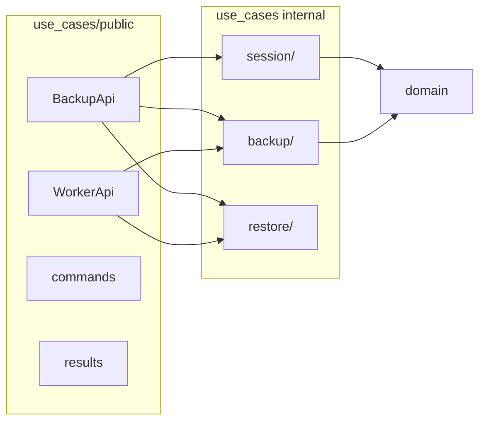

# UC-2 · use_cases/public/ — BackupApi, WorkerApi

**Gate:** compile + `tests/test_public_api.py` + все `test_use_cases_*` green.  
**Связано:** [PROJECT.md R4 §4.6](../PROJECT.md) — narrow public API.

---

## 1. Проблема

До UC-2 внешний мир видел:

- `infrastructure.facade.BackupFacade` с View-DTO (`SessionView`, `EnqueueResult`, …) **внутри infrastructure**.
- Workers и GUI — одна «дверь» facade, лишний hop.
- Domain entity (`Session`, `SourceItem`) утекали наружу через facade mappers.

**Цель:** единственная публичная поверхность use_cases — пакет `use_cases/public/`, без domain entity наружу.

---

## 2. Структура `use_cases/public/`

```
use_cases/public/
  commands.py    # входные Command dataclass
  results.py     # выходные Result dataclass (frozen)
  backup_api.py  # GUI-сценарии
  worker_api.py  # worker-сценарии (UC-2: без failure; UC-4 расширит)
  __init__.py    # экспорт только public surface
```

---

## 3. Commands (`commands.py`)

| Command | Поля | Кто вызывает |
|---------|------|--------------|
| `StartSessionCommand` | `profile_name`, `encryption_key: str \| None` | GUI via BackupApi |
| `EnqueueFileCommand` | `session_id`, `source_path`, `display_name` | GUI |
| `RestoreSessionCommand` | `session_id`, `dest_path` | GUI |

**Правило:** Command — один dataclass на сценарий; удобнее рефакторить, чем длинные сигнатуры.

---

## 4. Results (`results.py`)

| Result | Поля | Примечание |
|--------|------|------------|
| `SessionResult` | `session_id`, `profile_name`, `status`, `generated_encryption_key` | задел под R3 GUI |
| `QueueItemResult` | `source_item_id`, `display_name`, `status` | |
| `SourceItemProgressResult` | id, `display_name`, `status` | элемент progress |
| `ProgressResult` | `session_id`, `items: tuple[...]` | |
| `RestoreResult` | `session_id`, `downloaded_paths` | после UC-7 — пути **извлечённых** файлов |

**Правило:** frozen dataclass, **без методов и без domain entity**.

---

## 5. BackupApi (`backup_api.py`)

```python
@dataclass(frozen=True, slots=True)
class BackupApi:
    create_session: CreateSessionUseCase
    get_session_progress: GetSessionProgressUseCase
    enqueue_source_item: EnqueueSourceItemUseCase
    start_backup_pipeline: StartBackupPipelineUseCase
    restore_session_uc: RestoreSessionUseCase  # поле, не метод (избежать shadowing)
```

### Методы → делегаты

| Public method | Use case | Result mapping |
|---------------|----------|----------------|
| `start_session(StartSessionCommand)` | `CreateSessionUseCase` | `Session` → `SessionResult` + `generated_encryption_key` |
| `enqueue_file(EnqueueFileCommand)` | `EnqueueSourceItemUseCase` | `SourceItem` → `QueueItemResult` |
| `start_backup(session_id)` | `StartBackupPipelineUseCase` | `int` (число поставленных в очередь) |
| `get_progress(session_id)` | `GetSessionProgressUseCase` | `SessionProgress` → `ProgressResult` |
| `restore_session(RestoreSessionCommand)` | `RestoreSessionUseCase` | `list[Path]` → `RestoreResult` |

**Маппинг domain → Result только внутри BackupApi** — adapters не импортируют `domain`.

---

## 6. WorkerApi (`worker_api.py`) — базовая версия UC-2

```python
class WorkerApi:
    process_archive_uc: ProcessArchiveVolumeUseCase
    process_upload_uc: ProcessUploadVolumeUseCase
    process_cleanup_uc: CleanupVolumeUseCase
    process_restore_volume_uc: ProcessRestoreVolumeUseCase
```

| Method | Use case |
|--------|----------|
| `process_archive(source_item_id)` | `ProcessArchiveVolumeUseCase` |
| `process_upload(archive_volume_id)` | `ProcessUploadVolumeUseCase` |
| `process_cleanup(archive_volume_id)` | `ProcessCleanupVolumeUseCase` |
| `process_restore_volume(archive_volume_id)` | `ProcessRestoreVolumeUseCase` |

**UC-4** добавит `Report*FailureUseCase` и методы `report_*`.

---

## 7. Экспорт (`public/__init__.py`)

Экспортируются только:

- `BackupApi`, `WorkerApi`
- `StartSessionCommand`, `EnqueueFileCommand`, `RestoreSessionCommand`
- `SessionResult`, `QueueItemResult`, `ProgressResult`, `RestoreResult`, …

**Не экспортируются:** `CreateSessionUseCase`, records, ports, domain types.

---

## 8. Связь с facade (на момент UC-2)

План допускал: facade остаётся thin wrapper над `BackupApi` **до UC-3**.  
Фактически UC-2 и UC-3 шли подряд: public API + тесты без полного переключения adapters.

---

## 9. Тесты — `tests/test_public_api.py`

| Тест | Проверяет |
|------|-----------|
| `test_start_session_returns_result_without_domain_entity` | нет `Session` наружу |
| `test_start_session_auto_generates_encryption_key` | `generated_encryption_key` заполнен |
| `test_enqueue_file_returns_queue_item_result` | `display_name`, enqueue archive |
| `test_get_progress_reads_display_name` | progress из record |
| `test_worker_api_process_archive_delegates` | backup + worker chain |

**Fakes:** `InMemoryRepositories`, `FakeTaskQueue`, `FakeArchiveService`, `FakeStorageProvider` — **без infrastructure**.

---

## 10. Диаграмма границ



---

## 11. Не в scope UC-2

- Переключение `backend_receiver` / `tasks.py` — **UC-3**.
- Удаление `facade.py` — **UC-3**.
- `import-linter` — **UC-8**.
