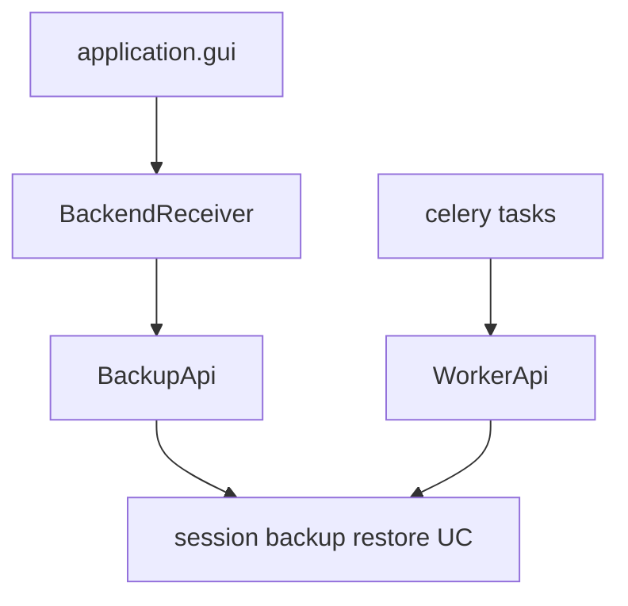

# UC-3 · Замена facade hop — adapters → public API

**Gate:** backup smoke обязателен (главный риск PR).  
**Связано:** [PROJECT.md R5](../PROJECT.md), checklist facade.

---

## 1. Проблема

**Было:**

```
GUI → BackendReceiver → BackupFacade → UseCase → ports
Worker (tasks.py) ────→ BackupFacade ────────────┘
```

- `BackupFacade` в `infrastructure/facade.py` — лишний hop.
- View-DTO (`SessionView`, `SessionProgressView`) жили в **infrastructure**, не в use_cases.
- Один composition root `build_facade()` смешивал GUI и worker wiring.

---

## 2. Решение

### 2.1 Два composition root

**Файл:** `src/infrastructure/bootstrap.py`

| Функция | Возвращает | Потребитель |
|---------|------------|-------------|
| `build_backup_api(cfg)` | `BackupApi` | GUI (`BackendReceiver`) |
| `build_worker_api(cfg)` | `WorkerApi` | Celery `tasks.py` |

Общее:

```python
def _wire_repositories(cfg: AppConfig) -> Repositories:
    return SqlAlchemyRepositories.from_dsn(cfg.postgres_dsn)
```

**Разделение зависимостей:**

- `BackupApi`: session, enqueue, start pipeline, restore session, progress.
- `WorkerApi`: archive, upload, cleanup, restore volume (+ report failure с UC-4).

Оба создают **свои** экземпляры `CeleryTaskQueue`, `TelegramProviderV1`, `ArchiveServiceAdapter` — допустимо для v1 (stateless wiring); оптимизация — позже.

### 2.2 BackendReceiver

**Было:** `facade: BackupFacade`  
**Стало:** `api: BackupApi`

**Файл:** `src/application/backend_receiver.py`

- Импорт: `use_cases.public.BackupApi`, `use_cases.public.commands.*`
- **Не импортирует:** `infrastructure`, `domain`, внутренние `use_cases.*`

Маппинг:

```
SessionResult      → SessionViewDTO
QueueItemResult    → QueueItemViewDTO
ProgressResult     → ProgressDTO
RestoreResult      → RestoreResultDTO
```

Application DTO остаются в `application` — тонкий слой для Tkinter.

### 2.3 Celery tasks

**Файл:** `src/infrastructure/worker/tasks.py`

**Было:**

```python
def _facade() -> BackupFacade:
    return build_facade(load_config())
_facade().process_archive_volume(...)
```

**Стало:**

```python
def _worker_api() -> WorkerApi:
    return build_worker_api(load_config())
_worker_api().process_archive(...)
```

### 2.4 GUI entrypoint

**Файл:** `src/application/gui/__main__.py`

```python
receiver = BackendReceiver(build_backup_api(load_config()))
```

### 2.5 Удалён facade

| Удалено | Замена |
|---------|--------|
| `src/infrastructure/facade.py` | `use_cases/public/backup_api.py` + `results.py` |
| `build_facade()` | `build_backup_api()` + `build_worker_api()` |
| `tests/test_facade.py` | `tests/test_public_api.py` + обновлённые wiring-тесты |

**`infrastructure/__init__.py`:**

```python
from infrastructure.bootstrap import bootstrap, build_backup_api, build_worker_api
```

---

## 3. Изменённые тесты

| Файл | Изменение |
|------|-----------|
| `tests/test_backend_receiver.py` | mock `BackupApi`, imports `use_cases.public.results` |
| `tests/test_bootstrap_wiring.py` | `test_build_backup_api_*`, `test_build_worker_api_*` |
| `tests/test_worker_tasks.py` | patch `_worker_api`, не `_facade` |
| `tests/test_layer_boundaries.py` | application может импортировать `use_cases.public` |

---

## 4. Правила импортов после UC-3

| Слой | Может импортировать |
|------|---------------------|
| `application` (кроме `gui/__main__.py`) | `use_cases.public`, application DTO |
| `application/gui/__main__.py` | + `infrastructure.bootstrap`, `infrastructure.config` (entrypoint) |
| `infrastructure` | `use_cases.*` для wiring, **не** `domain` напрямую |
| Workers | `WorkerApi` через bootstrap |

---

## 5. Диаграмма «после»



---

## 6. Smoke (обязательно)

```bash
docker compose up -d
PYTHONPATH=src .venv/bin/python -m application.gui
```

1. Start Session (пустой ключ OK)
2. Add File
3. Start Backup
4. Refresh Progress — статусы меняются
5. `docker compose logs -f celery-worker-archive-1` — archive/upload без traceback

---

## 7. Риски и откат

| Риск | Митигация |
|------|-----------|
| Двойной wiring repos в backup/worker | Каждый task вызывает `build_worker_api()` — новый pool; как было с facade |
| Сломан enqueue → worker | `test_worker_tasks`, integration позже |
| GUI не видит progress | `GetSessionProgressUseCase` уже в BackupApi |

---

## 8. Не в scope

- Report failure — UC-4.
- `shared/` layout — UC-6.
- Документация PROJECT.md sync — отдельный пункт R8.
