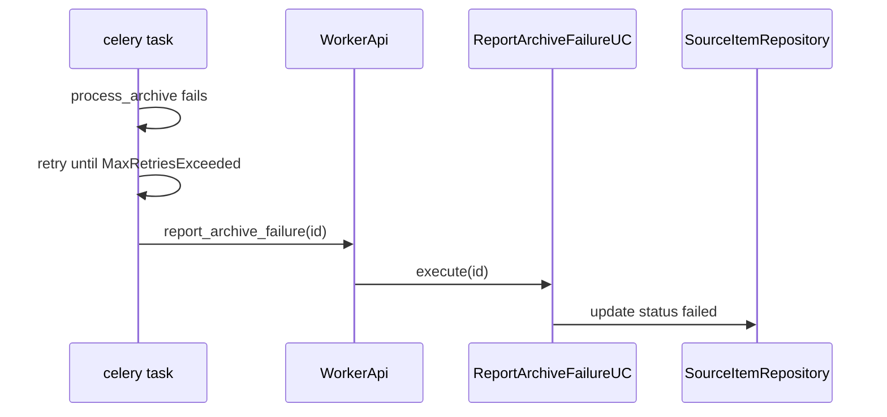

# UC-4 · Wire Report*FailureUseCase в WorkerApi + Celery

**Gate:** unit-тест report paths; backup smoke happy path не ломается.  
**Связано:** [BACKLOG.md P0.1](../BACKLOG.md) — Failed-status wiring.

---

## 1. Проблема

Use cases для пометки `failed` **уже существовали**, но не были подключены к runtime:

| Use case | Файл | Когда нужен |
|----------|------|-------------|
| `ReportArchiveFailureUseCase` | `backup/report_failure.py` | archive worker сдался после retries |
| `ReportUploadFailureUseCase` | `backup/report_failure.py` | upload worker сдался |
| `ReportCleanupFailureUseCase` | `backup/report_failure.py` | cleanup worker сдался |

**Было:** Celery tasks только retry + raise; статус в БД оставался «зависшим» (`archiving`, `uploading`, …).

**Правила** (из docstring `report_failure.py`):

- Только non-terminal → `failed`.
- Никогда не перезаписывать `completed`.
- Повторный вызов на уже `failed` — no-op.

---

## 2. Решение

### 2.1 WorkerApi — новые зависимости и методы

**Файл:** `src/use_cases/public/worker_api.py`

```python
report_archive_failure_uc: ReportArchiveFailureUseCase
report_upload_failure_uc: ReportUploadFailureUseCase
report_cleanup_failure_uc: ReportCleanupFailureUseCase
```

| Public method | Делегат |
|---------------|---------|
| `report_archive_failure(source_item_id)` | `ReportArchiveFailureUseCase` |
| `report_upload_failure(archive_volume_id)` | `ReportUploadFailureUseCase` |
| `report_cleanup_failure(source_item_id)` | `ReportCleanupFailureUseCase` |
| `report_cleanup_failure_for_volume(archive_volume_id)` | lookup volume → `source_item_id` → cleanup report |

**Зачем `report_cleanup_failure_for_volume`:** Celery task знает только `archive_volume_id`; `ReportCleanupFailureUseCase` принимает `source_item_id`.

### 2.2 Bootstrap

**Файл:** `src/infrastructure/bootstrap.py` — в `build_worker_api()`:

```python
report_archive_failure_uc=ReportArchiveFailureUseCase(repos.source_items),
report_upload_failure_uc=ReportUploadFailureUseCase(repos.source_items, repos.archive_volumes),
report_cleanup_failure_uc=ReportCleanupFailureUseCase(repos.source_items),
```

### 2.3 Celery — `_run_with_failure_report`

**Файл:** `src/infrastructure/worker/tasks.py`

Паттерн:

```python
try:
    runner()
except Exception as error:
    try:
        raise task.retry(exc=error)
    except MaxRetriesExceededError:
        api.report_*_failure(...)
        raise
```

| Task | stage | report method |
|------|-------|---------------|
| `archive_volume` | `"archive"` | `report_archive_failure(source_item_id)` |
| `upload_volume` | `"upload"` | `report_upload_failure(archive_volume_id)` |
| `cleanup_volume` | `"cleanup"` | `report_cleanup_failure_for_volume(archive_volume_id)` |
| `restore_volume` | — | **без** failure report (restore UX отдельно) |

**Минимум логики в tasks:** только dispatch по stage; бизнес-правила — в use cases.

---

## 3. Поведение Report*Failure (кратко)

### ReportArchiveFailureUseCase

- `source_items.require(id)` → если не `failed`/`completed` → `mark_source_item(FAILED)`.

### ReportUploadFailureUseCase

- Volume → `FAILED` если ещё не failed.
- Source item → `FAILED` если статус `UPLOADING`.

### ReportCleanupFailureUseCase

- Только если item в `CLEANUP` → иначе return.

---

## 4. Тесты

**Уже были:** `tests/test_use_cases_backup.py` — report failure cases.

**Добавлено:** `tests/test_public_api.py`:

- `test_worker_api_report_failures_delegate` — после `report_archive_failure` item.status == `failed`.

**Workers:** `tests/test_worker_tasks.py` — mock `_worker_api`, не тестирует retry exhaustion (можно добавить integration).

---

## 5. Диаграмма



---

## 6. Smoke

Happy path backup **не должен** вызывать report. Проверить:

- Обычный backup до `completed`.
- (Опционально) симулировать падение archive — item → `failed` в GUI Refresh Progress.

---

## 7. Не в scope

- GUI отображение failed / stuck — P0.3.
- Rollback temp files on failure — P0.2.
- Restore failure reporting.
