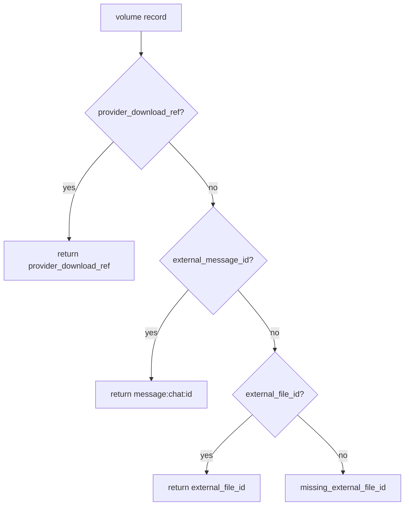

# UC-5 · Client API restore refs

**Gate:** `tests/test_restore_refs.py` green.  
**Связано:** [TELEGRAM_CLIENT_API_MIGRATION.md §restore refs](../TELEGRAM_CLIENT_API_MIGRATION.md), BACKLOG P0.1.

---

## 1. Проблема

Restore download через Bot API использует `external_file_id`, который **протухает**.  
Client API (MTProto) опирается на стабильные refs: `provider_download_ref`, `external_message_id`.

**Было** (`restore/refs.py`):

1. `provider_download_ref` (если есть)
2. fallback → `external_file_id`
3. иначе → `DomainError.missing_external_file_id`

**Не было:** fallback через `message_id + chat_id` для будущего Client API provider.

---

## 2. Решение

### 2.1 Новая функция — `restore_ref_for_volume`

**Файл:** `src/use_cases/restore/refs.py`

```python
def restore_ref_for_volume(volume: ArchiveVolume, target_chat_id: str) -> str:
```

**Приоритет:**

| # | Условие | Ref |
|---|---------|-----|
| 1 | `volume.provider_download_ref` | opaque client ref, напр. `client:-1001:99:1` |
| 2 | `volume.external_message_id` | `message:{target_chat_id}:{message_id}` |
| 3 | `volume.external_file_id` | bot legacy `file_id` |
| 4 | иначе | `DomainError.missing_external_file_id` |

**Формат `message:…`:** opaque string для `StorageProviderPort.get_file_info(ref)` — **порт не менялся**; Client provider интерпретирует ref в infra.

### 2.2 Legacy alias — `restore_download_ref`

Без `target_chat_id` — только:

1. `provider_download_ref`
2. `external_file_id`

Для старых тестов и кода, не знающего chat_id.

### 2.3 Прокидывание `target_chat_id`

**Из config:** `cfg.telegram_target_chat_id` в bootstrap.

**Изменённые use cases:**

| Use case | Новое поле |
|----------|------------|
| `RestoreSessionUseCase` | `target_chat_id: str` |
| `ProcessRestoreVolumeUseCase` | `target_chat_id: str` |

**`download_volume_to_dir`:**

```python
download_ref = restore_ref_for_volume(volume, target_chat_id)
file_info = storage_provider.get_file_info(download_ref)
```

---

## 3. Идентификаторы (справка)

| Поле БД | Bot API | Client API (цель) |
|---------|---------|-------------------|
| `external_message_id` | `message_id` | то же — главный ключ restore |
| `external_file_id` | bot `file_id` | `document.id` |
| `provider_download_ref` | `file_unique_id` / path | `client:{chat}:{msg}:{doc}` |

См. [INTERNAL_SPEC.md §4](../INTERNAL_SPEC.md) — все три поля persist после upload.

---

## 4. Тесты — `tests/test_restore_refs.py`

| Тест | Проверяет |
|------|-----------|
| `test_restore_download_ref_prefers_provider_download_ref` | client ref побеждает |
| `test_restore_download_ref_falls_back_to_external_file_id` | legacy bot path |
| `test_restore_ref_for_volume_falls_back_to_message_id` | `message:-1001:99` |
| `test_restore_ref_for_volume_raises_when_no_refs` | error |

**`tests/test_use_cases_restore.py`:** все конструкторы с `target_chat_id="-1001"`.

---

## 5. Что не сделано (намеренно)

- Реализация `TelegramClientProvider` — P0.2 infra.
- Парсинг `message:` ref в `TelegramProviderV1` — Bot API не понимает; до миграции provider.
- Изменение `StorageProviderPort` signature.

---

## 6. Диаграмма выбора ref


