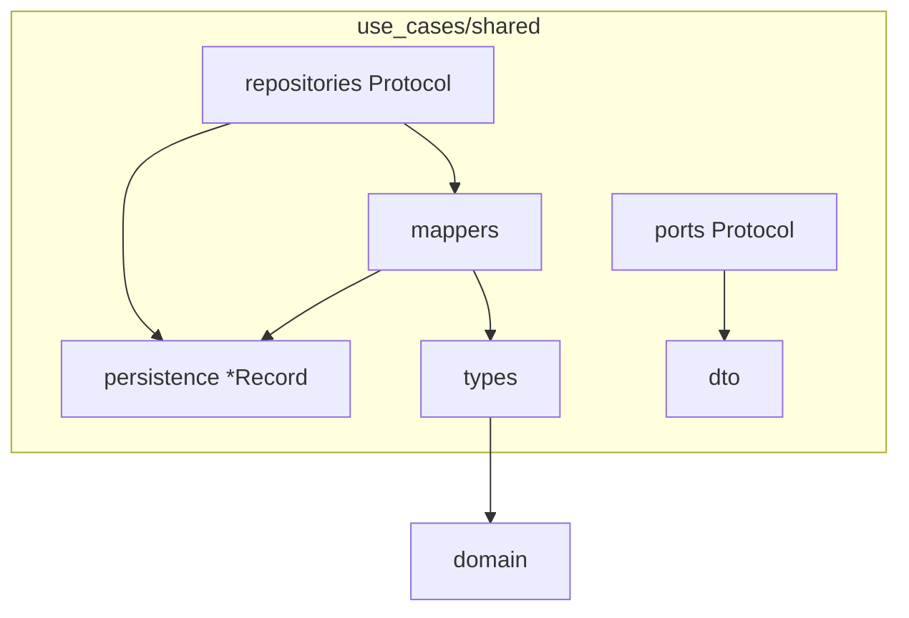

# UC-6 · Layout `use_cases/shared/` — move-only

**Gate:** pytest green; diff ≈ imports only.  
**Связано:** [PROJECT.md R6 / CH-2](../PROJECT.md).  
**Правило:** не начинать до зелёного UC-3.

---

## 1. Проблема

**Было:** в корне `use_cases/` смешаны orchestration и shared-инфраструктура:

```
use_cases/
  persistence.py
  mappers.py
  dto.py
  types.py
  ports/
  repositories/
  session/
  backup/
  restore/
```

Сложно читать: «где сценарий», «где порт», «где record».

---

## 2. Целевая структура

```
use_cases/
  shared/              ← move-only из корня
    persistence.py
    mappers.py
    dto.py
    types.py           ← internal re-export domain
    ports/
      archive_service.py
      storage_provider.py
      task_queue.py
    repositories/
      session.py
      source_item.py
      archive_volume.py
      loading.py
  session/
  backup/
  restore/
  public/
  __init__.py          ← re-export records/mappers для совместимости
```

---

## 3. Что перемещено (без изменения логики)

| Откуда | Куда |
|--------|------|
| `use_cases/persistence.py` | `use_cases/shared/persistence.py` |
| `use_cases/mappers.py` | `use_cases/shared/mappers.py` |
| `use_cases/dto.py` | `use_cases/shared/dto.py` |
| `use_cases/types.py` | `use_cases/shared/types.py` |
| `use_cases/ports/` | `use_cases/shared/ports/` |
| `use_cases/repositories/` | `use_cases/shared/repositories/` |

**Zero logic changes** — только paths и imports.

---

## 4. Массовая замена imports

Паттерн во всём `src/` и `tests/`:

| Старый import | Новый import |
|---------------|--------------|
| `use_cases.persistence` | `use_cases.shared.persistence` |
| `use_cases.mappers` | `use_cases.shared.mappers` |
| `use_cases.dto` | `use_cases.shared.dto` |
| `use_cases.types` | `use_cases.shared.types` |
| `use_cases.ports` | `use_cases.shared.ports` |
| `use_cases.repositories` | `use_cases.shared.repositories` |

---

## 5. `shared/__init__.py`

Re-export для удобства внутри слоя:

- `*Record`, mappers, ports protocols, `UploadResult`, …
- `Session`, `SourceItem`, `ArchiveVolume` из `types.py` — **internal**, см. UC-8.

---

## 6. `use_cases/__init__.py`

Публичный re-export пакета use_cases (legacy для tests/infra):

- Use case classes
- `*Record`, mapper functions
- **После UC-8:** без domain entity types в `__all__`

---

## 7. Границы слоёв

`tests/test_layer_boundaries.py`:

- `use_cases/shared/` **не** включён в проверку «не импортировать domain submodules» — исключение для `types.py` (re-export `domain.models`).

---

## 8. Зависимости модулей shared



**Persistence chain** (не изменилась):

```
ORM Row → infra/db/mappers → *Record → use_cases/shared/mappers → domain entity
```

---

## 9. Проверка после move

```bash
.venv/bin/pytest -m "not integration" -v
.venv/bin/ruff check src tests
.venv/bin/mypy src
```

84 unit-теста — ожидаемый baseline после UC-6.

---

## 10. Не в scope UC-6

- Переименование use case классов.
- Объединение backup/restore helpers.
- Удаление `use_cases/__init__.py` re-exports — UC-8 частично.
