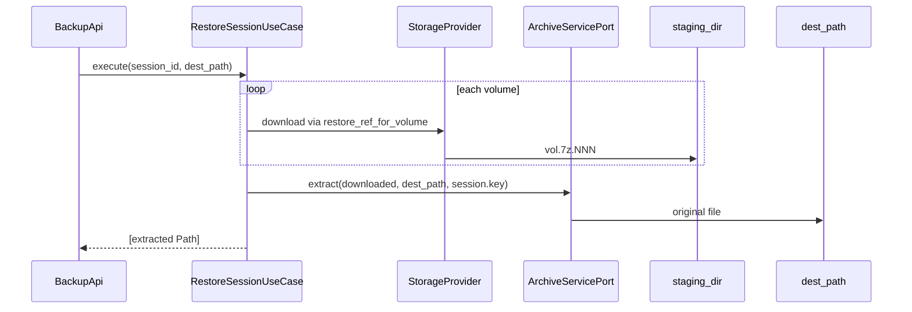

# UC-7 · Restore end-to-end — download + extract → dest_path

**Gate:** Roman smoke Restore Session → файл в выбранной папке.  
**Связано:** [BACKLOG.md P1](../BACKLOG.md), баг restore staging.

---

## 1. Проблема

### Баг dest_path

**Было** (`RestoreSessionUseCase`):

```python
def execute(self, session_id, dest_path):
    dest_path.mkdir(...)
    for volume in volumes:
        target = download_volume_to_dir(..., self.staging_dir)  # ← не dest_path!
        downloaded.append(target)
    return downloaded
```

`dest_path` создавался, но **файлы оказывались в staging** (`archive_cache_dir/restore`).  
GUI показывал пути staging — не user-selected folder.

### Нет extract

Backup = 7z encrypt + split. Restore = обратная операция:

1. Скачать все `.7z.001`, `.7z.002`, …
2. Расшифровать и извлечь оригинал с `encryption_key` сессии
3. Положить результат в **`dest_path`**

До UC-7 шаг 2 отсутствовал.

---

## 2. Решение — двухфазный RestoreSessionUseCase

**Файл:** `src/use_cases/restore/restore_session.py`

### Зависимости (расширены)

| Поле | Роль |
|------|------|
| `sessions: SessionRepository` | **новое** — `encryption_key` для extract |
| `archive_volumes` | список volumes по session |
| `storage_provider` | download |
| `archive_service: ArchiveServicePort` | **новое** — 7z extract |
| `staging_dir` | временные encrypted volumes |
| `target_chat_id` | restore refs (UC-5) |

### Алгоритм `execute`

1. `session = sessions.require(session_id)`
2. `volumes = archive_volumes.require_for_session(session_id)` — sorted by `part_number` в repo
3. `dest_path.mkdir`, `staging_dir.mkdir`
4. **Download phase:** для каждого volume → `download_volume_to_dir(..., staging_dir, target_chat_id)`
5. **Extract phase:**

```python
extracted = self.archive_service.extract(
    volume_paths=downloaded,
    dest_dir=dest_path,
    encryption_key=session.encryption_key,
)
return [extracted]
```

6. `BackupApi.restore_session` → `RestoreResult.downloaded_paths` = строки путей **извлечённого** файла(ов).

---

## 3. ArchiveServicePort.extract

**Файл:** `src/use_cases/shared/ports/archive_service.py`

```python
def extract(
    self,
    volume_paths: list[Path],
    dest_dir: Path,
    encryption_key: str,
) -> Path: ...
```

---

## 4. Infrastructure — SevenZipService.extract

**Файл:** `src/infrastructure/archive/seven_zip_service.py`

```bash
7z x -p{encryption_key} -o{dest_dir} {first_volume} -y
```

- Multi-part: 7z находит `.002`, `.003` рядом с `.001` в `staging_dir`.
- После extract: ровно **один файл** в `dest_dir` (v1 assumption).
- Иначе `SevenZipError`.

**Adapter:** `src/infrastructure/archive/archive_service_adapter.py` — thin delegate.

---

## 5. Bootstrap

`build_backup_api()` wire:

```python
archive_service = ArchiveServiceAdapter(service=SevenZipService())
RestoreSessionUseCase(..., archive_service=archive_service, sessions=repos.sessions, ...)
```

Worker API **не** вызывает full session restore — только `ProcessRestoreVolumeUseCase` (single volume download to staging).

---

## 6. Fake для тестов

**`tests/fakes/ports.py` — `FakeArchiveService.extract`:**

```python
extracted = dest_dir / "restored.bin"
extracted.write_bytes(b"restored-content")
return extracted
```

---

## 7. Тесты — `tests/test_use_cases_restore.py`

**Ключевой тест:** `test_restore_downloads_volumes_in_part_order_and_extracts_to_dest`

- 2 volumes в БД (part 2 добавлен раньше part 1 — repo сортирует)
- После execute: 2 download в staging, 1 файл в `dest_path/restored.bin`

---

## 8. Диаграмма restore session



---

## 9. Smoke (Roman)

1. Backup файл через GUI (happy path).
2. Restore Session → выбрать **другую** папку.
3. В папке — **оригинальный файл**, не `.7z.001`.
4. Размер/содержимое совпадают с source.

**Примечание:** Bot API download может 404 — smoke restore возможен только при рабочем provider; unit-тесты покрывают UC logic с fakes.

---

## 10. Ограничения v1

- Один source item → один extracted file (7z archive one file).
- Multi-file archive — не тестировался.
- Staging volumes **не удаляются** после extract (можно добавить cleanup в P0.2).
- Resume partial downloads — nice to have (BACKLOG P1).

---

## 11. Не в scope

- Client API provider для download.
- GUI progress restore UX — P0.3.
