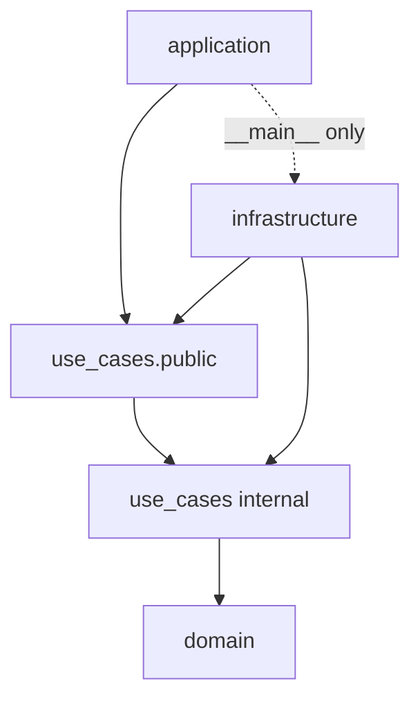

# UC-8 · types.py cleanup + import-linter + CI

**Gate:** `lint-imports` green; CI-ready.  
**Связано:** [PROJECT.md R7](../PROJECT.md), BACKLOG P2.

---

## 1. Проблема

### types.py tech debt

**Было:** `use_cases/types.py` re-export `domain.models`:

```python
from domain.models import ArchiveVolume, Session, SourceItem
```

И экспорт в `use_cases/__init__.py` наружу — infrastructure мог «легально» тянуть domain через use_cases, минуя records.

**Цель:** `types.py` — **internal** helper для gates/mappers внутри use_cases; adapters работают с `*Record` и public `*Result`.

### Границы только в AST-тесте

`tests/test_layer_boundaries.py` — ручной AST walk. Нужен автоматический контракт в CI ([BACKLOG P2](../BACKLOG.md)).

---

## 2. Решение — types internal

**Файл:** `src/use_cases/__init__.py`

**Убрано из `__all__`:**

- `Session`, `SourceItem`, `ArchiveVolume`

**Осталось в `__all__`:**

- Use case classes
- `*Record`, mapper functions

**Файл:** `src/use_cases/shared/types.py` — **не удалён**, используется внутри:

- `shared/mappers.py`
- `backup/gates.py`, `idempotency.py`, `report_failure.py`
- `restore/refs.py`, `download_volume.py`

---

## 3. import-linter — `.importlinter`

**Файл:** `.importlinter` в корне репо.

**Dev dependency:** `import-linter==2.1` в `pyproject.toml`.

**Команда:** `lint-imports`

### Контракты

| ID | Имя | Суть |
|----|-----|------|
| `domain-isolated` | Domain isolated | `domain` ↛ use_cases, infrastructure, application |
| `use-cases-isolated` | Use cases isolated | `use_cases` ↛ infrastructure, application, sqlalchemy, celery, redis, psycopg |
| `infrastructure-no-domain` | Infra no domain | `infrastructure` ↛ domain, application *(direct)* |
| `application-public-api` | App public only | `application` ↛ domain, infra, use_cases.{backup,session,restore,shared} *(direct)* |

### Особенности конфигурации

```ini
include_external_packages = True
```

Нужно для forbidden `sqlalchemy`, `celery`, …

**`allow_indirect_imports = True`** для infra и application:

- `bootstrap` → use_cases → domain — **не** прямой import domain из infra (OK).
- `backend_receiver` → public → backup UC → domain — OK.

**`ignore_imports`** для entrypoint:

```ini
application.gui.__main__ -> infrastructure.bootstrap
application.gui.__main__ -> infrastructure.config
```

Desktop app: composition root в `__main__.py` — осознанное исключение.

---

## 4. CI

**Файл:** `.github/workflows/ci.yml`

Добавлен шаг:

```yaml
- name: Import linter
  run: lint-imports
```

Порядок: ruff → lint-imports → mypy → pytest.

---

## 5. test_layer_boundaries.py — обновления

**Application layer:**

```python
FORBIDDEN_APPLICATION = {"domain"}
ALLOWED_APPLICATION_USE_CASES = {
    "use_cases.public",
    "use_cases.public.commands",
}
```

**backend_receiver** импортирует только public — тест `test_backend_receiver_imports_only_use_cases_public`.

---

## 6. mypy — celery tasks

**`pyproject.toml`:**

```toml
[[tool.mypy.overrides]]
module = "infrastructure.worker.tasks"
disable_error_code = ["misc", "type-arg", "no-untyped-def"]
```

Celery `Task` generics — шум strict mypy; override сохранён и расширен после UC-4.

---

## 7. Полный gate (финальный)

```bash
.venv/bin/ruff check src tests
.venv/bin/lint-imports
.venv/bin/mypy src
.venv/bin/pytest -m "not integration" -v
```

Ожидание: **84 passed**, 4 contracts kept.

---

## 8. Диаграмма allowed imports



---

## 9. Что дальше (не UC-8)

| Трек | Файл |
|------|------|
| R3 GUI autoclave messagebox | `application/gui` |
| Client API provider | `TELEGRAM_CLIENT_API_MIGRATION.md` |
| PROJECT.md sync R8 | `docs/PROJECT.md` |
| Убрать `use_cases/__init__.py` legacy re-exports полностью | optional hardening |

---

## 10. Критерий «use_cases слой закрыт»

- [x] Adapters → `use_cases.public` (кроме gui entrypoint → bootstrap)
- [x] Нет `BackupFacade`
- [x] `GetSessionProgressUseCase` вместо raw repos
- [x] `shared/` layout
- [x] Failure reporting wired
- [x] Restore → файл в `dest_path`
- [x] import-linter + pytest green
- [ ] Roman smoke backup + restore *(только Roman)*
