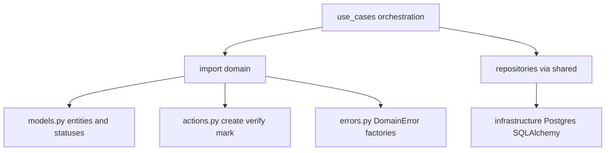
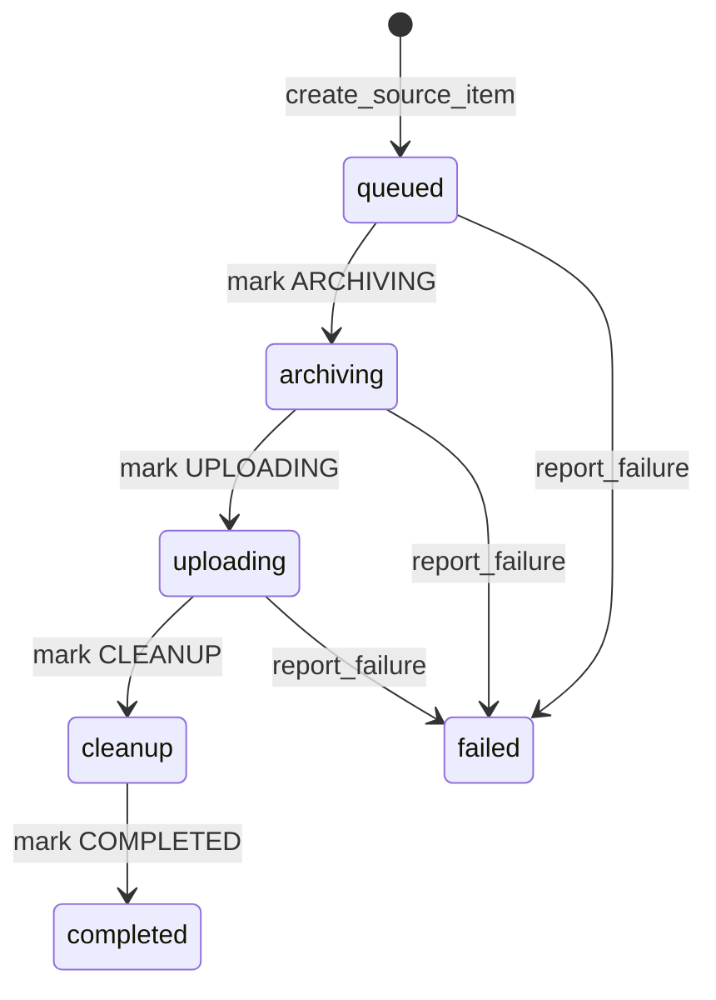
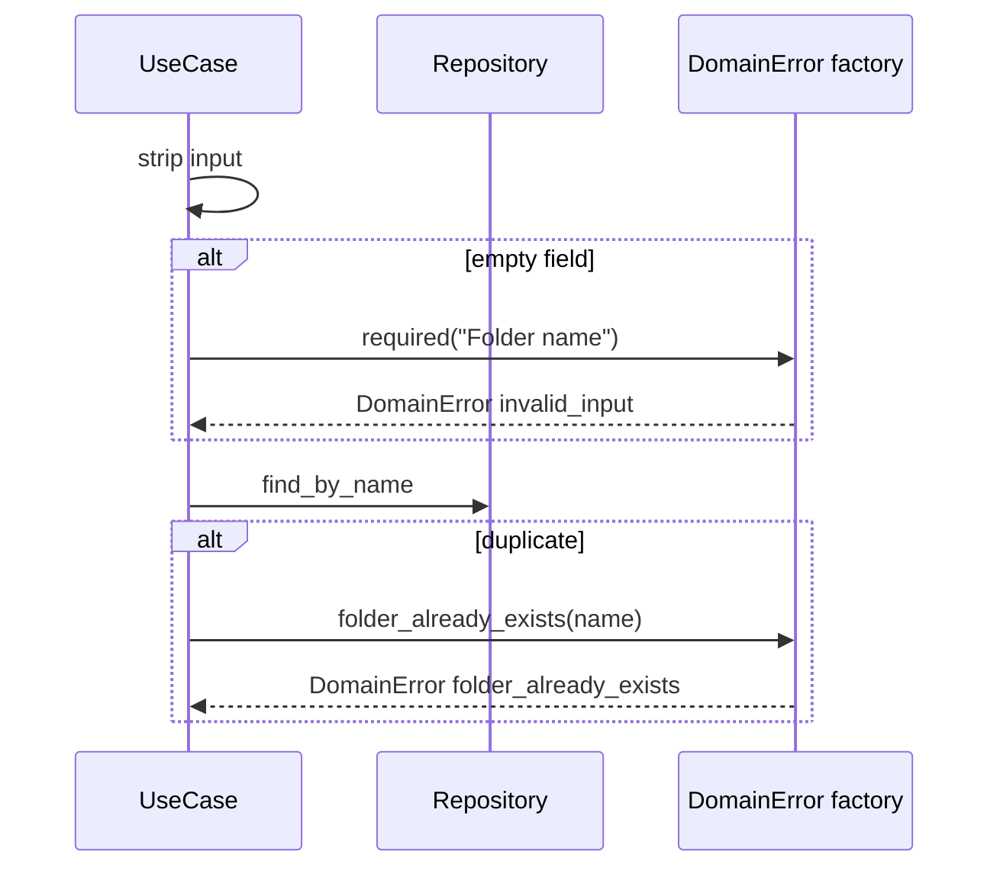

# domain — мануал слоя

> Ядро правил telegram-uploader: модели, статусы, создание сущностей, типизированные ошибки.  
> Канон архитектуры: [docs/PROJECT.md](../../docs/PROJECT.md).  
> Слой выше: [use_cases/MANUAL.md](../use_cases/MANUAL.md).

---

## Зачем этот слой

`domain` — **«правила игры»** без I/O. Здесь живут:

- **модели** — `Session`, `SourceItem`, `ArchiveVolume` и их статусы;
- **действия** — создать сущность, проверить статус, сменить статус;
- **ошибки** — единый `DomainError` с фабриками (`code`, `message`, контекст).

`use_cases` решает **когда** и **в каком порядке** вызывать domain; `infrastructure` решает **как** сохранить в Postgres, отправить в Telegram, положить задачу в Celery.



**Импорт:** только `import domain as domain` — не из подмодулей (`domain.models`, `domain.errors`).

---

## Границы слоя

| Можно | Нельзя |
|-------|--------|
| dataclass-сущности, enum статусов | Repository, SQLAlchemy, Celery |
| чистые функции create / verify / mark | GUI, HTTP, Telegram API |
| `DomainError` с `code` и контекстом | читать/писать файлы, сеть, env |
| `Path` в полях модели | проверки через БД (это в UC + repo) |

Domain **не знает** про папки backup (`BackupFolderRecord`) — это persistence в `use_cases/shared`.  
Domain **не знает** про repo — UC спрашивает repo и при нарушении правила вызывает фабрику ошибки.

---

## Карта файлов

| Файл | Роль |
|------|------|
| [`models.py`](models.py) | Сущности и enum'ы статусов |
| [`actions.py`](actions.py) | `create_*`, `verify_*`, `mark_*`, `is_source_item` |
| [`errors.py`](errors.py) | `DomainError` + factory methods |
| [`__init__.py`](__init__.py) | Единая точка экспорта |

---

## Три сущности

### Session (backup-профиль / «база»)

Профиль с именем и ключом шифрования. Статусы: `created` → `running` → `completed` / `failed` / `cancelled` / `paused`.

### SourceItem (файл в очереди backup)

Один файл пользователя в сессии. Статусы backup-пайплайна:



### ArchiveVolume (часть 7z-архива)

Один split-файл после 7z. Статусы: `created` → `uploading` → `uploaded` / `failed`.

---

## actions.py — когда что вызывать

| Функция | Зачем | Типичный caller |
|---------|-------|-----------------|
| `create_session` | Новая сущность Session в статусе `created` | `CreateDatabaseUseCase`, `CreateSessionUseCase` |
| `create_source_item` | Файл в очереди, статус `queued` | `EnqueueSourceItemUseCase` |
| `create_archive_volume` | Часть архива после split, статус `created` | `ProcessArchiveVolumeUseCase` |
| `verify_session` | Session должна быть в ожидаемом статусе | `backup/gates.py` |
| `verify_source_item` | SourceItem в нужном статусе перед шагом | `backup/gates.py`, idempotency |
| `verify_archive_volume` | Volume готов к upload | `backup/gates.py` |
| `mark_session` | Сменить статус Session (immutable copy) | `StartBackupPipelineUseCase` |
| `mark_source_item` | Сменить статус SourceItem | pipeline UC, `report_failure`, `cleanup_volume` |
| `mark_archive_volume` | Сменить статус volume | `ProcessUploadVolumeUseCase`, `start_backup_pipeline` |
| `mark_archive_volume_uploaded` | `uploaded` + metadata Telegram для restore | `ProcessUploadVolumeUseCase` |
| `is_source_item` | Условный переход без exception | `cleanup_volume`, `report_failure`, gates |

**Паттерн:** `verify_*` — guard перед шагом (бросает `invalid_status_transition`).  
`mark_*` — после успеха; UC сохраняет через mapper + repository.

---

## DomainError — кто решает «когда», кто «как»



- **Use case** — условие (пустой input, дубликат в repo, не тот статус).
- **Domain factory** — единый `code`, текст для GUI, поля `entity_id` / `reason`.

Пример hover-вопроса: `DomainError.required("Folder name")` — строка `"Folder name"` это **подпись поля** для сообщения (`"Folder name is required"`), а не ввод пользователя.

---

## Таблица фабрик ошибок

| Factory | `code` | Когда | Typical caller |
|---------|--------|-------|----------------|
| `required(field)` | `invalid_input` | Пустое поле после `strip()` | `CreateDatabaseUseCase`, `CreateFolderUseCase` |
| `profile_already_exists(name)` | `profile_already_exists` | Имя профиля уже в repo | `CreateDatabaseUseCase` |
| `session_not_found_by_profile(name)` | `session_not_found` | Unlock: профиль не найден | `UnlockSessionUseCase` |
| `wrong_encryption_key(name)` | `wrong_encryption_key` | Unlock: неверный ключ | `UnlockSessionUseCase` |
| `session_not_found(id)` | `session_not_found` | Load by UUID — нет записи | `shared/repositories/loading.py` |
| `source_item_not_found(id)` | `source_item_not_found` | Rename/move — item нет | `ManageSourceItemUseCase` |
| `archive_volume_not_found(id)` | `archive_volume_not_found` | Load volume — нет записи | `shared/repositories/loading.py` |
| `no_volumes_for_session(id)` | `archive_volume_not_found` | Restore: нет volumes | `shared/repositories/loading.py` |
| `missing_external_file_id(id)` | `archive_volume_not_found` | Restore ref без Telegram id | `restore/refs.py` |
| `folder_not_found(id)` | `folder_not_found` | Enqueue в несуществующую папку | `EnqueueSourceItemUseCase` |
| `folder_already_exists(name)` | `folder_already_exists` | Дубликат имени папки | `CreateFolderUseCase` |
| `invalid_status_transition(...)` | `invalid_status_transition` | Недопустимый статус / rename queued only | gates, idempotency, `ManageSourceItemUseCase` |
| `no_restorable_backups(id)` | `no_restorable_backups` | Restore: нет uploaded volumes | `RestoreSessionUseCase` |
| `no_restorable_backups_in_folder(name)` | `no_restorable_backups_in_folder` | Restore папки без backup | `RestoreSessionUseCase` |
| `legacy_volumes()` | `legacy_volumes` | Старый Bot API backup | `restore/refs.py`, `RestoreSessionUseCase` |
| `restore_destination_not_writable(path, detail)` | `restore_destination_not_writable` | Нельзя писать в dest | `restore/restore_session.py` |

GUI ловит `DomainError` и показывает `str(error)` (message). Некоторые `code` обрабатываются отдельно в `application/gui/errors.py`.

---

## Типичный сценарий: Create Folder

1. GUI → `GuiEntrypoint.create_folder` → `CreateFolderUseCase.execute`
2. UC: `name.strip()` → если пусто → `DomainError.required("Folder name")`
3. UC: `folders.find_by_name` → если есть → `DomainError.folder_already_exists`
4. UC: создаёт `BackupFolderRecord`, `folders.add` — **это уже не domain**

Domain участвует только в шагах 2–3 (ошибки). Сущность Folder в domain не моделируется.

---

## Связь с другими слоями

```
application (GUI)  →  use_cases/public  →  use_cases/*  →  domain
                                              ↓
                                        infrastructure
```

- Подробнее про сценарии: [use_cases/MANUAL.md](../use_cases/MANUAL.md)
- Архитектура проекта: [docs/PROJECT.md](../../docs/PROJECT.md)
- Hover-подсказки в IDE: docstring'и на функциях и фабриках в `actions.py`, `errors.py`, `models.py`
